# Dependency Parsing

# 1. Structure of Sentences

语言的结构，一般可以有两种视角：

1. constituency 组成关系：
   - 主要关心的是句子是怎么构成的，词怎么组成短语。
   - 所以研究Constituency主要是研究忽略语义的“ 语法” 结构（content-free grammars） 。
2. dependency 依赖关系。
   - 主要关心的是句子中的每一个词， 都依赖于哪个其他的词。

## 1.1 Consistency grammer

> 💡 Consisteny 
>
> ​       = Phrase structure grammar
>
> ​       = context-free grammars(CFGs) 
>
> ​      = 抓住“结构”，与上下文/单词含义无关

### 1.1.1 结构

1. **Starting unit: words**

   - the, cat, cuddly, by, door

   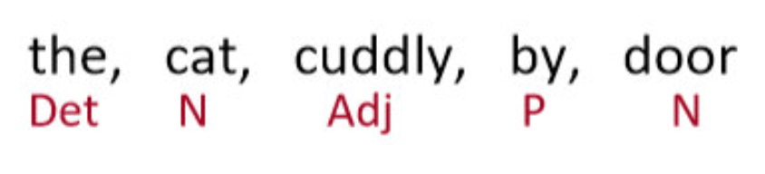

2. **Words combine into phrases**

   - the cuddly cat,   by the door

   

3. **Phrases can combine into bigger phrases**

   - the cuddly cat by the door  

     

- `Det` 指的是 **Determiner**，在语言学中的含义为 **限定词**
  
- `NP` 指的是 **Noun Phrase** ，在语言学中的含义为 **名词短语**

- `VP` 指的是 **Verb Phrase** ，在语言学中的含义为 **动词短语**

- `P` 指的是 **Preposition** ，在语言学中的含义为 **介词**

- - `PP` 指的是 **Prepositional Phrase** ，在语言学中的含义为 **介词短语**

- Rule1: "Noun Phrase (NP)"

  - 比如 the cat，a dog =>  `NP =  Det + N`
  - 再比如 the large cat, a barking dog => `NP = Det + (adj) + N`
  - 进一步 the large cat in a crate => `NP = Det + (adj) + N + Prep`

- Rule 2: Preposition Phrase 

  - `PP = Prep + NP`

  - => The cat by the large crate on the large table by the door

- Rule 3: `VP = V + PP`

类似可以一层一层的，建一个长句子.

## 1.2 Denpendency structur

这种观点在计算语言学中占主导地位：不是使用各种类型的短语，而是直接通过单词与其他的单词关系表示句子的结构，显示哪些单词依赖于(修饰或是其参数)哪些其他单词

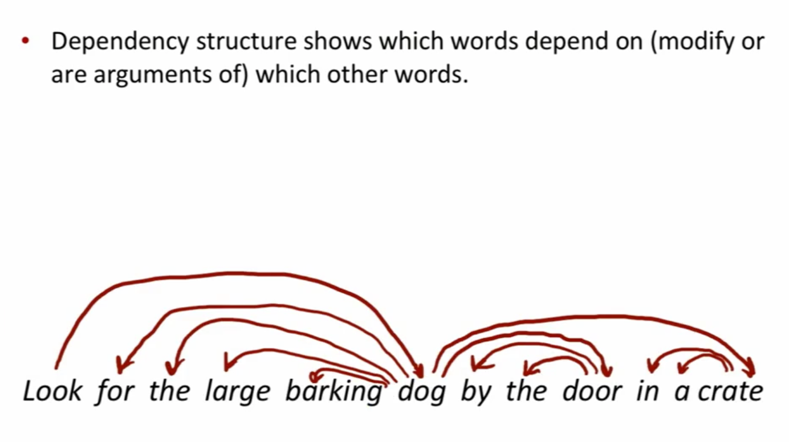

- `Look` 是整个句子的 root, 依赖于 `dog` （或者说，`dog` 是 `Look` 的依赖）
- `for the large barking`  是 `dog`的修饰[Question: 修饰 vs 依赖]
- `by`, `the` 都是 `door`的依赖
- `by the door`是 `dog` 的依赖

## 1.3 Why do we need sentence structure?

- We need to understand sentence structure in order to be able to interpret language correctly

  - 为了能够正确地解释语言，我们需要理解句子结构

- Humans communicate complex ideas by composing words together into bigger units to convey complex meanings

  - 人类通过将单词组合成更大的单元来传达复杂的意思，从而交流复杂的思想

- We need to know what is connected to what

  - 我们需要知道什么与什么相关联

- - 除非我们知道哪些词是其他词的参数或修饰词，否则我们无法弄清楚句子是什么意思

    

## 1.4 Ambiguities

### 1.4.1 Prepositional phrase attachment ambiguity 介词短语依附歧义

#### 例子1 🌰 

San Jose cops kill man with knife.

- `cops` 是`kill` 的 subject;
- `man` 是 `kill` 的 object

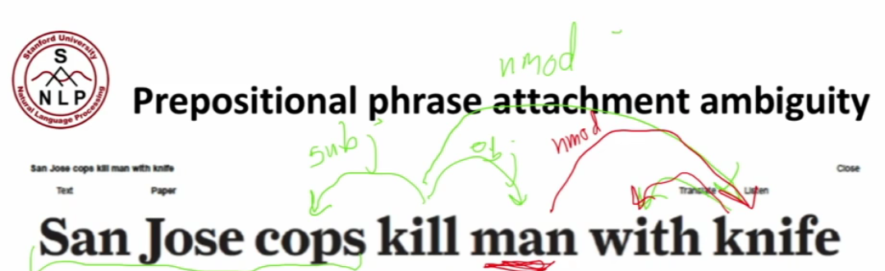

**理解1** 警察用刀杀了那个男子

- `knife`是 `kill` 的 modifier(修饰符-> 名称修饰符，nmod) 
- 如上图绿色

**理解2**  警察杀了那个有刀的男子

- `knife`是 `man` 的 modifier(修饰符) 

#### 例子2 🌰 

Scientists count whales from space

- `from space` 这一介词短语修饰的是前面的动词 `count` 还是名词 `whales` ？ 

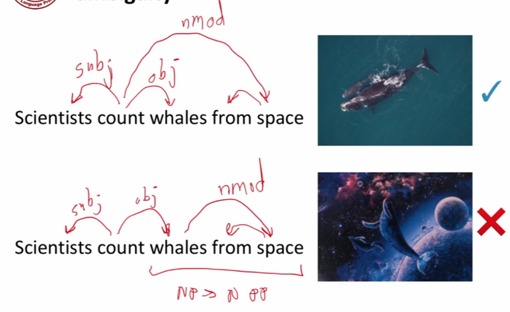

> A key parsing decision is **how we 'attach' various counstituents**
>
> - PPs, adverbial or participial phrases, infinitives, coordinations

#### 例子3 🌰

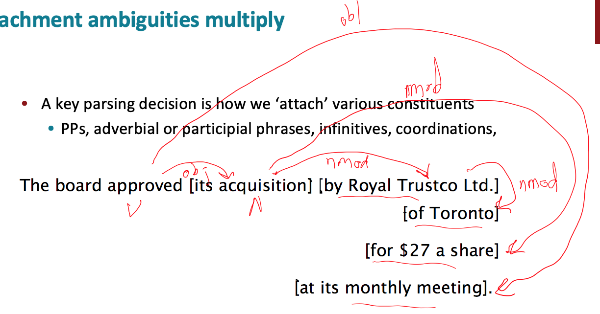

- 上述句子中有四个介词短语
- `board` 是 `approved` 的 主语，`acquisition` 是 `approved` 的宾语
- `by Royal Trustco Ltd.` 是修饰 `acquisition` 的，即董事会批准了这家公司的收购
- `of Toronto` 可以修饰 `approved, acquisition, Royal Trustco Ltd.` 之一，经过分析可以得知是修饰 `Royal Trustco Ltd.` 即表示这家公司的位置
- `for $27 a share` 修饰 `acquisition`
- `at its monthly meeting` 修饰 `approved` ，即表示批准的时间地点

面对这样复杂的句子结构，我们需要考虑 **指数级** 的可能结构，这个序列被称为 **Catalan numbers**

**Catalan numbers : ** $C_n = (2n)!/[(n+1)!n!]$ 指数增长的序列

### 1.4.2 Coordination scope ambiguity 协调范围模糊

#### 1.4.2.1 例子1 🌰

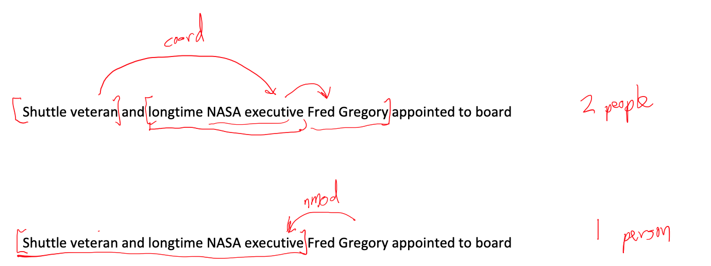

- [(Shuttle veteran and longtime NASA executive) Fred Gregory] appointed to board.
- (Shuttle veteran) and (longtime NASA executive Fred Gregory) appointed to board.

#### 1.4.2.2 例子2

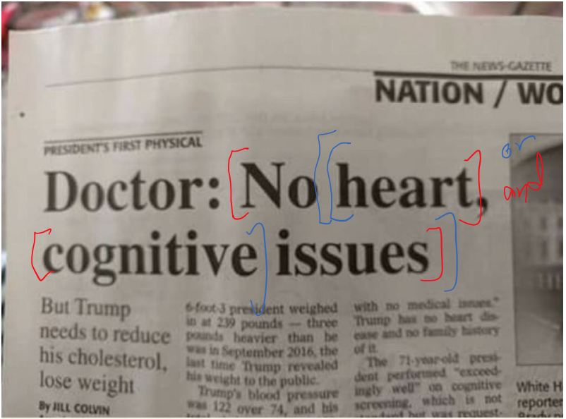

- Doctor: [No heart], [cognitive issues]
  - `,` 表达 and 的含义
  - [No heart] and [cognitive issues]

- Doctor: No [[heart, cognitive] issues]
  - `,` 表达 or 的含义
  - No [ [heart or cognitive] issues]

### 1.4.3  Adjectival Modifier Ambiguity 形容词修饰语歧义

- Students get [[first hand] job experience]
  - `first hand` 第一手的，直接的
  - 学生获得了直接的工作经验
- Students get [first [hand job] experience]
  - hand job ...

### 1.4.4 Verb Phrase(VP) attachment ambiguity 动词短语依存歧义

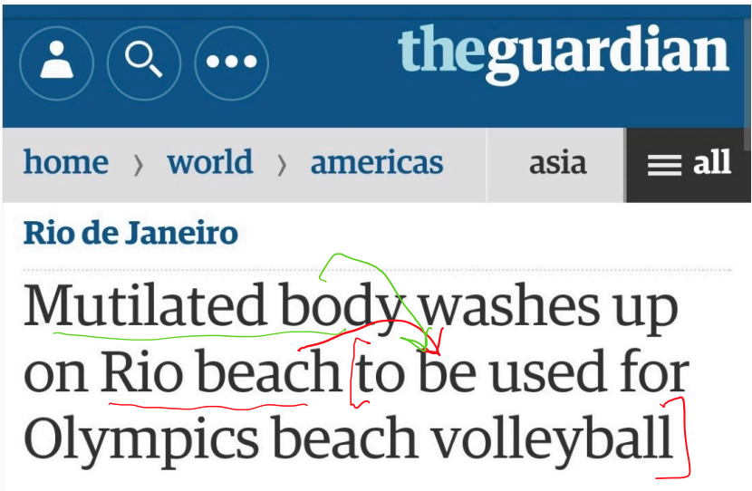

- `to be used for Olympic beach volleyball` 是 动词短语 (VP)
- 修饰的是 `body` 还是 `beach`

### 1.4.5 Solution :  Dependency paths

> Dependency paths help extract semantic interpretation

例句🌰 The results demonstrated that KaiC interacts rhythmically with KaiA, KaiB, and SasA.

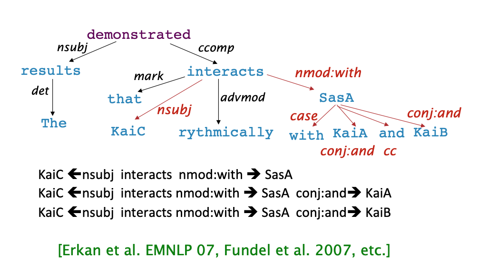

# 2. Dependency Grammar and Dependency Structure

关联语法假设句法结构包括词汇项之间的关系，通常是二元不对称关系(“箭头”)，称为依赖关系

## 2.1 Dependency Structure 的两种表现形式

### 2.1.1 直接在句子上标出依存关系箭头及语法关系

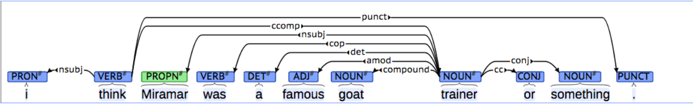

- Pro 原始句子内容清楚

- Con 关系结构不够清楚

### 2.1.2 Dependence Tree Graph

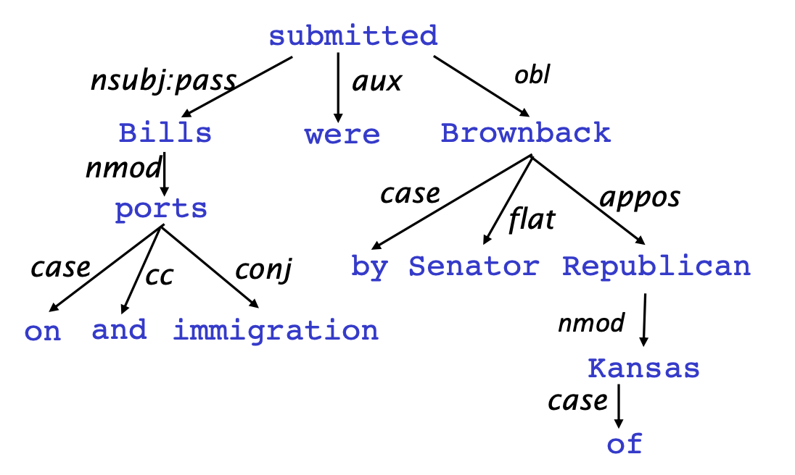

- Pro 关系结构清楚
- Con 原始句子内容（顺序）不清楚

**图释**

- 箭头上通常会标记（**type**）语法关系，比如 subject、prepositional object、apposition等。
  - 课程中只用arrow，不用type（nsubj,etc)
- 关系：
  - the arrow connects a ***head*** (governor,superior, regent) with a ***dependent*** (modifier, inferior, subordinate)
    - A $\rightarrow$ 依赖于/修饰 A的部分
  - dependencies form a ***tree***(connected, acyclic, single-head)
    - 连通，无环，单向
- 依赖关系标签的系统，例如 **universal dependency** 通用依赖

### 2.1.3 例子和注意

- 箭头的方向不统一，不同paper可能不一致；
- 通常，添加伪根节点 `ROOT`  指向整个句子的头部，这样，每个单词都精确地依赖于另一个节点

## 2.2 Universal Dependencies treebanks

ref [universal dependencies](https://universaldependencies.org/)

### 2.2.1 例子🌰

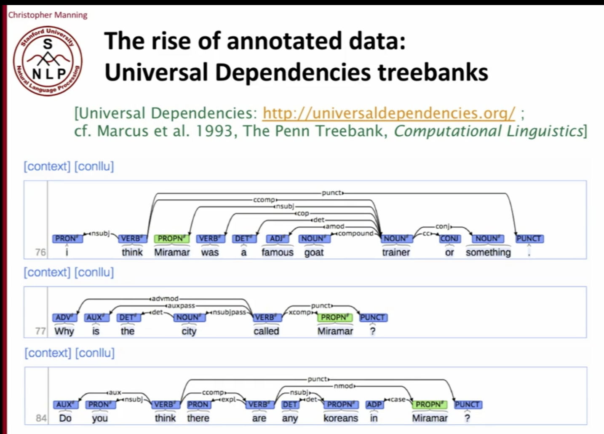

### 2.2.2 目标与优缺点

- **🎯goal of  "universal dependency"**：

  - have a uniform parallel system of dependency description which could be used for any human language 

- **Cons**

  - 开始时候，构建 treebank 似乎比构建语法要慢的多，也没有那么有用
    - 语法可以一条规则捕捉很多东西，非常效率
    - 但是，在实践中并不好用：语法规则符号越来越复杂，并且没有共享和重用人类所做的工作

- **Pros**

  - 劳动力的可重用性

  - - 许多解析器、词性标记器等可以构建在它之上
    - 语言学的宝贵资源

  - 广泛的覆盖面，而不仅仅是一些直觉

  - 频率和分布信息（Frequencies and distributional information）：

    - 因为ML模型就是学习这种commoners and the frequency of things 

  - 一种评估系统的方法

  - 与 “Grammar”相比的好处：telling what is the right structure for ambiguous sentences

  

- 所以我们需要一个模型来capture what is the ***right parse***

### 2.2.3 Dependency parsing的需要考虑哪些信息

1. **Bilexical affinities** = word的含义
   1. 🌰 [discussion $\rightarrow$ issues] 看上去是合理的
   2.  [discussion $\rightarrow$ outstanding] 看上去是wierd的，所以不应该有这个依赖性 （下图绿色x）
2. **Dependency distance** 大部分的依赖发生在相邻词之间
3. **Intervening material** 依赖很少跨越介于中间的动词或标点符号
4. **Valency of heads**：How many dependents on which side are usual for a head?

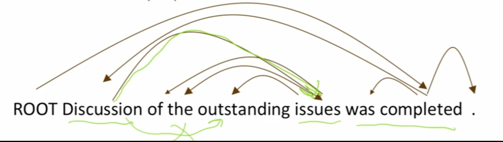

### 2.2.4 Dependency Parsing的构造/结构

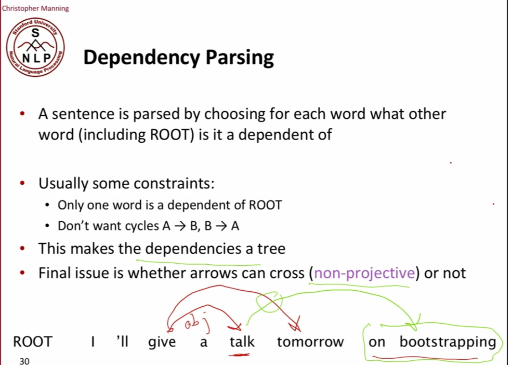

### Method : Transition-based parsing or deterministic dependency parsing

1. parsing的具体过程举例

 

2. **Question** 如何决定每一步正确的action (shift, left arc, right arc, etc)
   1. 遍历所有可能 （指数级）
   2. dynamic programming（过去使用的方法）
   3. MaltParser 用ML classifier预测下一步的action
      - Each action is predicted by a discrimnatvie classifier (e.g. softmax classifier) over each legal move
        - Max of 3 uptyped choices (shift, left arc, right arc);
        - Max of |R| X 2 + 1 when typed
          - put labeds on the dependencies 
          - |R| different labels
        - Features: top of stack word, POS; first in buffer word, POS; etc
      - There is NO search (in the simplest form)

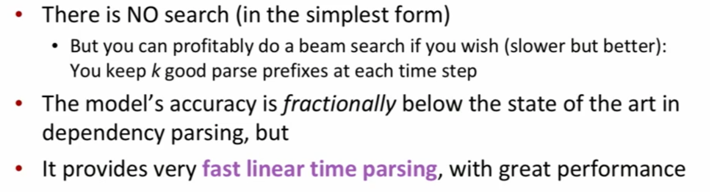

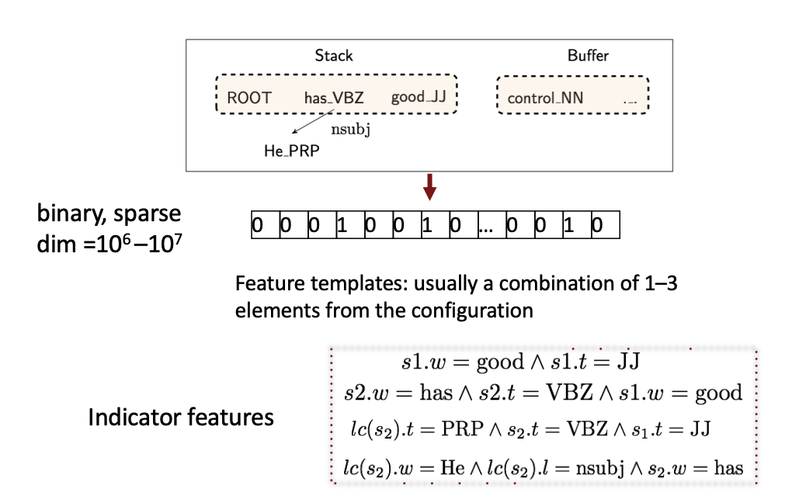

- logistic regression, SVM 等算法已经可以做的不错
- 下面会介绍Neural dependency parsing

## Evaluation

 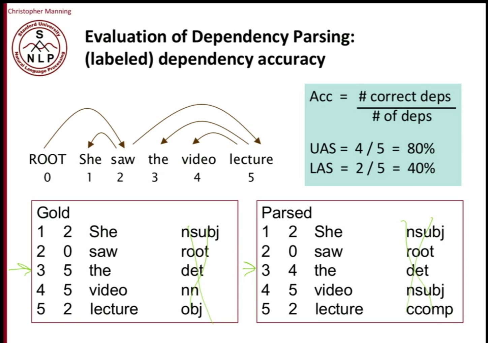

- UAS = 忽略label (nsubj, root, etc)，只看arc的正确率 

- LAS = 包括label+arc 的正确率

## Why train a neural dependency parser？

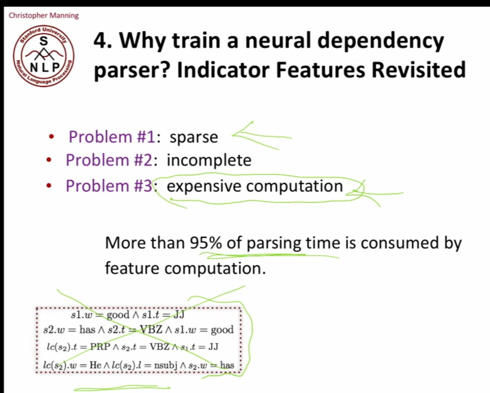

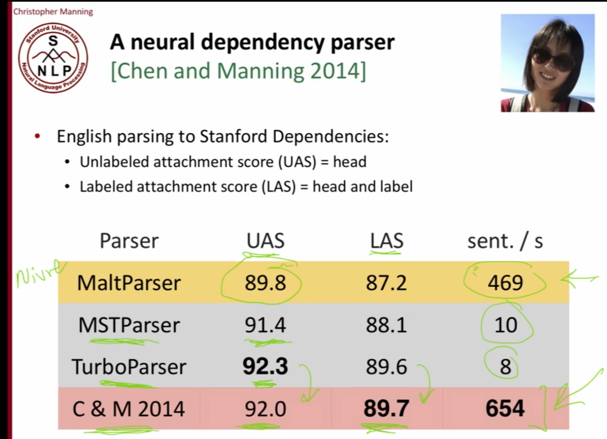

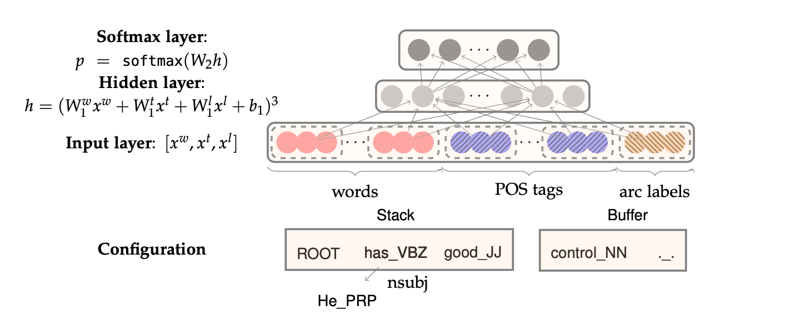

