# 1. How to evaluate word vectors

## 1.1 概述

**Answer** Intrinsic vs. extrinsic 内在与外在

- Intrinsic:
  - Evaluation on a specific/intermediate **subtask**
  - Fast to compute 
  - Helps to understand that system 
  - Not clear if really helpful unless correlation to real task is established 
- Extrinsic: 
  - Evaluation on a real task
  - Can take a long time to compute accuracy
  - Unclear if the subsystem is the problem or its interaction or other subsystems 
  - If replacing exactly one subsystem with another improves accuracy -> Winning!

## 1.2 Intrinsic word vector evaluation

### 1.2.1 Word Vector Analogies

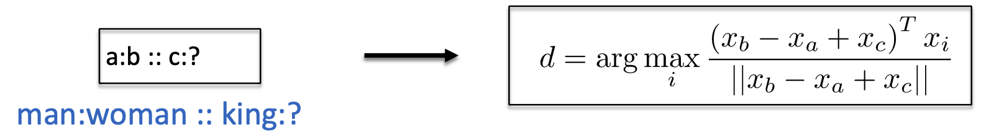

dea 💡** Evaluate word vectors by how well their cosine distance after addition captures intuitive semantic and syntactic analogy questions （余弦距离能多好的捕捉到语义和句法类比问题）

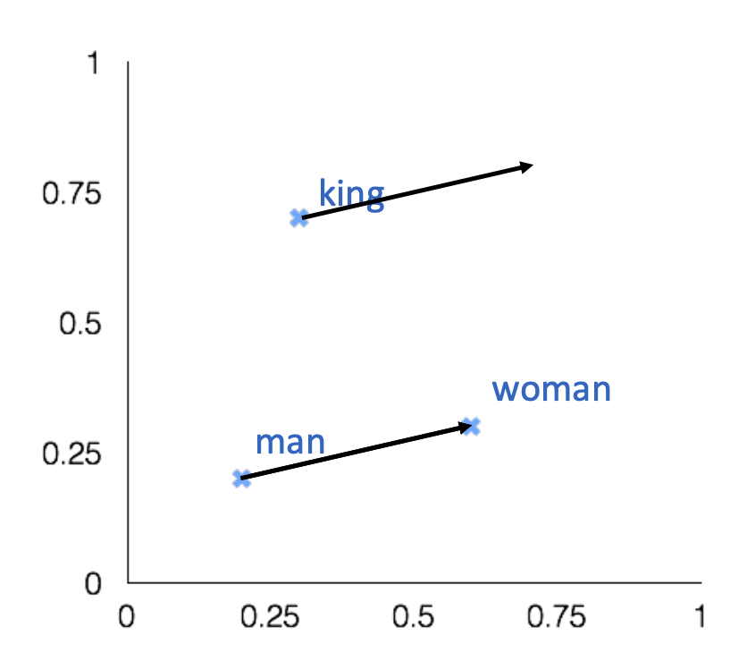

- 要从搜索中去掉input单词
- **Problem** 如果信息非线性，怎么办？[TODO]

## 1.3 Extrinsic word vector evaluation

- One example where good word vectors should help directly: **named entity recognition**

  - identifying references to a person, organization or location 

    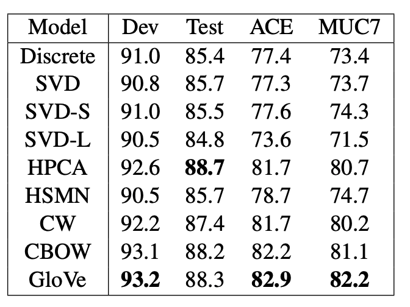

    Table 4: F1 score on NER task with 50d vectors. Discrete is the baseline without word vectors. We use publicly-available vectors for HPCA, HSMN, and CW. See text for deta

# 2. 共现矩阵 Co-occurrence Matrix 

## 2.1. 两种共现矩阵

### 2.1.1 Word- Document Matrix

**假设/猜想** 关联的单词会经常出现在同一个文章中。

**例子**🌰 

- "banks", "bonds", "stocks", "money", etc. 可能经常出现在同一个文章中；
-  "banks", "octopus", "banana", and "hockey"不大可能会连续出现。

**定义** $X  = \{X_{ij}\}$ 是一个word- document matrix：

1. 初始化X为一个$\mathbb{R}^{|V|\times M}$的0矩阵（$X_{ij} = 0$)，其中$|V|$是词汇量，M是文章数

2. 遍历所有文章，每当单词 $w_i$ 出现在文章j中，就$X_{ij}+= 1$ 

 **用途举例** general topics (all sports terms will have similar entries) leading to “Latent Semantic Analysis”

### 2.1.2 Window base co-occurence matrix

**Idea 💡** 计算每个单词在特定大小的窗口中出现的次数，得到$\mathbb{R}^{|V|\times |V|}$的共现矩阵

1. 与word2vec类似
2. 关注单词周围的某个window内的单词，获取一些语法和语义（syntactic and semantic）信息

**Notations** 

- $X$: word-word 的共现矩阵
- $X_{ij}$ = 单词 j 出现在单词 i 上下文的次数
- $X_i := \sum_{k}X_{ik}$ = 任意单词 k 出现在单词 i 的上下文的次数
- $P_{ij}:= P(w_j|w_i)=\frac{X_{ij}}{X_i}$ 是单词 j 出现在单词 i 上下文的概率

**例子🌰**

窗口长度为1，数据为以下句子

- I like deep learning

- I like NLP

- I enjoy flying

  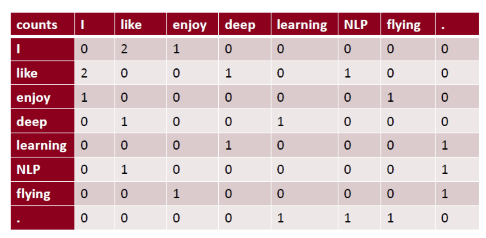

**缺点**

1. 矩阵维度经常发生变化（新单词，新语料库的增加）
2. 矩阵稀疏（很多单词不会共现）
3. 高维度 $\approx 10^6 \times 10^6$
4. 基于SVD的方法计算复杂度高（$m\times n$ 的矩阵计算SVD的复杂度是 $O(mn^2)$)
5. 需要在$X$上加入一些技巧来处理词频的极端不平衡

**部分解决方法**

- 忽略功能词，如"the","he","has"等
- 使用ramp window，即根据文档中单词之间的距离对共现计数进行加权(不懂，TODO)
- 使用 Pearson correlation并将负计数设置为0，而不是原始计数

## 2.2 怎么定义共现向量 （co-occurence vectors）

### 2.2.1 传统方法 Dimensionality Reduction on X 

#### 2.2.1.1 Idea 💡 

- 在一个固定的低维的稠密向量中，保存***大部分***重要信息

#### 2.2.1.2 构造方法

使用SVD方法将共现矩阵X分解为 $U\Sigma V^T$，其中$\Sigma$是特征值矩阵，U，V是对应于行和列的正交基。

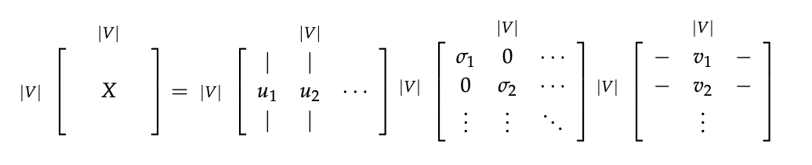

通过取前k个最大的特征值，对X进行降维。

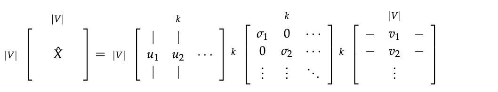

### 2.2.2 Hacks on X

- 在原始计数矩阵上，用SVD效果不好！
- 按比例调整计数对效果有很大提升-- **Scaling the counts**
  - Problem: 功能词（如"the","he","has"等）出现频率太高，导致对语法有太多影响
    - $\log(\text{frequencies})$
    - $\min(x,t),  \text{ with } t = 100$ ：对高频词（频次>t）设置固定频次
    - 忽略功能词
- 使用ramp window，即基于在文档中词与词之间的距离给共现计数加上一个权值[TODO]
- 使用 Pearson correlation并将负计数设置为0

**=> Idea 💡** 对计数进行处理是可以得到有效的词向量的

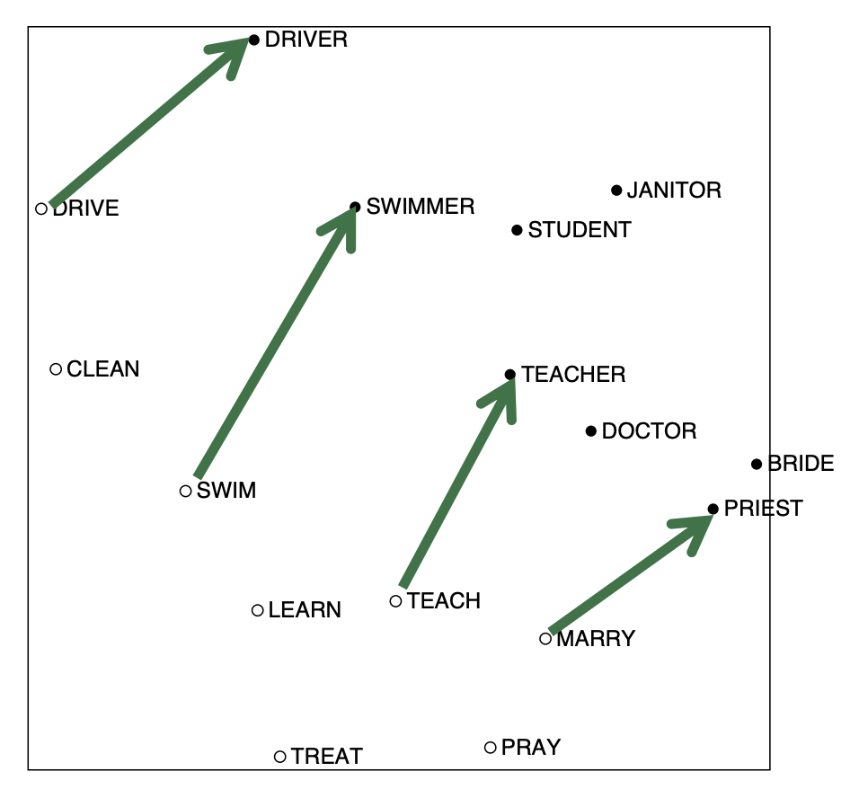

⚠️**Interesting semantic patterns emerge in the vectors**:

语义向量基本上是***线性***的，虽然有一些摆动，但是基本是存在动词和动词实施者的方向。

如果能够建立这样的“线性关系”，那么可以得到好的类比

### 2.2.3 总结&对比[TODO]

👈：基于计数的方法：使用整个矩阵的全局统计数据来直接估计

优点 ✅

- 训练非常迅速。 
- 能够有效的利用统计信息

缺点  ❎

- 主要用于获取词汇之间的相似性（其他任务表现差）
- 给定大量数据集，重要性与权重不成比例。

👉：基于预测的方法：定义概率分布并试图预测单词

优点 ✅

- 能够对其他任务有普遍的提高。 
- 能够捕捉到含词汇相似性外的复杂模式。

缺点  ❎

- 需要大量的数据集。
- 不能够充分利用统计信息。

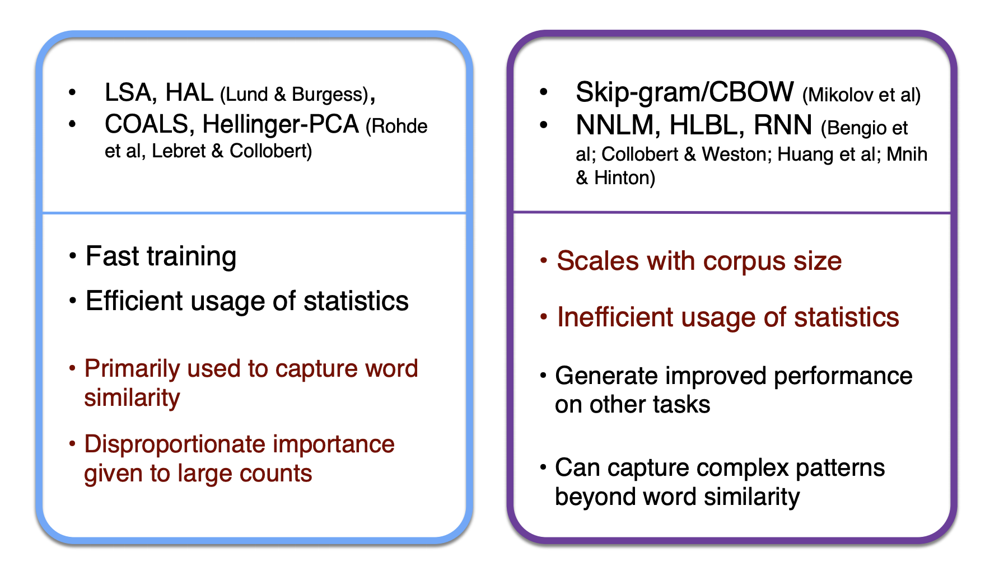

# 3 Glove

## 3.1 Idea

目标：把上述两种方法结合起来，用NN+某种计数矩阵

**Crucial Insight** Ratio of co-occurrence probablilities can encode meaning components

假定我们关心两个中心词，$w_i$ 和 $w_j$，我们通过给定不同的单词 $w_k$，研究他们共现的概率，来判定$w_i$ 和 $w_j$的关系。

下面，假定那么我们可以通过给定不同的单词$w_k$，研究

下面，我们想区分热力学上两种不同状态ice冰与蒸汽steam （$w_i=$ ice，$w_j=$ steam），它们之间的关系可通过与不同的单词 ![[公式]](https://www.zhihu.com/equation?tex=x) 的co-occurrence probability 的比值来描述：

- 例如对于x = solid，
  -  $P(\text{solid}|\text{ice})$ 与 $ P(\text{solid}|\text{steam})$  的值本身很小，不能透露有效的信息;
  - 它们的比值 $\frac{ P(\text{solid}|\text{ice})}{ P(\text{solid}|\text{steam})}$ 却较大
    - 因为solid更常用来描述ice的状态而不是steam的状态，所以在ice的上下文中出现几率较大，对于gas则恰恰相反
- 而对于x = water这种描述ice与steam均可，或者x = fashion这种与两者都没什么联系的单词，则比值接近于1。
- 所以相较于单纯的co-occurrence probability，实际上 **ratio** of co-occurrence probability更有意义。

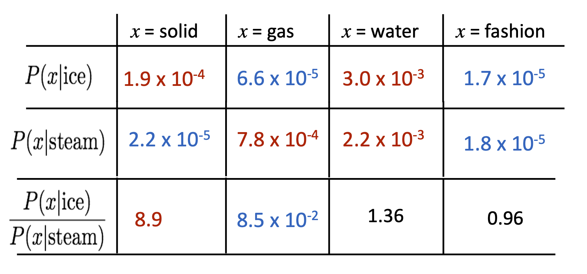

重点是Difference between  co- occurrence probabilities

[TODO]**希望 Ratio of co- occurrence probabilities TO BE linear!**

Encoding meaning components in vector differences

GloVe: • Using global statistics to predict the probability of word j appearing in the context of word i with a least squares objective

, GloVe consists of a weighted least squares model that trains on global word-word co-occurrence counts and thus makes efficient use of statistics. T

## 3.2 模型

**Question**: How can we capture ratios of co-occurrence probabilities as linear meaning components in a word vector space

**Answer**: Use a **Log-bilinear model**:
$$
w_i\cdot w_j = \log P(i|j)
$$
这样， vector differences就是
$$
w_x\cdot (w_a- w_b) = \log \frac{P(x|a)}{P(x|b)}
$$

## 3.3 目标函数

怎么得到的模型和目标函数（ref https://zhuanlan.zhihu.com/p/60208480）
$$
J = \sum_{i, j = 1}^{V} f(X_{ij})\left(w_i^T \tilde{w}_j+b_i+\tilde{b}_j-\log X_{ij}\right)^2
$$

**“简化假设做back-of-envelope计算合理推断”**

基于对于以上概率比值的观察，我们假设模型的函数有如下形式：

![[公式]](https://www.zhihu.com/equation?tex=F%28w_i%2Cw_j%2C%5Ctilde+w_k%29+%3D+%5Cfrac%7BP_%7Bik%7D%7D%7BP_%7Bjk%7D%7D)

其中， ![[公式]](https://www.zhihu.com/equation?tex=%5Ctilde%7Bw%7D) 代表了context vector，如上例中的solid，gas，water，fashion等。 ![[公式]](https://www.zhihu.com/equation?tex=w_i%2Cw_j) 则是我们要比较的两个词汇，如上例中的ice，steam。

![[公式]](https://www.zhihu.com/equation?tex=F)的可选的形式过多，我们希望有所限定。首先我们希望的是 ![[公式]](https://www.zhihu.com/equation?tex=F) 能有效的在单词向量空间内表示概率比值，由于向量空间是线性空间，一个自然的假设是 ![[公式]](https://www.zhihu.com/equation?tex=F) 是关于向量 ![[公式]](https://www.zhihu.com/equation?tex=w_i%2Cw_j) 的差的形式：

![[公式]](https://www.zhihu.com/equation?tex=F%28w_i-w_j%2C%5Ctilde+w_k%29+%3D+%5Cfrac%7BP_%7Bik%7D%7D%7BP_%7Bjk%7D%7D)

等式右边为标量形式，左边如何操作能将矢量转化为标量形式呢？一个自然的选择是矢量的点乘形式：

![[公式]](https://www.zhihu.com/equation?tex=F%28%28w_i-w_j%29%5ET%5Ctilde+w_k%29+%3D+%5Cfrac%7BP_%7Bik%7D%7D%7BP_%7Bjk%7D%7D)

在此，作者又对其进行了对称性分析，即对于word-word co-occurrence，将向量划分为center word还是context word的选择是不重要的，即我们在交换 ![[公式]](https://www.zhihu.com/equation?tex=w%5Cleftrightarrow+%5Ctilde+w) 与 ![[公式]](https://www.zhihu.com/equation?tex=X%5Cleftrightarrow+X%5ET) 的时候该式仍然成立。如何保证这种对称性呢？

我们分两步来进行，

- 首先要求满足 ![[公式]](https://www.zhihu.com/equation?tex=F%28%28w_i-w_j%29%5ET%5Ctilde+w_k%29+%3D+%5Cfrac%7BF%28w_i%5ET%5Ctilde+w_k%29%7D%7BF%28w_j%5ET%5Ctilde+w_k%29%7D) ，该方程的解为 ![[公式]](https://www.zhihu.com/equation?tex=F%3Dexp) 

- 同时与 ![[公式]](https://www.zhihu.com/equation?tex=F%28%28w_i-w_j%29%5ET%5Ctilde+w_k%29+%3D+%5Cfrac%7BP_%7Bik%7D%7D%7BP_%7Bjk%7D%7D) 相比较有 ![[公式]](https://www.zhihu.com/equation?tex=F%28w_i%5ET%5Ctilde+w_k%29%3DP_%7Bik%7D%3D%5Cfrac%7BX_%7Bik%7D%7D%7BX_i%7D)所以， ![[公式]](https://www.zhihu.com/equation?tex=w_i%5ET%5Ctilde+w_k+%3D+log%28P_%7Bik%7D%29+%3D+log%28X_%7Bik%7D%29-log%28X_i%29)

注意其中 ![[公式]](https://www.zhihu.com/equation?tex=log%28X_i%29) 破坏了交换 ![[公式]](https://www.zhihu.com/equation?tex=w%5Cleftrightarrow+%5Ctilde+w) 与 ![[公式]](https://www.zhihu.com/equation?tex=X%5Cleftrightarrow+X%5ET) 时的对称性，但是这一项并不依赖于 ![[公式]](https://www.zhihu.com/equation?tex=k) ，所以我们可以将其融合进关于 ![[公式]](https://www.zhihu.com/equation?tex=w_i) 的bias项 ![[公式]](https://www.zhihu.com/equation?tex=b_i) ，第二部就是为了平衡对称性，我们再加入关于 ![[公式]](https://www.zhihu.com/equation?tex=%5Ctilde+w_k) 的bias项 ![[公式]](https://www.zhihu.com/equation?tex=%5Ctilde+b_k) ，我们就可以得到 ![[公式]](https://www.zhihu.com/equation?tex=w_i%5ET%5Ctilde+w_k+%2B+b_i+%2B+%5Ctilde+b_k+%3D+log%28X_%7Bik%7D%29) 的形式。

另一方面作者注意到模型的一个缺点是对于所有的co-occurence的权重是一样的，即使是那些较少发生的co-occurrence。作者认为这些可能是噪声，所以他加入了前面的 ![[公式]](https://www.zhihu.com/equation?tex=f%28X_%7Bij%7D%29) 项来做weighted least squares regression模型，即为

![[公式]](https://www.zhihu.com/equation?tex=J%3D%5Csum_%7Bi%2Cj%3D1%7D%5EVf%28X_%7Bij%7D%29%28w_i%5ET%5Ctilde+w_j+%2B+b_i+%2B+%5Ctilde+b_j+-logX_%7Bij%7D%29%5E2) 的形式。

其中权重项 ![[公式]](https://www.zhihu.com/equation?tex=f) 需满足一下条件：

1. ![[公式]](https://www.zhihu.com/equation?tex=f%280%29%3D0) ，因为要求 ![[公式]](https://www.zhihu.com/equation?tex=lim_%7Bx%5Crightarrow+0%7Df%28x%29log%5E2x) 是有限的。

2. 较少发生的co-occurrence所占比重较小。

3. 对于较多发生的co-occurrence， ![[公式]](https://www.zhihu.com/equation?tex=f%28x%29) 也不能过大。

   

   

## 2.4 模型结果

### 2.4.1 Nearest words

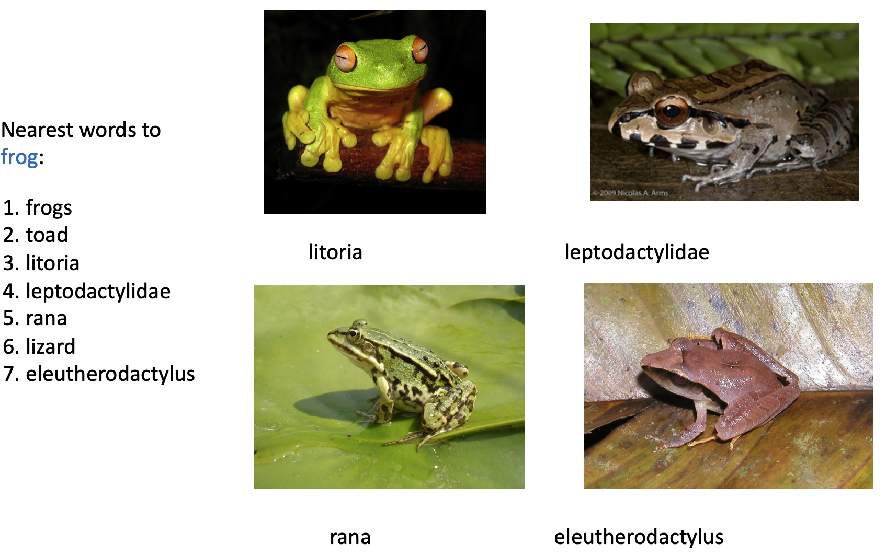

### 2.4.2 Visualizations

#### 2.4.2.1 Women -- man

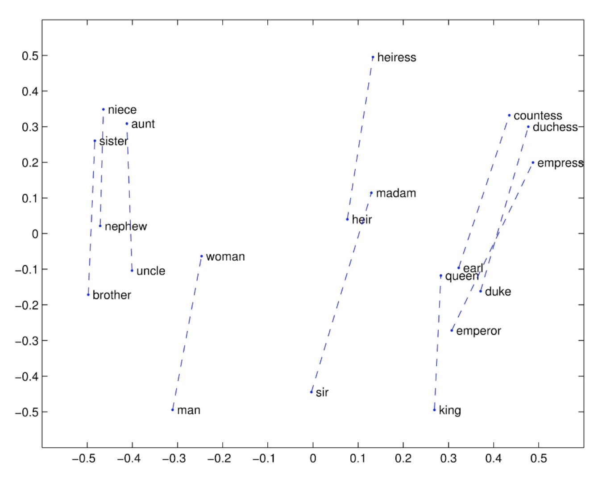

#### 2.4.2.2 Company-CEO

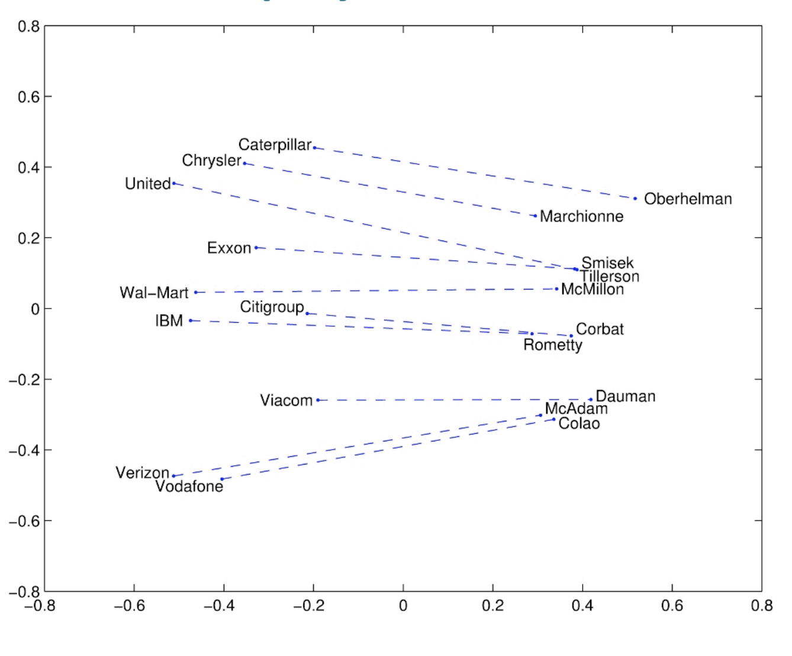

#### 2.4.2.3 Comparatives and Superlatives

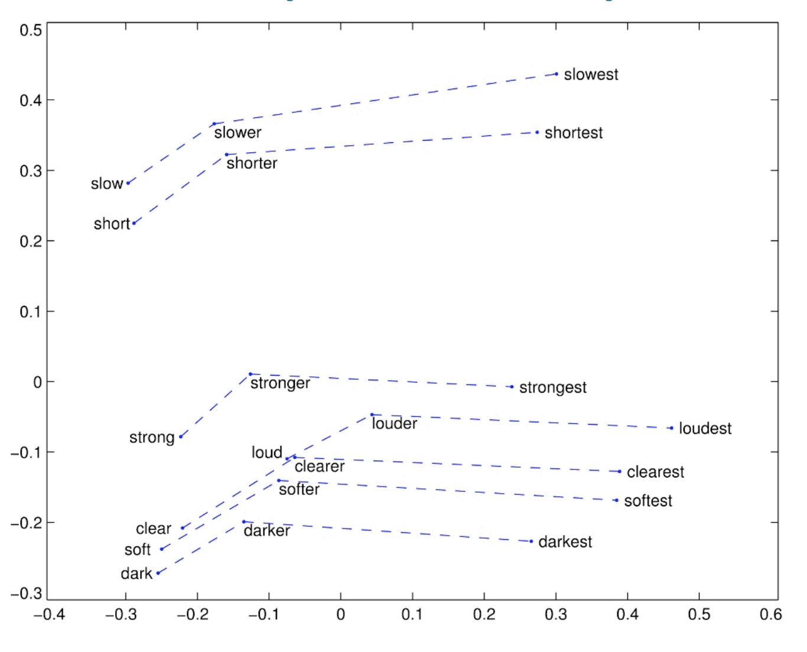

## 2.5 与其他模型对比

### 2.5.1 Word analogy task

#### 2.5.1.1 Task描述

Questions in the task like, 

>  “a is to b as c is to __ ?”

The dataset contains 19,544 such questions,

- a semantic subset 
  - about people or places
  - 🌰 “Athens is to Greece as Berlin is to __?”
- a syntactic subset
  - verb tenses or forms of adjectives,
  - 🌰  “dance is to dancing as fly is to __ ?”

模型通过找到满足下面条件的单词d，回答问题  “a is to b as c is to __ ?”

- $w_d$ 是cosine similarity 下，距离$w_b-w_a+w_c$ 最近的单词

#### 2.5.1.2 Accuracy结果比较 

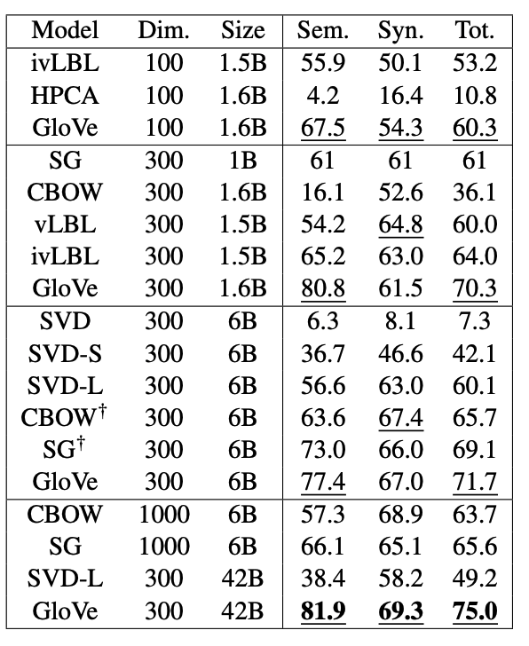

- Results= percent accuracy. 
- <u>Underlined scores</u> = best within groups of similarly-sized models;
- **Bold scores** are best overall. 
- HPCA vectors are publicly available
  - vLBL results are from (Mnih et al., 2013)
  - skip-gram (SG) and CBOW results are from (Mikolov et al., 2013a,b); 
  - we trained SG† and CBOW† using the word2vec tool
- Glove 表现最好；
- SVD表现不好，但对count进行操作后的SVD-L效果显著提高
- dim 增加，效果更好；

#### 2.5.1.3 Glove的参数

##### a. Dimension & window size

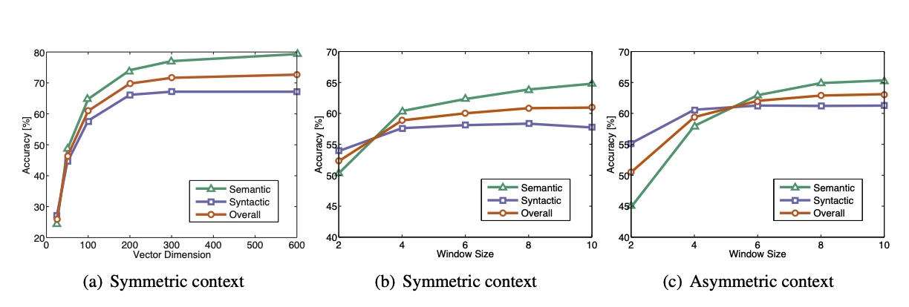 

- Good dimension is ~300
- Semantic效果随window size增加而提升
- asymmetric(用one-side window)效果不好

##### b. More training time helps

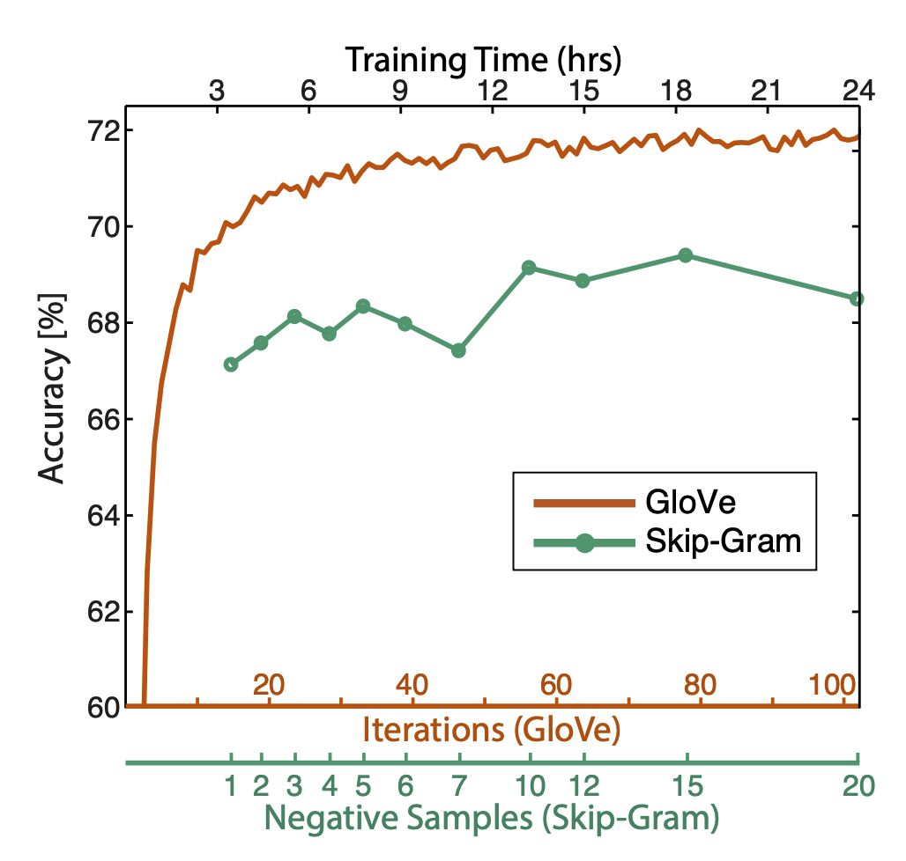  More training time helps

##### c. Wikipedia is better than news text!

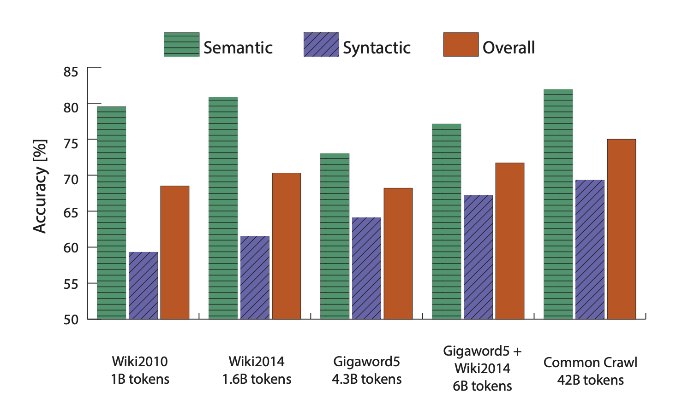 

- More data helps
- Wikipedia is better than news text!
  - Wikipedia 本身包含各种“关系”
- [Common Crawl]

### 2.5.2 Word similarity task

#### 2.5.2.1 Task描述

Word vector distances and their correlation with human judgments

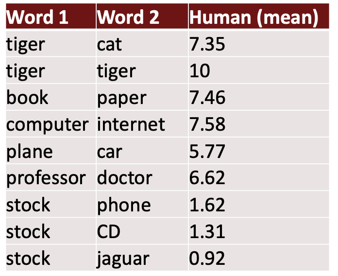

**例子**🌰

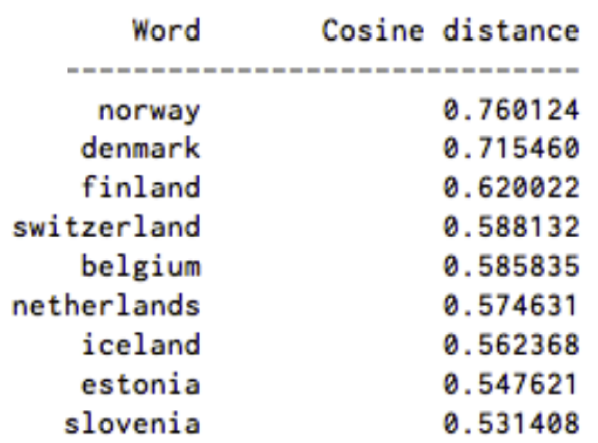

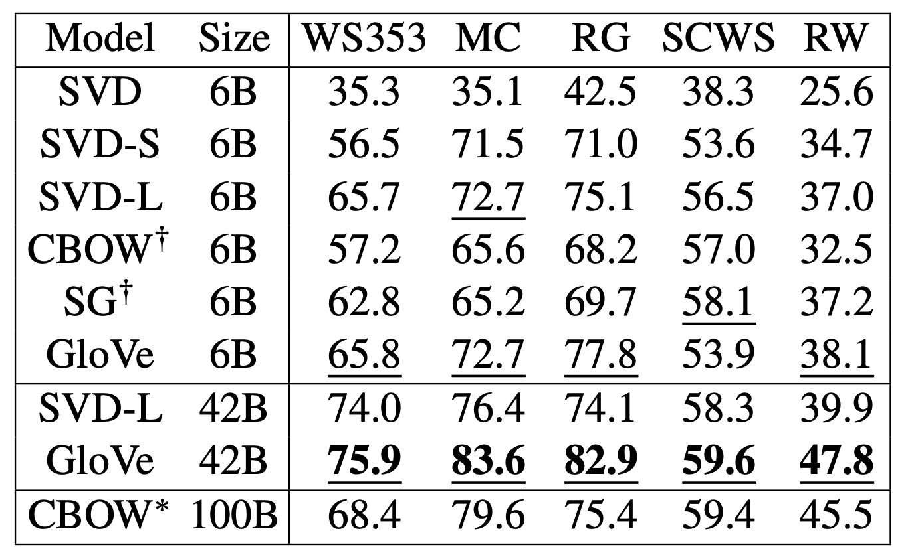Table 3: Spearman rank correlation on word similarity tasks. All vectors are 300-dimensional. The CBOW∗ vectors are from the word2vec website and differ in that they contain phrase vectors.

Table 3 shows results on five different word similarity datasets. A similarity score is obtained from the word vectors by first normalizing each feature across the vocabulary and then calculating the cosine similarity. We compute Spearman’s rank correlation coefficient between this score and the human judgments. CBOW∗ denotes the vectors available on the word2vec website that are trained with word and phrase vectors on 100B words of news data. GloVe outperforms it while using a corpus less than half the size. Table 4 shows results on the NER task

# 语义和歧义 

- Word senses and word senses ambiguity

**Most words have lots of meanings!**

- Especially common words 
- Especially words that have existed for a long time 

**Question**  Does one vector capture all these meanings or do we have a mess?

**Example**: pike

- A sharp point or staff 
- A type of elongated fish 
- A railroad line or system 
- A type of road
- The future (coming down the pike)
- A type of body position (as in diving) 
- To kill or pierce with a pike 
- To make one’s way (pike along) 
- In Australian English, pike means to pull out from doing something: I reckon he could have climbed that cliff, but he piked!

**Solution** 用pseudo word Improving Word Representations Via Global Context And Multiple Word Prototypes

**Idea**💡: Cluster word windows around words, retrain with each word assigned to multiple different clusters bank1, bank2, etc 

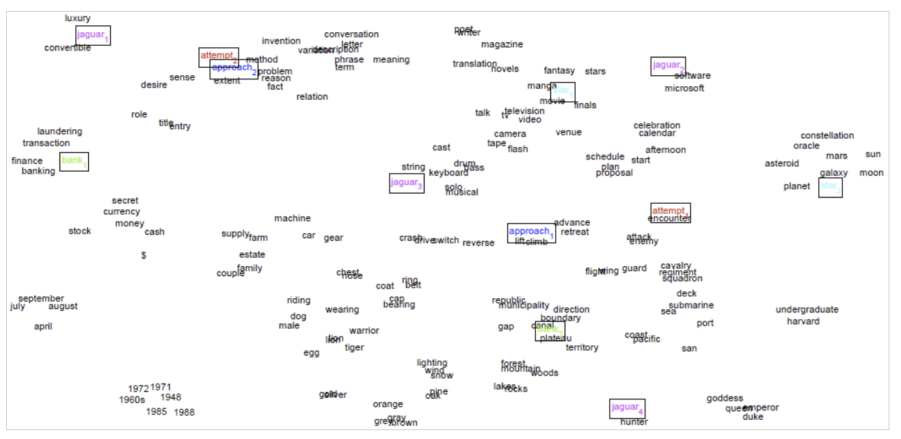

如上图中桃红色单词jaguar: jaguar1,...,jaguar4

**Problem** 大部分情况下，词义之前的区分不明显！很多单词的词意是相关或者overlap的

**Anthoter Solution** Linear Algebraic Structure of Word Senses, with Applications to Polysemy 

- Different senses of a word reside in a linear superposition (weighted sum) in standard word embeddings like word2vec 

- $$
  v_{\text{pike}} = \alpha_1v_{\text{pike}_1}+\alpha_2v_{\text{pike}_2}+\alpha_3v_{\text{pike}_3}
  $$

-  其中$\alpha_1 = \frac{f_1}{f_1+f_2+f_3}$，for frequency f

- **result** Because of ideas from sparse coding you can actually seperate out the sense 

-  [TODO]怎么区分不同含义的单词

- 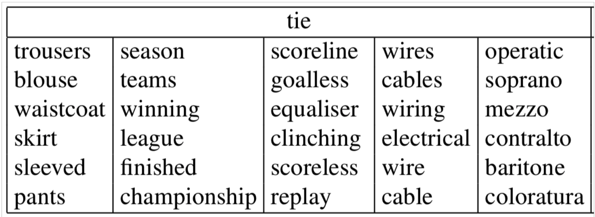

