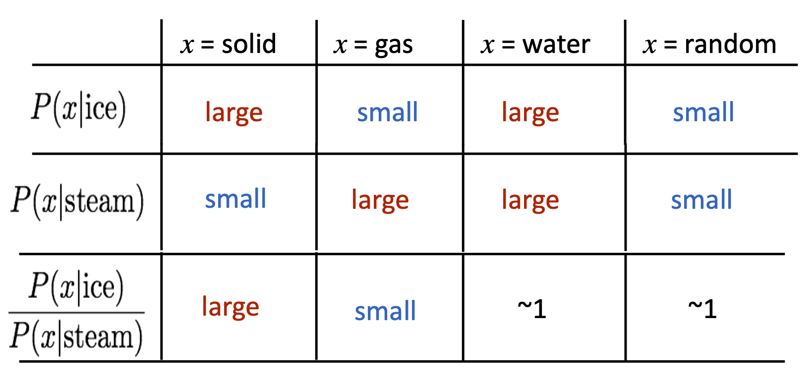

# 3. How to evaluate word vectors

## 3.1 概述

**Answer** Intrinsic vs. extrinsic 内在与外在

- Intrinsic:
  - Evaluation on a specific/intermediate **subtask**
  - Fast to compute 
  - Helps to understand that system 
  - Not clear if really helpful unless correlation to real task is established 
- Extrinsic: 
  - Evaluation on a real task
  - Can take a long time to compute accuracy
  - Unclear if the subsystem is the problem or its interaction or other subsystems 
  - If replacing exactly one subsystem with another improves accuracy -> Winning!

## 3.2 Intrinsic word vector evaluation

### 3.2.1 Word Vector Analogies

dea 💡** Evaluate word vectors by how well their cosine distance after addition captures intuitive semantic and syntactic analogy questions （余弦距离能多好的捕捉到语义和句法类比问题）

- 要从搜索中去掉input单词
- **Problem** 如果信息非线性，怎么办？[TODO]

## 3.3 Extrinsic word vector evaluation

- One example where good word vectors should help directly: **named entity recognition**

  - identifying references to a person, organization or location 

    

    

    Table 4: F1 score on NER task with 50d vectors. Discrete is the baseline without word vectors. We use publicly-available vectors for HPCA, HSMN, and CW. See text for deta

# 1. 共现矩阵 Co-occurrence Matrix 

## 1.1. 两种共现矩阵

### 1.1.1 Word- Document Matrix

**假设/猜想** 关联的单词会经常出现在同一个文章中。

**例子**🌰 

- "banks", "bonds", "stocks", "money", etc. 可能经常出现在同一个文章中；
-  "banks", "octopus", "banana", and "hockey"不大可能会连续出现。

**定义** $X  = \{X_{ij}\}$ 是一个word- document matrix：

1. 初始化X为一个$\mathbb{R}^{|V|\times M}$的0矩阵（$X_{ij} = 0$)，其中$|V|$是词汇量，M是文章数

2. 遍历所有文章，每当单词 $w_i$ 出现在文章j中，就$X_{ij}+= 1$ 

 **用途举例** general topics (all sports terms will have similar entries) leading to “Latent Semantic Analysis”

### 1.1.2 Window base co-occurence matrix

**Idea 💡** 计算每个单词在特定大小的窗口中出现的次数，得到$\mathbb{R}^{|V|\times |V|}$的共现矩阵

1. 与word2vec类似
2. 关注单词周围的某个window内的单词，获取一些语法和语义（syntactic and semantic）信息

**例子🌰**

窗口长度为1，数据为以下句子

- I like deep learning

- I like NLP

- I enjoy flying

  

**缺点**

1. 矩阵维度经常发生变化（新单词，新语料库的增加）
2. 矩阵稀疏（很多单词不会共现）
3. 高维度 $\approx 10^6 \times 10^6$
4. 基于SVD的方法计算复杂度高（$m\times n$ 的矩阵计算SVD的复杂度是 $O(mn^2)$)
5. 需要在$X$上加入一些技巧来处理词频的极端不平衡

**部分解决方法**

- 忽略功能次，如"the","he","has"等
- 使用ramp window，即根据文档中单词之间的距离对共现计数进行加权(不懂，TODO)
- 使用 Pearson correlation并将负计数设置为0，而不是原始计数

## 1.2 怎么定义共现向量 （co-occurence vectors）

### 1.2.1 传统方法 Dimensionality Reduction on X 

#### 1.2.1.1 Idea 💡 

- 在一个固定的低维的稠密向量中，保存***大部分***重要信息

#### 1.2.1.2 构造方法

使用SVD方法将共现矩阵X分解为 $U\Sigma V^T$，其中$\Sigma$是特征值矩阵，U，V是对应于行和列的正交基。

通过取前k个最大的特征值，对X进行降维。

### 1.2.2 Hacks on X

- 在原始计数矩阵上，用SVD效果不好！
- 按比例调整计数对效果有很大提升-- **Scaling the counts**
  - Problem: 功能词（如"the","he","has"等）出现频率太高，导致对语法有太多影响
    - $\log(\text{frequencies})$
    - $\min(x,t),  \text{ with } t = 100$ ：对高频词（频次>t）设置固定频次
    - 忽略功能词
- 使用ramp window，即基于在文档中词与词之间的距离给共现计数加上一个权值
- 使用 Pearson correlation并将负计数设置为0

**=> Idea 💡** 对计数进行处理是可以得到有效的词向量的

⚠️**Interesting semantic patterns emerge in the vectors**:

语义向量基本上是***线性***的，虽然有一些摆动，但是基本是存在动词和动词实施者的方向。

如果能够建立这样的“线性关系”，那么可以得到好的类比

### 1.2.3 总结&对比

👈：基于计数的方法：使用整个矩阵的全局统计数据来直接估计

👉：基于预测的方法：定义概率分布并试图预测单词

# 

# 2 Glove

## 2.1 Idea

目标：把上述两种方法结合起来，用NN+某种计数矩阵

**Crucial Insight** Ratio of co-occurrence probablilities can encode meaning components

重点是Difference between  co- occurrence probabilities

[TODO]**希望 Ratio of co- occurrence probabilities TO BE linear!**

Encoding meaning components in vector differences

## 2.2 模型

**Question**: How can we capture ratios of co-occurrence probabilities as linear meaning components in a word vector space

**Answer**: Use a **Log-bilinear model**:
$$
w_i\cdot w_j = \log P(i|j)
$$
这样， vector differences就是
$$
w_x\cdot (w_a- w_b) = \log \frac{P(x|a)}{P(x|b)}
$$

## 2.3 目标函数

[TODO]怎么得到的（ref https://zhuanlan.zhihu.com/p/60208480）
$$
J = \sum_{i, j = 1}^{V} f(X_{ij})\left(w_i^T \tilde{w}_j+b_i+\tilde{b}_j-\log X_{ij}\right)^2
$$

- Bias term 如果word common

## 2.4 模型结果

### 2.4.1 Nearest words

### 2.4.2 Visualizations

#### 2.4.2.1 Women -- man

#### 2.4.2.2 Company-CEO

#### 2.4.2.3 Comparatives and Superlatives

## 2.5 与其他模型对比

### 2.5.1 Word analogy task

#### 2.5.1.1 Task描述

Questions in the task like, 

>  “a is to b as c is to __ ?”

The dataset contains 19,544 such questions,

- a semantic subset 
  - about people or places
  - 🌰 “Athens is to Greece as Berlin is to __?”
- a syntactic subset
  - verb tenses or forms of adjectives,
  - 🌰  “dance is to dancing as fly is to __ ?”

模型通过找到满足下面条件的单词d，回答问题  “a is to b as c is to __ ?”

- $w_d$ 是cosine similarity 下，距离$w_b-w_a+w_c$ 最近的单词

#### 2.5.1.2 Accuracy结果比较 

- Results= percent accuracy. 
- <u>Underlined scores</u> = best within groups of similarly-sized models;
- **Bold scores** are best overall. 
- HPCA vectors are publicly available
  - vLBL results are from (Mnih et al., 2013)
  - skip-gram (SG) and CBOW results are from (Mikolov et al., 2013a,b); 
  - we trained SG† and CBOW† using the word2vec tool
- Glove 表现最好；
- SVD表现不好，但对count进行操作后的SVD-L效果显著提高
- dim 增加，效果更好；

#### 2.5.1.3 Glove的参数

##### a. Dimension & window size

 

- Good dimension is ~300
- Semantic效果随window size增加而提升
- asymmetric(用one-side window)效果不好

##### b. More training time helps

  More training time helps

##### c. Wikipedia is better than news text!

 

- More data helps
- Wikipedia is better than news text!
  - Wikipedia 本身包含各种“关系”
- 

### 2.5.2 Word similarity task

#### 2.5.2.1 Task描述

Word vector distances and their correlation with human judgments

**例子**🌰

Table 3: Spearman rank correlation on word similarity tasks. All vectors are 300-dimensional. The CBOW∗ vectors are from the word2vec website and differ in that they contain phrase vectors.

Table 3 shows results on five different word similarity datasets. A similarity score is obtained from the word vectors by first normalizing each feature across the vocabulary and then calculating the cosine similarity. We compute Spearman’s rank correlation coefficient between this score and the human judgments. CBOW∗ denotes the vectors available on the word2vec website that are trained with word and phrase vectors on 100B words of news data. GloVe outperforms it while using a corpus less than half the size. Table 4 shows results on the NER task

# 语义和歧义 

- Word senses and word senses ambiguity

**Most words have lots of meanings!**

- Especially common words 
- Especially words that have existed for a long time 

**Question**  Does one vector capture all these meanings or do we have a mess?

**Example**: pike

- A sharp point or staff 
- A type of elongated fish 
- A railroad line or system 
- A type of road
- The future (coming down the pike)
- A type of body position (as in diving) 
- To kill or pierce with a pike 
- To make one’s way (pike along) 
- In Australian English, pike means to pull out from doing something: I reckon he could have climbed that cliff, but he piked!

**Solution** 用pseudo word Improving Word Representations Via Global Context And Multiple Word Prototypes

**Idea**💡: Cluster word windows around words, retrain with each word assigned to multiple different clusters bank1, bank2, etc 

如上图中桃红色单词jaguar: jaguar1,...,jaguar4

**Problem** 大部分情况下，词义之前的区分不明显！很多单词的词意是相关或者overlap的

**Anthoter Solution** Linear Algebraic Structure of Word Senses, with Applications to Polysemy 

- Different senses of a word reside in a linear superposition (weighted sum) in standard word embeddings like word2vec 

- $$
  v_{\text{pike}} = \alpha_1v_{\text{pike}_1}+\alpha_2v_{\text{pike}_2}+\alpha_3v_{\text{pike}_3}
  $$

-  其中$\alpha_1 = \frac{f_1}{f_1+f_2+f_3}$，for frequency f

- **result** Because of ideas from sparse coding you can actually seperate out the sense 

-  [TODO]

- 

