## Sequnce to sequence model

# 1. Machine Translation

## 1.1 Definition 

- **Machine Translation (MT)** is the task of translating a sentence x from one language (the **source language**) to a sentence y in another language (the **target language**).

- Example:

## 1.2 History

### 1.2.1 

### 1.2.2 1990s-2010s: Statistical MT

**Question** How to learn translation model $P(x|y)$

**Ans**: 1. need large amount of **parallel data**

**Question** How to learn translation model $P(x|y)$​ from the parallel corpus?

**Ans**: Learn $P(x, a|y)$, where a is the **alignment**.  i.e. word-level correspondence between source sentence x and target sentence y

  #### Alignment

Alignment is the **correspondence between particular words** in the translated sentence pair. 

- **Typological differences** between languages lead to complicated alignments! 
- 
- Note: Some words have no counterpart

**Question**: How to compute this argmax?

### 1.2.3 Neural Machine Translation

- **Neural Machine Translation (NMT)** is a way to do Machine Translation with a single end-to-end neural network 
- The neural network architecture is called a **sequence-to-sequence** model (aka **seq2seq**) and it involves **two RNNs**

Language model：

$x^{<2>} := \hat{y}^{<1>}$

1. 

- encoder network: RNN
- decoder network

# Seq2seq Model

- The sequence-to-sequence model is an example of a **Conditional Language Model**
  - **Language Model** because the decoder is predicting the next word of the target sentence y 
  - **Conditional** because its predictions are also conditioned on the source sentence x

### Training a Neural Machine Translation system

 

## How to train

### X.1 Greedy decoding

**Problems** with greedy decoding: Greedy decoding has **no way to undo decisions**! 

### X.2 Beam search decoding

**Core idea**: On each step of decoder, keep track of the **k most probable** partial translations (which we call **hypotheses**)

- k is the beam size (in practice around 5 to 10)

A hypothesis $y_1, ..., y_t$​​ has a **score** which is its log probability:[TODO]

- $$
  \text{score}(y_1, ...y_t) = \log P_{\text{LM}}
  $$

  

- Beam search is not guaranteed to find optimal solution • But much more efficient than exhaustive search!

#### Example

#### Stop criterion

In beam search decoding, different hypotheses may produce `<END>`  tokens on **different timesteps** 

-  When a hypothesis produces , that hypothesis is complete.
- Place it aside and continue exploring other hypotheses via beam search.

Usually we continue beam search until: 

- We reach timestep T (where T is some pre-defined cutoff), or

- We have at least n completed hypotheses (where n is pre-defined cutoff)

#### How to select top one with highest score?

- **Problem** with the highest score:

  - $$
    分数 score(y_1,....,y_t)
    $$

  -  **longer hypotheses have lower scores**

  

- 

- Fix: **Normalize by length** :

  - $$
    TODO
    $$

- 

## Advantage of NMT 

compared to SMT

- Better **performance**
  - More **fluent**
  - Better use of **context**
  - Better use of **phrase similarities**
- A **single neural network** to be optimized end-to-end 
  - No subcomponents to be individually optimized
- Requires much **less human engineering effort**
  - No feature engineering
  - Same method for all language pairs

## Disadvantage of NMT 

- NMT is **less interpretable**
  - Hard to debug 
- NMT is **difficult to control**
  - For example, can’t easily specify rules or guidelines for translation
  - Safety concerns!

### MT Evaluation : BLEU

- BLEU = Bilingual Evaluation Understudy)

- BLEU compares the <u>machine-written translation</u> to one or several <u>human-written translation(s)</u>, and computes a **similarity score** based on: 
  - n-gram precision (usually for 1, 2, 3 and 4-grams)
  - Plus a penalty for too-short system translations
- BLEU is **useful** but **imperfect**
  - There are many valid ways to translate a sentence 
  - So a good translation can get a poor BLEU score because it has low n-gram overlap with the human translation

### Difficulties remain

- **Out-of-vocabulary** words
- **Domain mismatch** between train and test data
- Maintaining **context** over longer text
- **Low-resource** language pairs 
- Failures to accurately capture **sentence meaning**
- **Pronoun** (or **zero pronoun**) **resolution** errors
- **Morphological agreement** errors

- Using **common sense** is still hard
- NMT picks up **biases** in training data

- **Uninterpretable** systems do **strange things**
- 

[TODO]解释 [ref](https://www.skynettoday.com/briefs/google-nmt-prophecies)

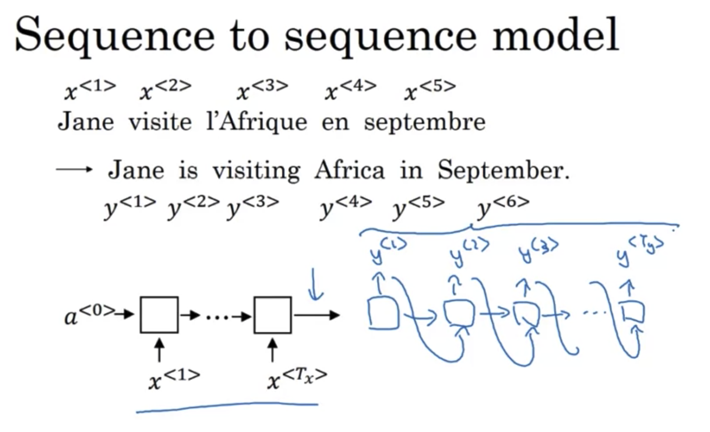

### Image captioning

- encoder network: CNN,encode the image to a 4096 dimension vector
- decoder: RNN
- 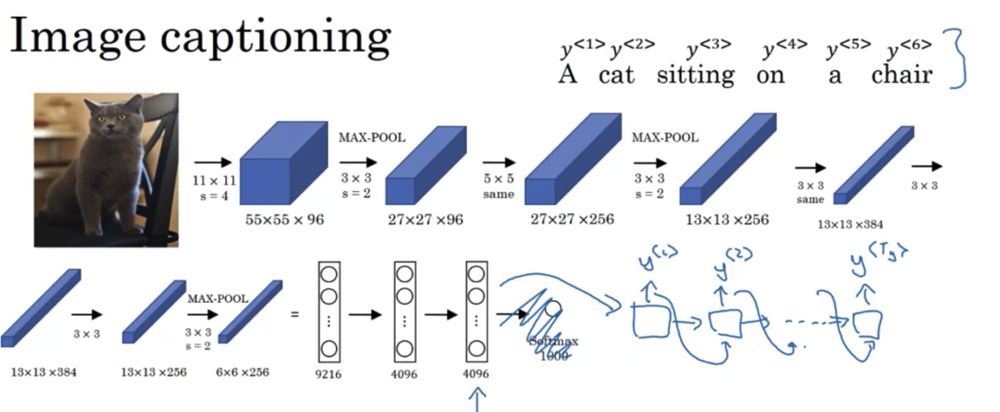

 Diffence vs pre NLP tasks: Don't want to randomly choose a word/in caption

## Picking the Most Likely Sentence

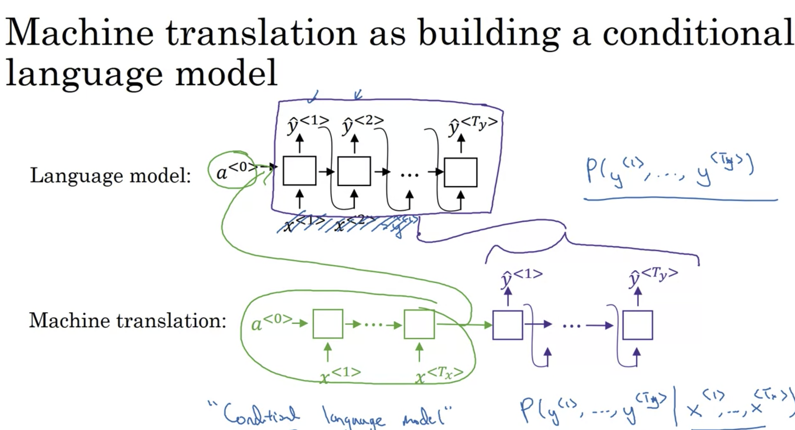

 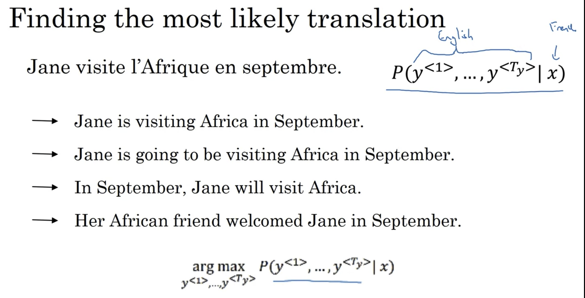

注意：区别于之前，这里不能“random choose“，因为会造成上面的多种翻译，且翻译质量不定，有好（1st) 有坏(4th)

=》 Algroithm to find a y maximize the P(y|x) x=French sentence 

- Beam search 常用算法
- 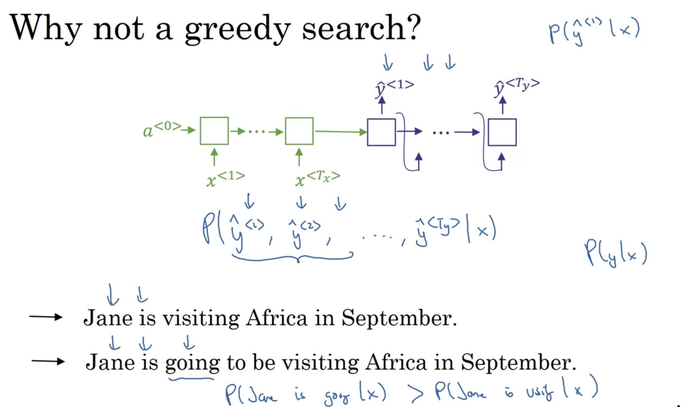

- 第一句翻译更好（第二句有过多冗余单词）

- 但是，用greedy search，假设已经有了前两个是"Jane is"
  - going 比visiting常见
  - P(Jane is going| x) > P(Jane is visiting | x)
  - 于是，greedy search会选择第二句 

- Why search directly? 为什么不遍历直接找max
  - 数量级太大！
  - 一个100K的单词表，10个word的句子有$10^{100K}$ 种选择，遍历太慢

## Beam search 

### 1. algorithm

1. Step 1 pick the first word
   - 有参数：beam width = k，选前k个最可能的单词 

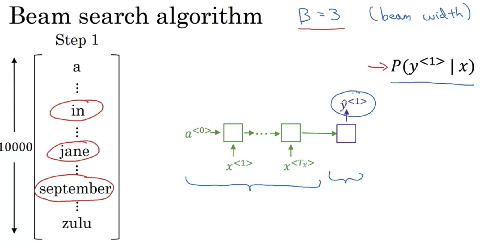

2. Step 2 对每一个可能的first word，选取最可能的second word

   - 这样，选择最有可能的(first word, second word) pair
     - $P(y^{<1>},y^{<2>}|x) = P(y^{<1>}|x)P(y^{<2>}|x,y^{<1>})$
   - 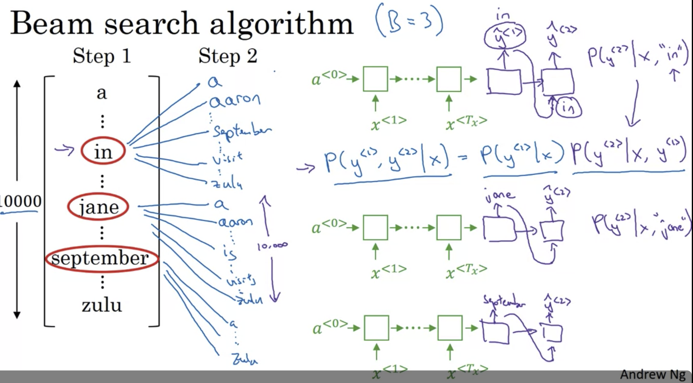

   -  最终要算 3 X 10,000 possibilities，然后选top3
   - 假设最终得到的top 3是 
     - in September
     - jane is 
     - jane visits
     - Reject "september" as 1st word

3. Step 3 

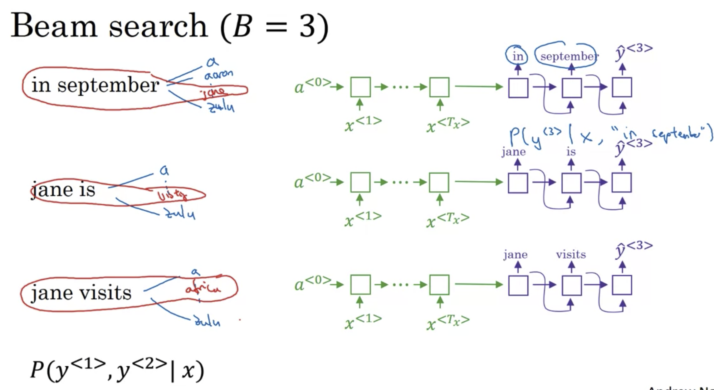

=> jane visits africa in september. <EOS>

- B = 1 => gready search
- 合理范围 B = 10

### 2. Refinements to Beam Search

1. log

   1. 因为P很小，所以连乘会很接近0，有computational问题，所以取log
   2. 

2. Length normalization 

   1. 因为连乘 <1的数字，对长句子不公平，所以做normalization

      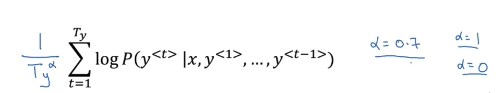

3. Beam width B?
   1. large B: better result, but slower
   2. small B: worse result, but faster

4. Compared with DFS, BFS, beam Search runs faster but is not guaranteed to find exact max for arg max P(y|x)

### 3. Error anaylsis 

Example: 下面翻译的不好，但是模型是由RNN和Beam Search两部分组成，问是哪一部分造成的错误

- 因为Beam search设置的beam可能太小的；
- 

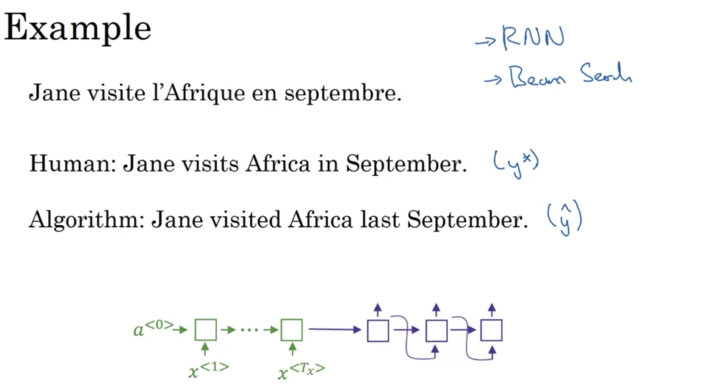

比较 $P(y^*|x)$ 和 $P(\hat{y}|x)$

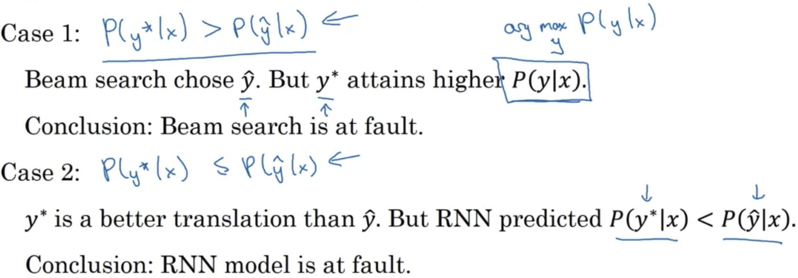

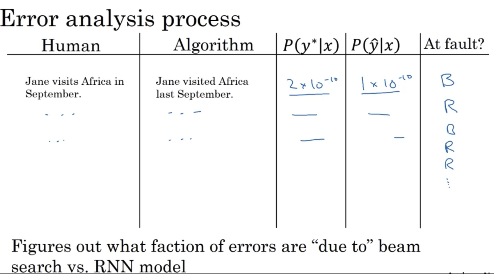

### 4. Bleu Score- 怎么从多个好的翻译中选择

Bleu = bilingual evaluation understudy

### unigram

precision = MT output中出现在reference的单词数/MT output的总单词书

（the 出现在reference 1/2中，所以分子= 7）

modified precision = MT output中重复出现的单词，只能拿到reference中该单词出现次数的credit（the 中reference 1 中出现2次，reference2中出现2次，所以分子 = 2)

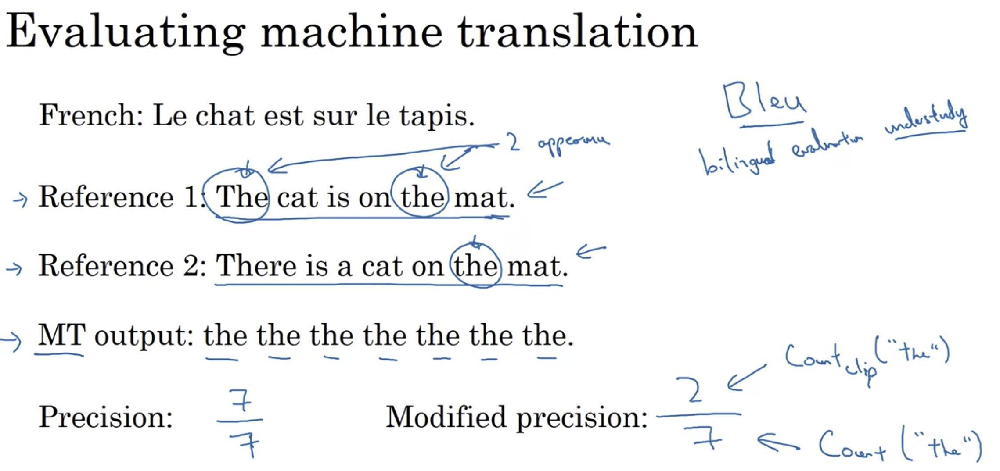 

#### Bigram

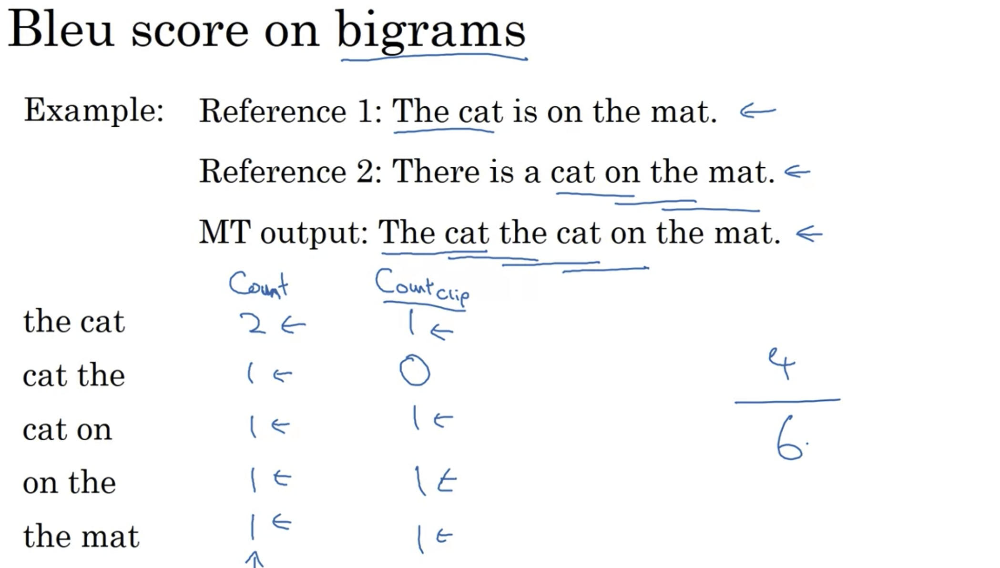

#### n-gram

如果MT output = 某个reference，则 P1,P2 = 1.0

#### details

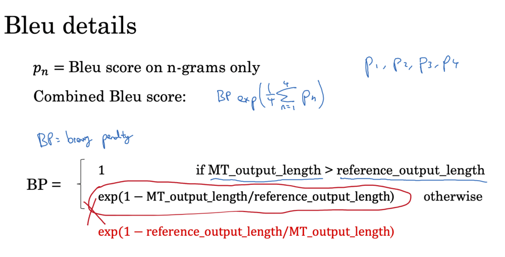BP= brevity penalty: 因为之前的定义，短句子会有更高的precision，但实际翻译并不希望句子过短，所以添加BP

## Attention model

### The problem of long sequences

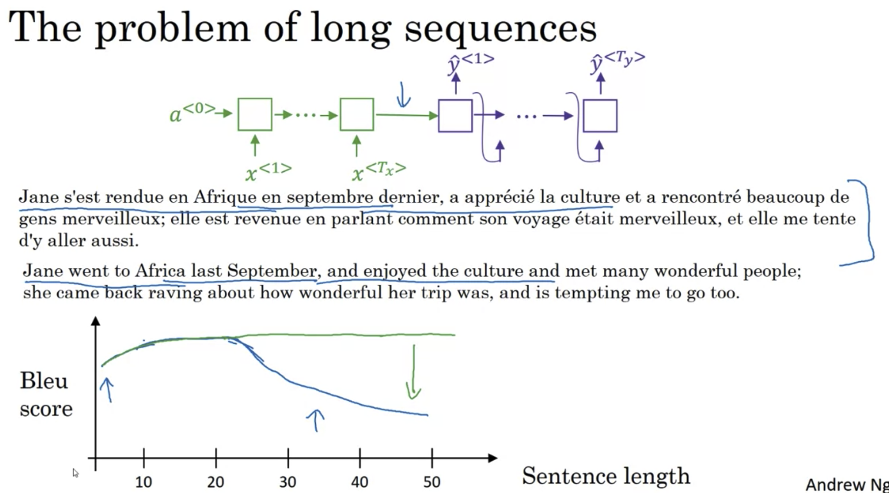

- 蓝色 RNN 对于短句子效果好，但长句子效果骤降
  - 需要记住一整句话，然后翻译
- 绿色 Attention
- 【Informational bottleneck 】因为encoder RNN 强制所有信息（source sentence）到最后一个vector
- 
- 橙色内容

### Architecture

### Equation

P75  

### Advantage vs NMT

- Attention significantly **improves NMT performance**
  - It’s very useful to allow decoder to focus on certain parts of the source 
- Attention **solves the bottleneck problem**
  - Attention allows decoder to look directly at source; bypass bottleneck
- Attention **helps with vanishing gradient problem**
  - Provides shortcut to faraway states
- Attention provides **some interpretability**
  - By inspecting attention distribution, we can see what the decoder was focusing on
  - We get (soft) alignment for free! 
  - This is cool because we never explicitly trained an alignment system 
  - The network just learned alignment by itself

P77：

values：all information

query: is somehow determining how it's gonna pay attation to the values 

### Intuition

-  Attention Model = is a set of attention weights

- $\alpha^{<1,1>}$ ： when you're generating the first words, how much should you be paying attention to this first word of the input.

- $\alpha^{<1,2>}$ ： when you're generating the first words, how much should you be paying attention to this second word of the input.

- what is exactly the context from denoter C that we should be paying attention to, 

and that is input to this RNN unit to try to generate the first words. 

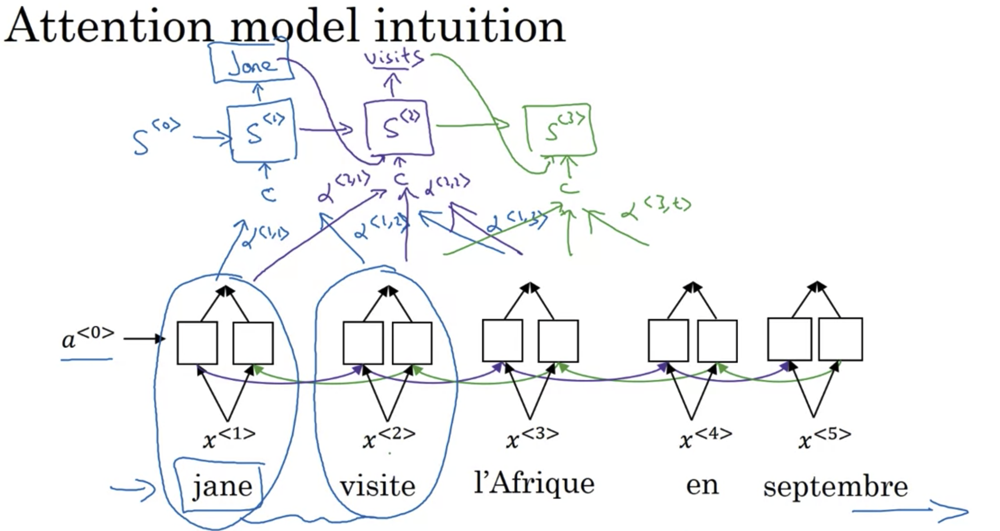

- Upper layer：decoder

- Lower layer：encoder

  

**Idea** Use attention weights to allows on every time step, to generate a specific English word, the model only pay attention to a local window of the French sentence.

 $\alpha^{<t, t'>}$ =  when you're trying to generate the t th English word, how much should you be paying attention to the t' French words. 

#### Details

- $\alpha^{<t,t'>} = \text{amout of "attention" } y^{<t>} \text{ should pay attention to  }a^{<t'>}$
- 

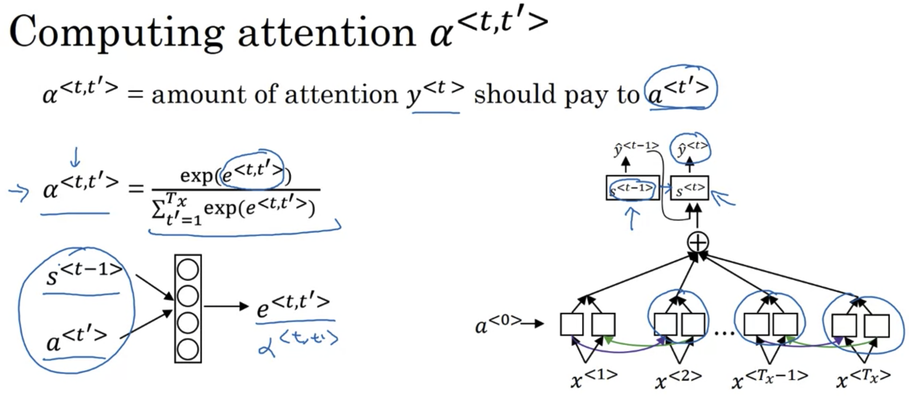

(-) Quadratic cost 

## Application - Audio data

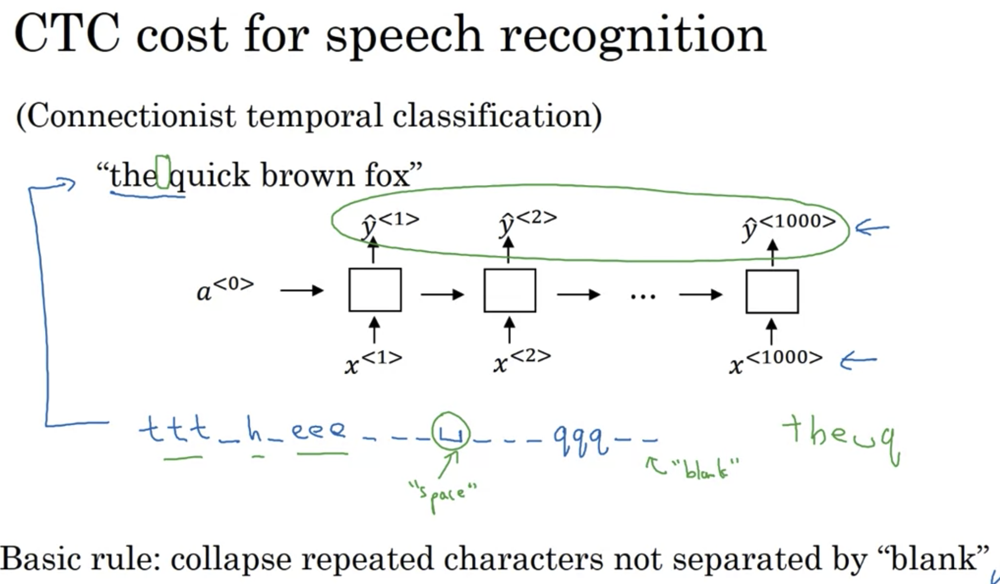

input size = output size

但存在特殊的'_' blank output

### Trigger word detection

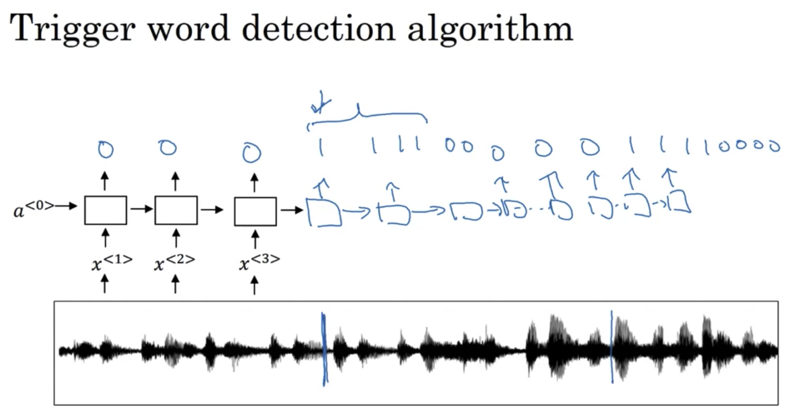

为了避免unbalance，在说了trigger word之后（蓝线）标记多个 1 

