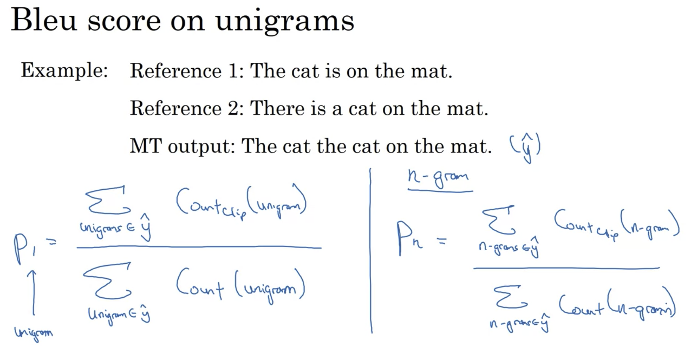
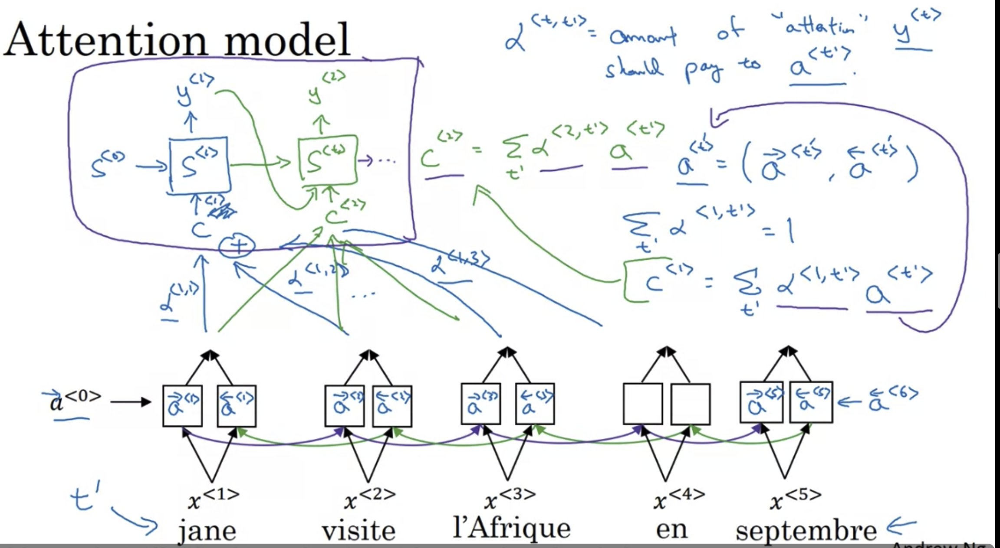

## Sequnce to sequence model

### Machine Translation

1. Language model：

   $x^{<2>} := \hat{y}^{<1>}$

   

2. 

- encoder network: RNN
- decoder network

### Image captioning

- encoder network: CNN,encode the image to a 4096 dimension vector
- decoder: RNN
- 

 Diffence vs pre NLP tasks: Don't want to randomly choose a word/in caption

## Picking the Most Likely Sentence

 

注意：区别于之前，这里不能“random choose“，因为会造成上面的多种翻译，且翻译质量不定，有好（1st) 有坏(4th)

=》 Algroithm to find a y maximize the P(y|x) x=French sentence 

- Beam search 常用算法
- 

- 第一句翻译更好（第二句有过多冗余单词）

- 但是，用greedy search，假设已经有了前两个是"Jane is"
  - going 比visiting常见
  - P(Jane is going| x) > P(Jane is visiting | x)
  - 于是，greedy search会选择第二句 

- Why search directly? 为什么不遍历直接找max
  - 数量级太大！
  - 一个100K的单词表，10个word的句子有$10^{100K}$ 种选择，遍历太慢

## Beam search 

### 1. algorithm

1. Step 1 pick the first word
   - 有参数：beam width = k，选前k个最可能的单词 

2. Step 2 对每一个可能的first word，选取最可能的second word

   - 这样，选择最有可能的(first word, second word) pair
     - $P(y^{<1>},y^{<2>}|x) = P(y^{<1>}|x)P(y^{<2>}|x,y^{<1>})$
   - 

   -  最终要算 3 X 10,000 possibilities，然后选top3
   - 假设最终得到的top 3是 
     - in September
     - jane is 
     - jane visits
     - Reject "september" as 1st word

3. Step 3 

=> jane visits africa in september. <EOS>

- B = 1 => gready search
- 合理范围 B = 10

### 2. Refinements to Beam Search

1. log

   1. 因为P很小，所以连乘会很接近0，有computational问题，所以取log
   2. 

2. Length normalization 

   1. 因为连乘 <1的数字，对长句子不公平，所以做normalization

      

3. Beam width B?
   1. large B: better result, but slower
   2. small B: worse result, but faster

4. Compared with DFS, BFS, beam Search runs faster but is not guaranteed to find exact max for arg max P(y|x)

### 3. Error anaylsis 

Example: 下面翻译的不好，但是模型是由RNN和Beam Search两部分组成，问是哪一部分造成的错误

- 因为Beam search设置的beam可能太小的；
- 

比较 $P(y^*|x)$ 和 $P(\hat{y}|x)$

### 4. Bleu Score- 怎么从多个好的翻译中选择

Bleu = bilingual evaluation understudy

### unigram

precision = MT output中出现在reference的单词数/MT output的总单词书

（the 出现在reference 1/2中，所以分子= 7）

modified precision = MT output中重复出现的单词，只能拿到reference中该单词出现次数的credit（the 中reference 1 中出现2次，reference2中出现2次，所以分子 = 2)

 

#### Bigram

#### n-gram

如果MT output = 某个reference，则 P1,P2 = 1.0

#### details

BP= brevity penalty: 因为之前的定义，短句子会有更高的precision，但实际翻译并不希望句子过短，所以添加BP

## Attention model

### The problem of long sequences

- 蓝色 RNN 对于短句子效果好，但长句子效果骤降
  - 需要记住一整句话，然后翻译
- 绿色 Attention

### Intuition

-  Attention Model = is a set of attention weights

- $\alpha^{<1,1>}$ ： when you're generating the first words, how much should you be paying attention to this first word of the input.

- $\alpha^{<1,2>}$ ： when you're generating the first words, how much should you be paying attention to this second word of the input.

- what is exactly the context from denoter C that we should be paying attention to, 

and that is input to this RNN unit to try to generate the first words. 

- Upper layer：decoder

- Lower layer：encoder

  

**Idea** Use attention weights to allows on every time step, to generate a specific English word, the model only pay attention to a local window of the French sentence.

 $\alpha^{<t, t'>}$ =  when you're trying to generate the t th English word, how much should you be paying attention to the t' French words. 

#### Details

- $\alpha^{<t,t'>} = \text{amout of "attention" } y^{<t>} \text{ should pay attention to  }a^{<t'>}$
- 

(-) Quadratic cost 

## Application - Audio data

input size = output size

但存在特殊的'_' blank output

### Trigger word detection

为了避免unbalance，在说了trigger word之后（蓝线）标记多个 1 

## Transformer Network

### Motivation 

- 上面的模型都说**sequential** 的，即为了预测最终结果，需要一次预测一个；
- transformer可以并行计算

### Intuition : Attention + CNN

### self-attention

- query q: let you ask a question about the word 
  - $q^{<3>}$ = question at `I'Afrique` ,e.g. what's happending there

- key k: looks at all of the other words, and by the similarity to the query, 

  helps you figure out which words gives the most relevant answer to that question.  

  - $q^{<3>} \cdot k^{<1>}$ = how good is `Jane` as an answer to the question $q^{<3>}$

- value allows the representation to plug in how visite should be represented within A^3, within the representation of Africa. 

  - This allows you to come up with a representation for the word Africa that says this is Africa and someone is visiting Africa. 

- 

### muti-head attention

- **Idea** is basically just a big for-loop over the self attention mechanism

- heads 可以并行计算

### Transformer

