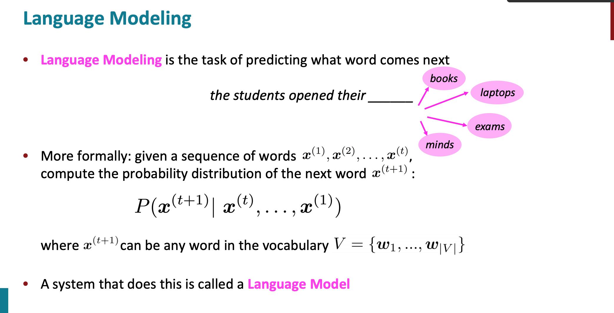
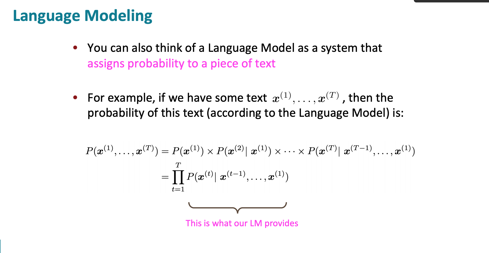
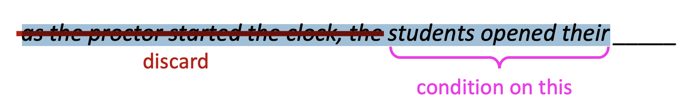
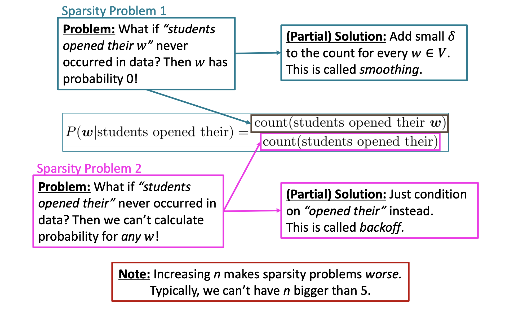
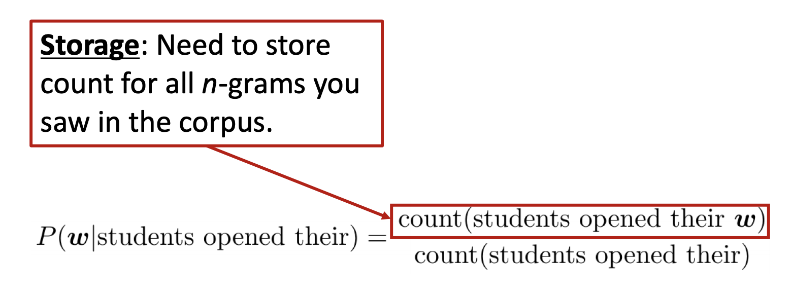
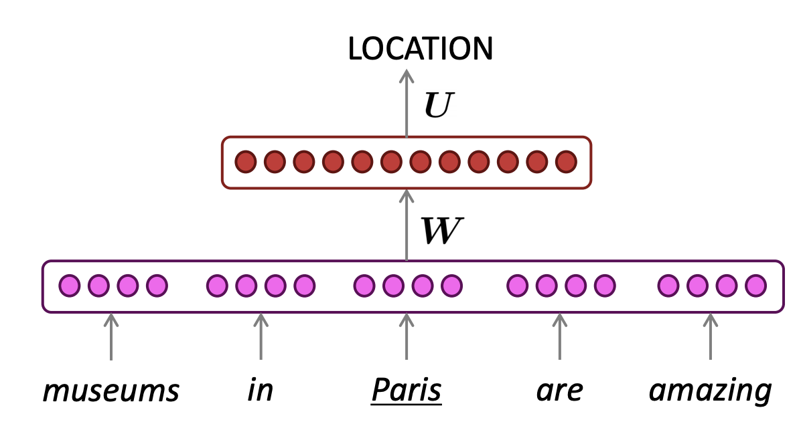
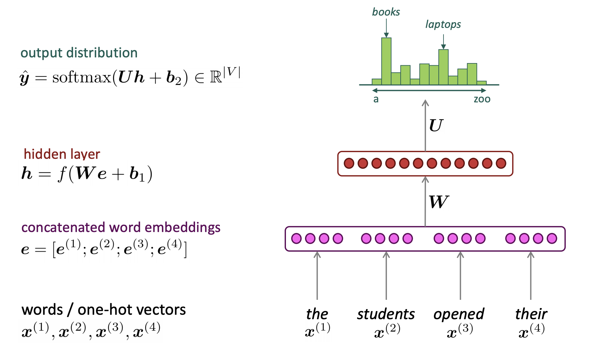

# Language Model 语言模型

## 1. Two views

- VIEW 1

- classifier ，给出 V 中任何一个单词 w 出现的概率
- VIEW 2

Some application

1. 手机打单词，会补全；
2. Google search

- 

#### Idea 💡

语言模型是用来计算一个句子的概率的概率模型。比如*"The cat jumped over the puddle."* 这样完整且合理的句子应该有高的概率，而 *"stock boil fish is toy"* 有低概率。

对于任意一列n个单词，它的概率用 $P(w_1, w_2, ..., w_T)$ 表示。

一般的，根据Bayes 公式，
$$
P(w_1,...,w_T) = P(w_1)P(w_2|w_1)P(w_3|w_1,w_2)...P(w_T|w_1,...,w_{T-1})
$$
其中条件概率 $p(w1), p(w_2|w_1), ..., p(w_T|w_1,...,w_{T-1})$ 是模型的参数。对于一个长度为$T$ 的句子，需要计算 $T$  个参数。在词汇量为$|V|$ 的语料库，任意长度 T 的句子共用 $|V|^T$ 种可能，进一步就有 $T \cdot |V|^T$ 个参数。（这里忽略了重复参数，只看量级就好）。

**Question: How would you learn a language model?**

**Ans** (pre Deep Learning) n-gram language model

# 2. N-gram model

## 2.1 Introduction

**Definition** A **n-gram**  is a chunk of n consecutive words. 

**例子** 🌰 The students opened their ...

- **uni**grams:  “the”, “students”, “opened”, ”their” 
- **bi**grams: “the students”, “students opened”, “opened their” 
- **tri**grams: “the students opened”, “students opened their” 
- **4-**grams: “the students opened their”

**Idea 💡** Collect statistics about how frequent different n-grams are and use these to predict next word.

## 2.3 模型细节

### 2.3.1 Assumption

**Markov 假设** 当前单词$w_{t+1} = x^{(t+1)}$ 只依赖于它前n-1个单词。

### 2.3.2 How to get thest n-gram and (n-1) grams probabilities?

**Ans** counting! 用计数比作为统计估值
$$
\approx \frac{\text{count}(x^{(t+1)},x^{t},...,x^{(t-n+2)})}{\text{count}(x^{(t)},x^{t},...,x^{(t-n+2))}}
$$

### 2.3.3 Examples 

#### 2.3.3.1 Unigram 模型

假设单词之间完全独立，那么
$$
P(w_1,...,w_T) = \prod_{i = 1}^T P(w_i)
$$
显然，我们知道这个是不合理的，因为当前单词肯定是依赖于前一个单词的。

#### 2.3.3.2 Bigram 模型

假设当前单词只依赖于它前一个单词，那么
$$
P(w_1,...,w_T) = \prod_{i = 2}^TP(w_i|w_{i-1})
$$

#### 2.3.3.3 N-gram 模型

类似的
$$
P(w_1, ..., w_T) = \prod_{i=n}^{T} P(w_i|w_{i-n+1},...,w_{i-1})
$$
进一步，根据大数定律，当语料库足够大时，
$$
P(w_i|w_{i-n+1}, ..., w_{i-1}) \approx \frac{\text{count}(w_{i-n+1}, ..., w_i)}{\text{count}(w_{i-n+1}, ..., w_{i-1})}
$$
以上面Bigram 为例 (n=2)，有
$$
P(w_i|w_{i-1}) \approx \frac{\text{count}(w_{i-1},w_i)}{\text{count}(w_{i-1})}
$$
不仅使得单个参数的统计变得更容易（统计时需要匹配的词串更短），也使得参数的总数变少了。

### 2.3.4 Markov 假设的不合理例子

以4-gram处理下面句子：

​		 as the proctor started the clock, the students opened their 

- 因为是4-gram，所以忽略前面内容：as the proctor started the clock, the

  

$$
P(\bold{w}|\text{students opened their}) = \frac{\text{count}(\text{students open their }\bold{w})}{\text{count}(\text{students open their})}
$$

- For example, suppose that in the corpus: 

  - “students opened their” occurred 1000 times 
  - “students opened their books” occurred 400 times 
  - “students opened their exams” occurred 100 times

- P(**exams** | students opened their) = 0.1  < P(**books** | students opened their) = 0.4

- 但是！根据上下文，应该填 **exam**

  

### 2.3.4 Sparsity Problems

考虑三个问题（极端情况）：

- 如果 分子 $\text{count}(w_{i-n+1}, ..., w_i) = 0$，是否认为 $P(w_i|w_{i-n+1}, ..., w_{i-1}) = 0$? 
  - 上图中 Sparsity Problem1，smoothing
- 如果 $\text{count}(w_{i-n+1}, ..., w_i) = \text{count}(w_{i-n+1}, ..., w_{i-1}) $, 是否认为 $P(w_i|w_{i-n+1}, ..., w_{i-1}) = 1$?
- 如果 分母 $\text{count}(w_{i-n+1}, ..., w_i-1) = 0$，怎么处理 $P(w_i|w_{i-n+1}, ..., w_{i-1})$? 
  - backoff 

**稀疏问题** - 尤其当n变大时，更容易出现这样的状况：某些n-gram从未出现过。（日常不会使用大于5的n）

**例子🌰** 在bi-gram中，若词库中有20k个词，那么两两组合就有近2亿个组合。其中的很多组合在语料库中都没有出现，根据极大似然估计得到的组合概率将会是0，从而整个句子的概率就会为0。最后的结果是，我们的模型只能计算零星的几个句子的概率，而大部分的句子算得的概率是0，这显然是不合理的。 

### 2.3.4 Storage Problems

下表给出了n-gram模型中模型参数数量随着的逐渐增大而变化的情况，其中假定词汇量为 $|V| = 200,000$(汉语的词汇量大致是这个量级)。

|     n      |   模型参数的数量   |
| :--------: | :----------------: |
| 1(unigram) |   $2\times 10^5$   |
| 2(bigram)  | $4\times 10^{10}$  |
| 3(trigram) | $8\times 10^{15}$  |
| 4(4-gram)  | $16\times 10^{20}$ |

实际应用中，最多采用n=3的trigram模型。

### 2.3.5 Smoothing

因为要进行数据平滑（data Smoothing），数据平滑的目的有两个：

1. 所有的N-gram概率之和为1;

2. 所有的n-gram概率都不为0

   > **本质💡 重新分配整个概率空间-- 劫富济贫** 
   >
   > - 降低已经出现过的n-gram的概率
   > - 补充给未曾出现过的n-gram的概率
   > - 消除0概率，改进模型的整体准确率。

总结起来，n-gram模型是这样一种模型，其主要工作是在语料中统计各种词串出现的次数以及平滑化处理。概率值计算好之后就存储起来，下次需要计算一个句子的概率时，只需找到相关的概率参数，将它们连乘起来就好了。

#### 2.3.4.1 拉普拉斯平滑 Add one

- Idea💡 强制让所有的n-gram至少出现一次，只需要在分子和分母上分别做加法即可。
- 以2-gram为例

$$
P(w_i|w_{i-1}) = \frac{\text{count}(w_{i-1},w_i)+1} {\text{count}(w_{i-1})+ |V|}
$$

- 缺点❎ 

  - 大部分n-gram都是没有出现过的，很容易为他们分配过多的概率空间
  - 假设的所有未出现的n-Gram概率相等不一定合理。
  - 对于出现在训练语料中的那些n-Gram，都增加同样的频度值，不一定合理

- 衍生：Add k，加一个小于1的正数k

  - 2-gram为例

  $$
  P(w_i|w_{i-1}) = \frac{\text{count}(w_{i-1},w_i)+k} {\text{count}(w_{i-1})+ k|V|}
  $$

  - 最常使用的k值是1/2
  - 优点✅
    - 通常，add-k算法的效果会比Add-one好
  - 缺点❎ 
    - 它不能完全解决问题。
    - 常数k需要人工确定，对于不同的语料库K可能不同。

#### 2.3.4.2 Interpolation 插值 & Backoff 回退

##### a. Idea 💡

- 插值和回退的思想其实非常相像。

- 设想对于一个trigram的模型，我们要统计语料库中 “like chinese food” 出现的次数，结果发现它没出现过，则计数为0。
  - 在回退策略中，将会试着用低阶gram来进行替代，也就是用 “chinese food” 出现的次数来替代。
  - 在使用内插值法时，我们把不同阶别的n-Gram模型线形加权组合后再来使用。

##### b. Interpolation 插值法

如下是一个三阶组合，假设$p(w_n|w_{n−1}w_{n−2})=0$，而$p(w_n|w_{n−1})>0$ ，$p(w_n)>0$ ，则加权平均后的概率不为0，从而达到平滑的效果。
$$
\hat{p}(w_n|w_{n−1}w_{n−2})= \lambda_3 p(w_n|w_{n−1}w_{n−2}) + \lambda_2p(w_n|w_{n−1}) + \lambda_1p(w_n)
$$
其中 $\lambda_1 + \lambda_2 + \lambda_3 = 1$，$\hat{p}(w_n|w_{n−1}w_{n−2})$ 为3-gram模型的插值结果， $p(w_n|w_{n−1})= \frac{\text{count}(w_{i-1},w_i)} {\text{count}(w_{i-1})}$ 

##### c. Backoff 回退法

会尽可能地用最高阶组合计算概率，当高阶组合不存在时，退而求其次找次低阶，直到找到非零组合为止。

下面用$P_{katz}^{(n)}(w_i|w_{i-n+1}^{i-1})$ 表示光滑化后 $w_i$ 的n-gram，有
$$
P_{katz}^{(n)}(w_i|w_{i-n+1}^{i-1})= \left\{\begin{split}
& P(w_i|w_{i-n+1}^{i-1}) , \quad\text{  if count}(w_{i-n+1}^{i-1}) > 0\\
&\alpha P_{katz}^{(n-1)}(w_i|w_{i-n+2}^{i-1}), \quad \quad\text{  if count}(w_{i-n+1}^{i-1}) = 0. \\ 
\end{split}\right.
$$
其中$P(w_i|w_{i-n+1}^{i-1}) = \frac{\text{count}(w_{i-n+1}, ..., w_i)}{\text{count}(w_{i-n+1}, ..., w_{i-1})}$， $\alpha = \alpha({w_{i-n+1}, ..., w_{i-1}})$ 是归一化因子。

- 缺点❎ 
  - 在有些环境中效果不好。
    - 🌰 我们已经看到 $w_i w_j$ 出现很多次，并且 $w_k$ 是一个常用词，但从来没有见过的trigram $w_iw_jw_k$的组合 => 这个trigram很可能是一个"零概率"的例子，而不应用回退法计算$P(w_k|w_j)$来估计$P(w_k|w_iw_j)$
  - 添加新数据到语料库会导致概率的突然改变。
    - 新添加的数据可能导致回退模型选择不同阶的n-gram模型作为估计概率

#### 2.3.4.3 Good-Turing

**Idea 💡: 折扣思想**- 所谓折扣就是从条件概率不为零的n-gram概率中拿一部分概率给训练集未出现的n-gram.

- 对于任何一个出现r的n-gram，都假设它出现了$r^*$次，这里

$$
  r^*=(r+1)\frac{n_{r+1}}{n_r}
$$

  - 其中$n_r$ 是恰好出现r次的n-gram的数目	

- 这样，出现次数为r的概率就变成了

$$
p_r = \frac{r^*}{N},\text{ with }N = \sum_{r=0}^{\infty}n_rr^*
$$

注意到N满足：
$$
N = \sum_{r=0}^{\infty}n_rr^* = \sum_{r=0}^{\infty}(r+1)n_{r+1} = \sum_{r=1}^{\infty}r n_{r} 
$$
即，N就是这个分布中最初的计数。

# 3. Neural Language Model

## 3.1 Window-based neural model

### 3.1.1 Basic Architecture

### 3.1.2 Apply to example

- window size = 4

  

### 3.1.3 Summary

✅ （vs n-gram）

- No sparsity problem 
- Don’t need to store all observed n-grams

❎

- Fixed window is too small 
- Enlarging window enlarges W
- Window can never be large enough! 
- 【学习效率低，因为每个单词对W的贡献不共享 】$x^{(1)}$ and $x^{(2)}$ are multiplied by completely different weights in W.
  - No symmetry in how the inputs are processed. 

We need a neural architecture that can process **any length input**

# 4. 目标函数

对于统计语言模型而言，利用最大似然，可把目标函数设为：
$$
L = \prod_{w \in C} P(w|\text{contex}(w))
$$
其中 C表示 语料库（Corpus)，Contex(w)表示单词w的上下文