input x: 一个句子，长度记为 $T_x$

- $x^{<t>}$ word at position t

$x^{(i)<t>}$ 第i个input的t位置，$T_{x}^{(i)}$ 对不同sample可能不同，如有的句子9个单词，有的15个单词

output y:

Vacabulary :30K-50K

# RNN

- 直接用NN

  - input,outputs 长度不同；
  - doesn't share features learned across different positions of text

  - a better model can reduce # of parameters 

- 结构 architectures 

  - $T_x = T_y$

- 
- 

- 利用前面的信息

- 共享参数

- 缺点 只用前面信息，不用后面信息

  - He said 
  - He said
  - -》 Bidirectional RNN（BRNN）

  $W_{ax}$ 乘以x，用于计算a，比如$a^{<1>} = g(W_{aa}a^{<0>}+W_{ax}x^{<1>}+b_a)$

  [TODO] $T_x \neq T_y$ 是怎么做的-> different types

  

  

  # Recurrent Neural Networks (RNN)

  

  -  hidden **states**: a single state that's mutating over time(several version of the same thing) 
  - **Core idea** Apply the same weights W repeatedly

  

  ## Example 

  

- current hidden state based on previous hidden state and current input 

✅

- Can process **any length** input
- Computation for step t can (in theory) use information from **many steps back**
- **Model size doesn’t increase** for longer input context 

- Same weights applied on every timestep, so there is **symmetry** in how inputs are processed.

❎ 

- Recurrent computation is **slow** 
- In practice, difficult to access information from **many steps back**

## Training a RNN Language Model

**Problem** : Computing loss and gradients across entire corpus $$ is too expensive!

- 第二条补充：shorter unit of text

## Backpropagation for RNN

[TODO]

## Generating text with an RNN Language Model

- RNN 不能记住overall的信息（比如之前在做或者做过什么事情）

[TODO: 移入language model的笔记]

## Evaluating Language Models

=> min(J(\theta)) 等价于 min(perplexity)

## Why should we care about Language Modeling? 

- Language Modeling is a **benchmark task** that helps us **measure our progress** on understanding language
- Language Modeling is a **subcomponent** of many NLP tasks, especially those involving **generating text** or **estimating the probability of text**:
  - Predictive typing 
  - Speech recognition 
  - Handwriting recognition 
  - Spelling/grammar correction 
  - Authorship identification 
  - Machine translation 
  - Summarization 
  - Dialogue 
  - etc

## Other applications of RNN

### 1. tagging e.g., part-of-speech tagging, named entity recognition

### 2 .sentiment classification

### 3. encode model

文字版的问题 --通过RNN --> 代表question的something

### 4. generate text

- 在speech recognition里，一般用WER （word error rate）作为衡量标准，有时候也用 perplexity
- conditional language model =there's some kind of input that we need to condition on

## Different types

1. many-to-many
   1. $T_x = T_y$
   2. $T_x \neq T_y$
      1. machine translation 
      2. 
2. many-to-one
   1. 🌰 setimant classification
3. one-to-many
   1. music generation 
   2. 

## Backpropagation through time

Sampling a sequence from a **trained** RNN 

区别于之前，现在的input $x^{<2>} = \hat{y}^{<1>}$ 而不是 $y^{<1>}$ 【Q】

Novel Sequences 

Character-level language model

- (+) 不会<unk>
- (-) match longer sequence
- (-) much computational expensive

## Vanishing Gradients with RNN

### 1. Why happened

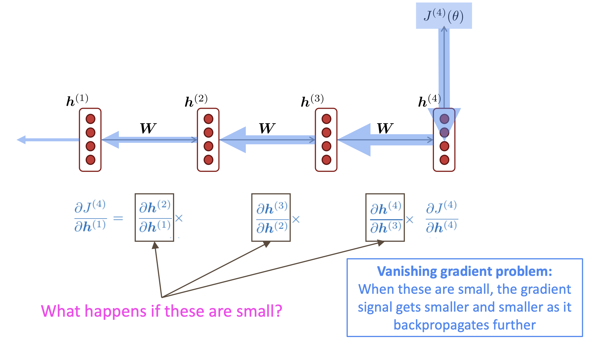

- may have very long term dependency 
  - The ==cat==. Which already ate ..., ==was== full

  - The ==cats==. Which already ate ..., ==were== full
- $\frac{\part \text{error}}{\part \text{前排参数}} \approx 0$ 
- The basic RNN model has many local influence

### 2 why a problem

#### 1. 丧失 long term effect

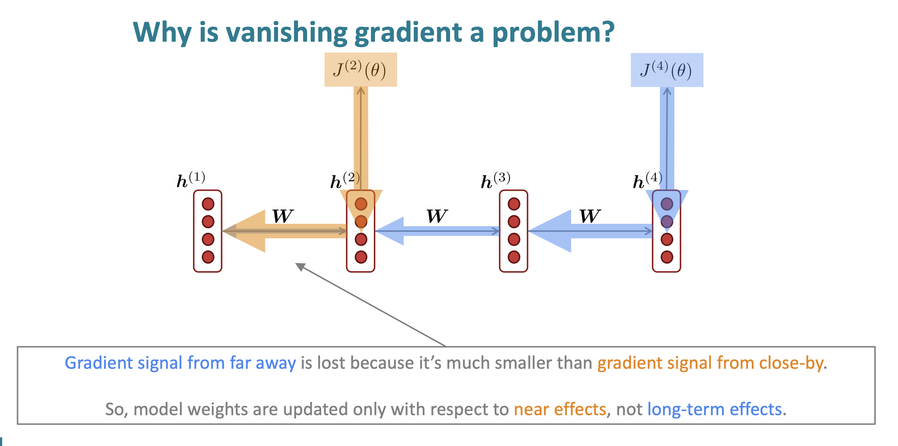

#### 2.  当gradient很小的时候，无法判断是完成学习还是错误参数

Gradient = a measure of the effect of the past on the future

it the gradient becomes vanishingly small over longer distances (step t to t+n), we can't tell whether:

a. There's **no dependency** between step t and t+n in the data -> 这种情况下，本身t 和 t+n 没有关联，所以 gradient 很小是合理的；

b. We have **wrong parameters** to capture the true dependency between t and t+n -> 这种情况下，本身是有关联的，理论上也应该学习到这种关系，但是由于我们错误的参数，让模型认为他们之间是没有关系的，所以我们也学不到两者之间的依赖关系

Gradient vanishing 让我们无法确定上二者哪个发生

### 3. Example 🌰

1. **LM task**: When she tried to print her ==tickets==, she found that the printer was out of toner. She went to the stationery store to buy more toner. It was very overpriced. After installing the toner into the printer, she finally printed her ________

- 模型需要学习到 7th step 的 **"tickets"** 和 目标单词  ________ 的关系。

2. **LM task**: The writer of the boos ________ 
   - IS
   - ARE

- syntactic recency (语法新近度) ：The  <u>writer</u> of the books <u>is</u> （correct)
- sequential recency (顺序新近度) :The writer of the <u>books</u> <u>are</u> (incorrect)
- RNN 更擅长学习  sequential recency，而不是 syntactic recency

### 4. Solution

- The main problem = RNN 不能在长时间内保存信息。

  -  **it’s too difficult for the RNN to learn to preserve information over many timesteps.**

- In a vanilla RNN, the hidden state is **constantly being rewritten**
  $$
  h^{(t)} = \sigma\left ( W_hh^{(t-1)} + W_x x^{(t)} + b\right)
  $$

  - 所以很难把信息从前一个hidden state 保存到 下一个hidden state

- **Idea**：Add separate **memory** to  a RNN 

## Exploding gradient

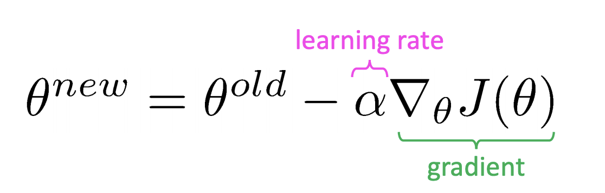

- 当gradient 很大的时候，更新变化很大
- 可能出现 **inf** 或者 **NaN**

### Solution: Gradient clipping

当 gradient > 某个threshold, 使用 scale后的 gradient 对SGD更新

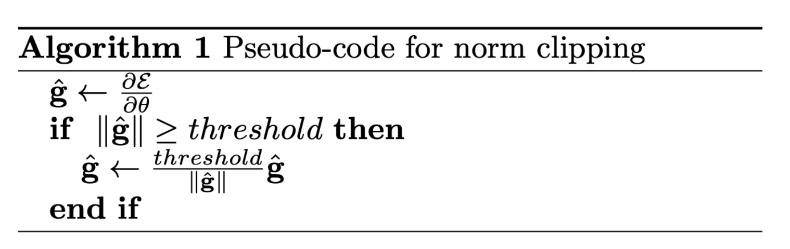

**Idea** 不改变方向，只更新一小步

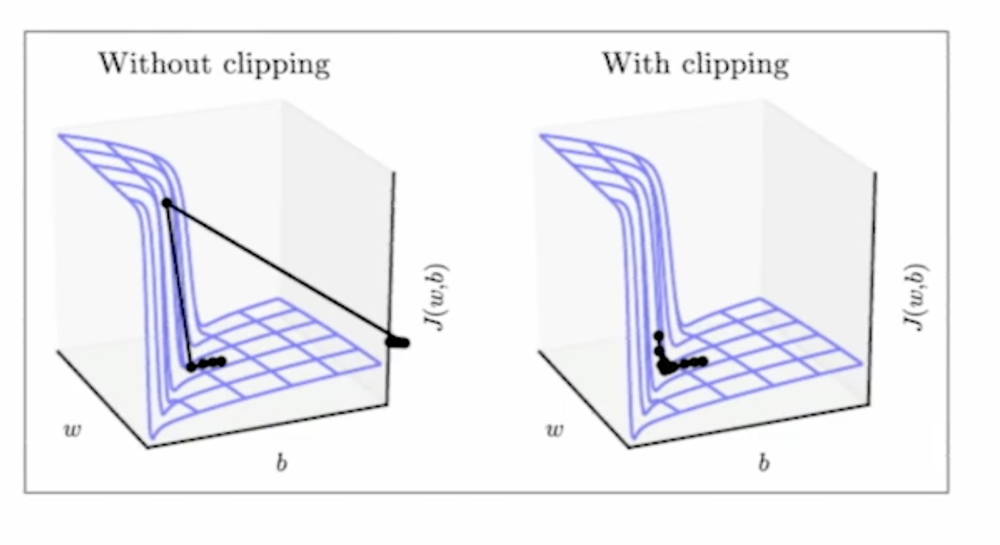

1. exploding graident also problem
   1. 容易发现
   2. solution: gradient clipping

## LSTM

### 1. Structrue

除了 hidden state，相比RNN 增加了 cell state来存储长期信息；

- On step t, there is a **hidden state** $h^{(t)}$ and a **cell state** $c^{(t)}$ 
  - Both are vectors length n 
  - The cell stores **long-term information**
  - The LSTM can **read**, **erase**, and **write** information from the cell
    -  The cell becomes conceptually rather like RAM in a computer

使用3个 🚪 来控制对信息的读，擦，写

- The selection of which information is erased/written/read is controlled by three corresponding **gates**
  - The gates are also vectors length n 
  - On each timestep, each element of the gates can be **open** (1),** closed** (0), or somewhere in-between
  - The gates are **dynamic**: their value is computed based on the current context 

### 2. Equations

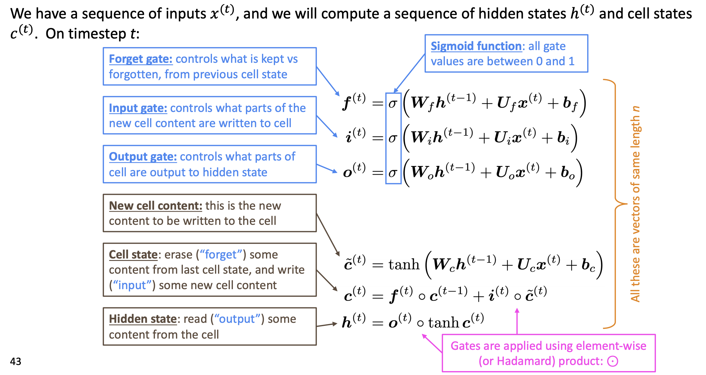

问题1: 为什么 forget gate 只使用 $h^{(t-1)}$ 的信息，而不用 $c^{(t-1)}$，即直接看之前的原始数据来决定要不要舍弃；

问题2: 为什么hidden state 里，要对 $c^{(t)}$ 去 $\tanh$ 

### 3. Graph Version

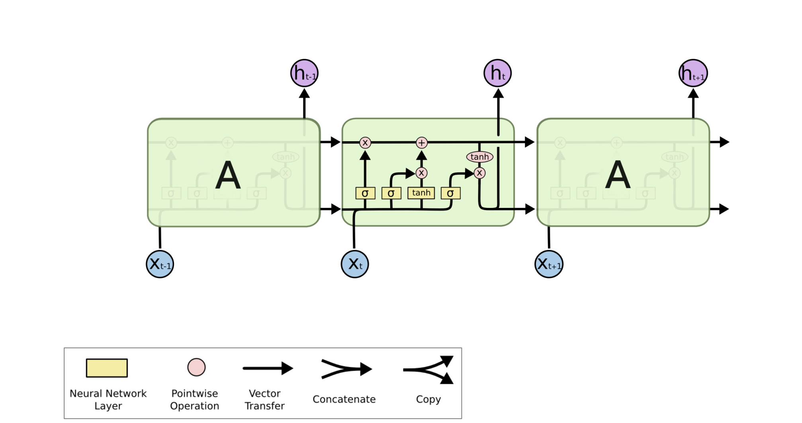

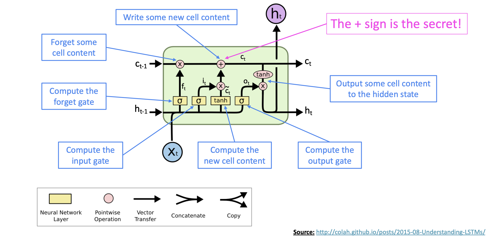

### 4. Why solve vanishing gradients?

- The LSTM architecture makes it easier for the RNN to preserve information over many timesteps
  - In practice, you get about 100 timesteps rather than about 7
- LSTM doesn’t guarantee that there is no vanishing/exploding gradient, but it does provide an easier way for the model to learn long-distance dependencies

- $a^{<t>} = C^{<t>}$ 不成立；
- 更新$C^{<t>}$ 的Gates有两个update $\Gamma_u$ 和forget  $\Gamma_f$  
- 增加output gate $\Gamma_o$
  - $a^{<t>} = \Gamma_o C^{<t>}$

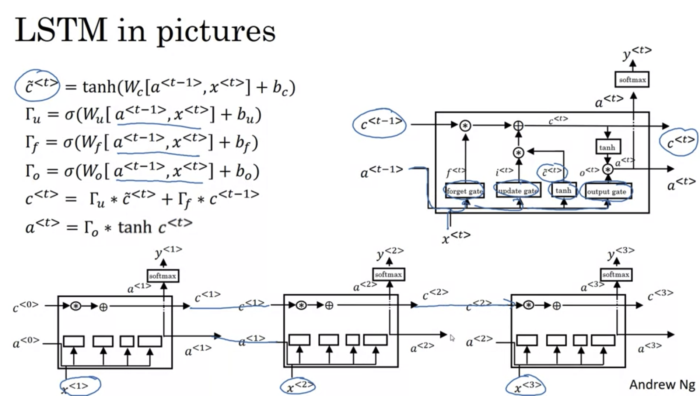

注意到，当设置合理的 $\Gamma_u, \Gamma_f$后，上面一行： $c^{<0>}$到$c^{<3>}$ 可以很快传递，保证了LSTM可以长时间很好的记住某些信息

### Peephole connection （LSTM的变形）

- Gates also depends on $c^{<t-1>}$

### GRU (Gated recurrent unit) 

### 1. Equations

Motivation** cat---> was

= modification of hidden layer in RNN 

+ (+) capture long range connections
+ (+)Helps a lot with  vanishing gradient problem

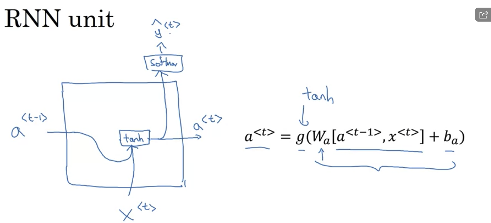

增加 c = memory cell 来存储信息，比如 cat是单数还是复数

$c^{<t>}:=$ memory cell value

$a^{<t>}:=$ output activation value

In GRU，取 $c^{<t>}:= a^{<t>}$ ，但在LSTM中不同。

- $\tilde{C}^{<t>} = \tanh(W_c[c^{<t-1>, x^{<t>}}] + b_c)$
- 遗忘门 $\Gamma_u = \sigma()$,between 0 and 1, u: undate ,
  - $\Gamma_u$ 是否记住某个信息
- $C^{<t>} = \Gamma_u *\tilde{C}^{<t>}  +(1-\Gamma_u) * C^{<t-1>}$
  - $\Gamma_u = 0$ 保持旧信息
    - 因为是$\sigma()$，当内部比较负的时候，会始终保持
  - $\Gamma_u = 1$ 遗忘旧信息，记住t时刻的新信息；

=> 显著帮助vanishing gradient  problem

【Q】没理解：$\Gamma_u$ 接近0，所以 $C^{<t>} \approx C^{<t-1>}$ 不就意味着不更新了么

FULL GRU

1. 增加Gate $\Gamma_r$ 告诉如果通过前一个时刻的$C^{<t-1>}$计算t时刻的候选$\tilde{C}^{<t>}$
2. 其他paper的notation
   1. h,u,c,h...

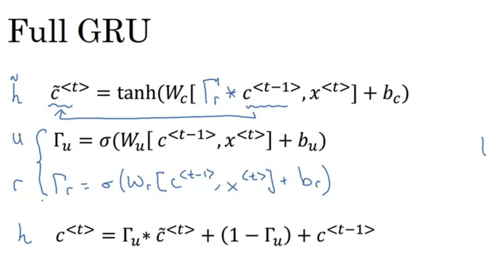

## 

#### GRU VS LSTM

- GRU 
  - 更简单，可以建更大的模型

- LSTM
  - more powerful, more effective 
  - more proven choice 

- Researchers have proposed many gated RNN variants, but LSTM and GRU are the most widely-used 
- The biggest difference is that GRU is **quicker to compute** and has fewer parameters
- There is no conclusive evidence that one consistently performs better than the other 
- LSTM is a **good default choice** (especially if your data has particularly long dependencies, or you have lots of training data) 
- **Rule of thumb**: start with LSTM, but switch to GRU if you want something more efficient

## Is vanishing/exploding gradient just a RNN problem?

==No!==

- It can be a problem for all neural architectures (including feed-forward and convolutional), especially very deep ones. 
  - Due to chain rule / choice of nonlinearity function, gradient can become vanishingly small as it backpropagates 
  - Thus, lower layers are learned very slowly (hard to train)
- Solution: lots of new deep feedforward/convolutional architectures that **add more direct connections** (thus allowing the gradient to flow) 

For example

- Residual connections aka “ResNet” 
- Also known as skip-connections
- The identity connection preserves information by default
- This makes deep networks much easier to train

- Dense connections aka “DenseNet” 

- Directly connect each layer to all future layers!

- Highway connections aka “HighwayNet” 

- Similar to residual connections, but the identity connection vs the transformation layer is controlled by a dynamic gate
- Inspired by LSTMs, but applied to deep feedforward/convolutional networks

**Conclusion**: Though vanishing/exploding gradients are a general problem, **RNNs are particularly** unstable due to the **repeated** multiplication by the **same** weight matrix 

### Bidirectional RNN

### 1. Motivation

#### 1.1 Example 1: He said, "Teddy ..."

- 单向不够！只给前两个单词 "He said"，无法判断 "Teddy" 是人名 还是其他
- 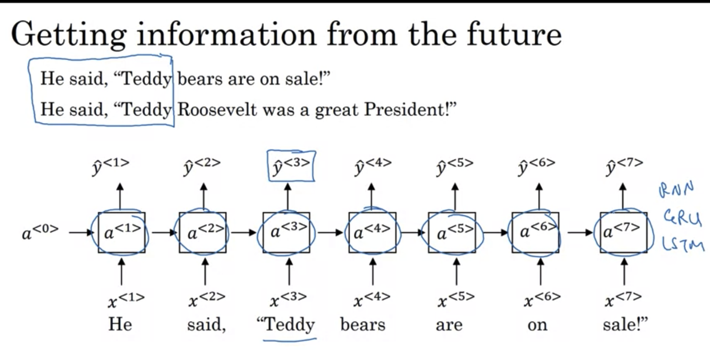

### 1.2 Example 2: terribly exciting 

### Architecture

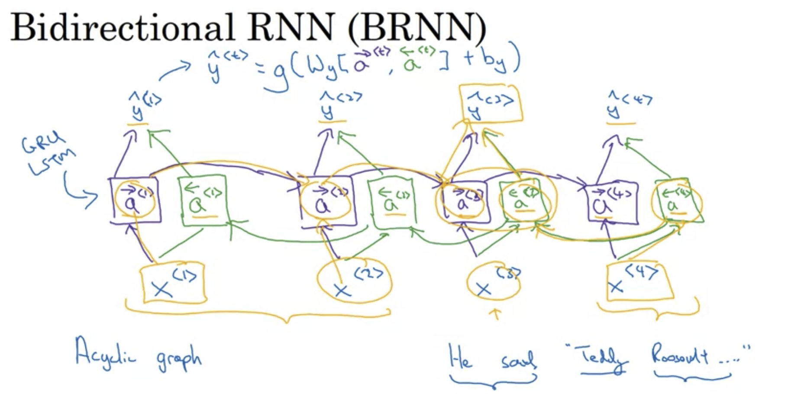

- (-)需要entire sentence 

Note: bidirectional RNNs are only applicable if you have access to the **entire input sequence**

- They are **not** applicable to Language Modeling, because in LM you only have left context available. 
- If you do have entire input sequence (e.g., any kind of encoding), **bidirectionality is powerful** (you should use it by default).

## Deep RNNs (Multi-layer RNNs)

- Multi-layer RNNs are also called **stacked RNNs**
- 

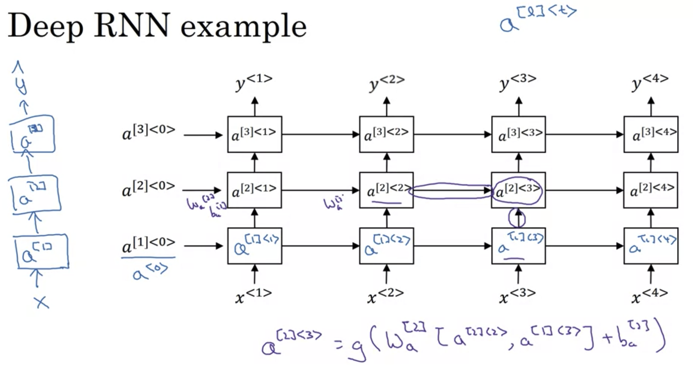

- 对RNN来说，3层已经很深了
  - 因为水平已经很长了
- 更常见的是，3层RNN后续在$y^{<t>}$ 的位置加多层的NN（深但没有水平连接）
- 
- 

Multi-layer RNNs in practice

- **High-performing RNNs are often multi-layer** (but aren’t as deep as convolutional or feed-forward networks) 
- For example: In a 2017 paper, Britz et al find that for Neural Machine Translation, 
  - 2 to 4 layers is best for the encoder RNN, 
  - 4 layers is best for the decoder RNN 
  - Usually, skip-connections/dense-connections are needed to train deeper RNNs (e.g., 8 layers)
