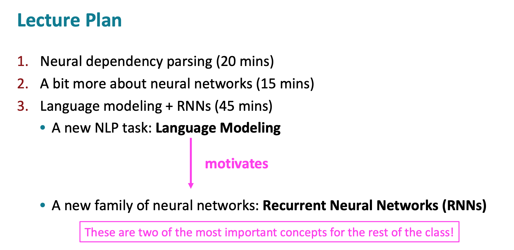

input x: 一个句子，长度记为 $T_x$

- $x^{<t>}$ word at position t

$x^{(i)<t>}$ 第i个input的t位置，$T_{x}^{(i)}$ 对不同sample可能不同，如有的句子9个单词，有的15个单词

output y:

Vacabulary :30K-50K

# RNN

- 直接用NN

  - input,outputs 长度不同；
  - doesn't share features learned across different positions of text

  - a better model can reduce # of parameters 

- 结构 architectures 

  - $T_x = T_y$

- 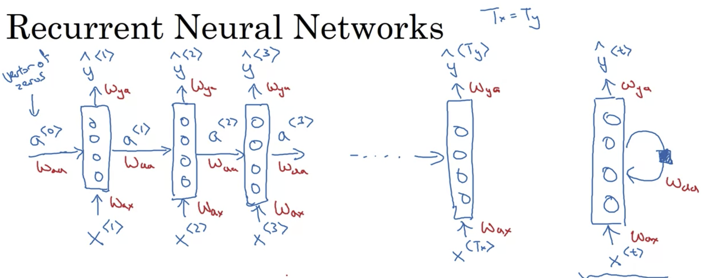
- 

- 利用前面的信息

- 共享参数

- 缺点 只用前面信息，不用后面信息

  - He said 
  - He said
  - -》 Bidirectional RNN（BRNN）

  $W_{ax}$ 乘以x，用于计算a，比如$a^{<1>} = g(W_{aa}a^{<0>}+W_{ax}x^{<1>}+b_a)$

  [TODO] $T_x \neq T_y$ 是怎么做的-> different types

  

  

  # Recurrent Neural Networks (RNN)

  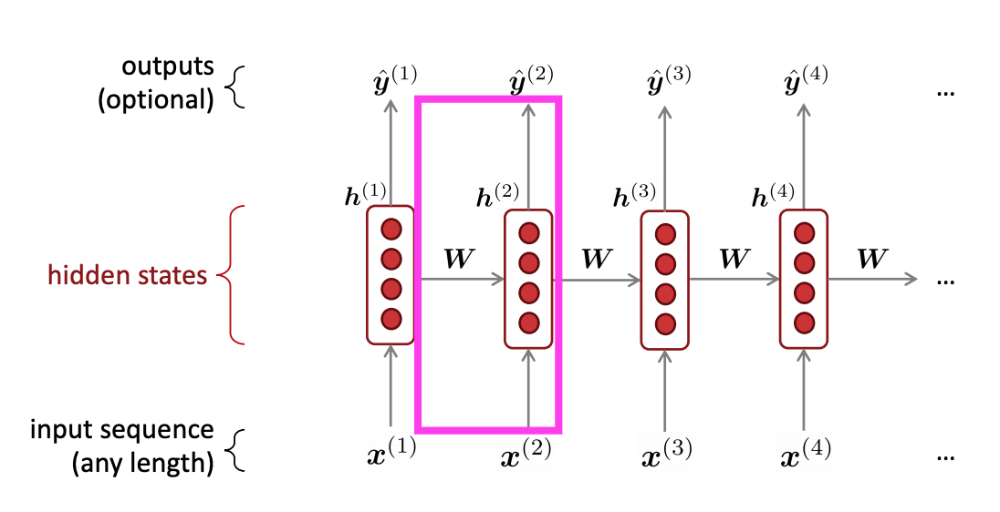

  -  hidden **states**: a single state that's mutating over time(several version of the same thing) 
  - **Core idea** Apply the same weights W repeatedly

  

  ## Example 

  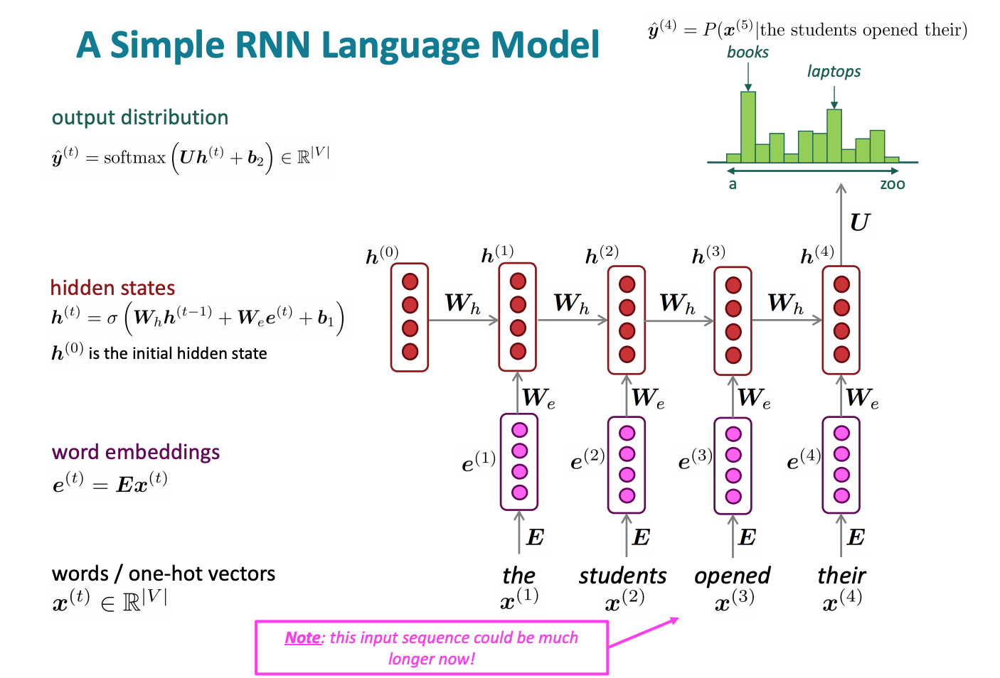

- current hidden state based on previous hidden state and current input 

✅

- Can process **any length** input
- Computation for step t can (in theory) use information from **many steps back**
- **Model size doesn’t increase** for longer input context 

- Same weights applied on every timestep, so there is **symmetry** in how inputs are processed.

❎ 

- Recurrent computation is **slow** 
- In practice, difficult to access information from **many steps back**

## Training a RNN Language Model

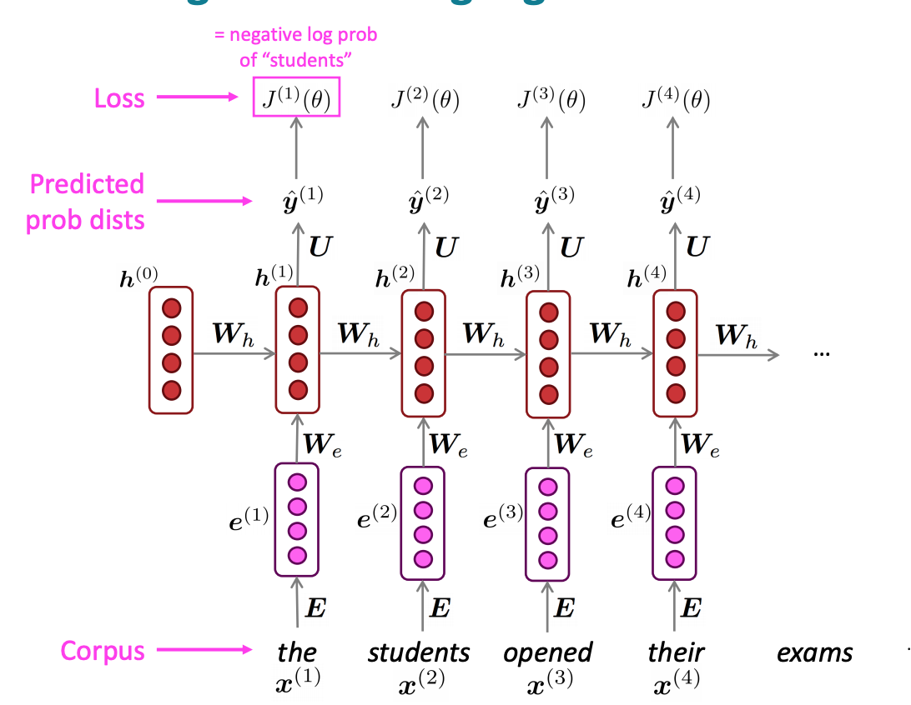

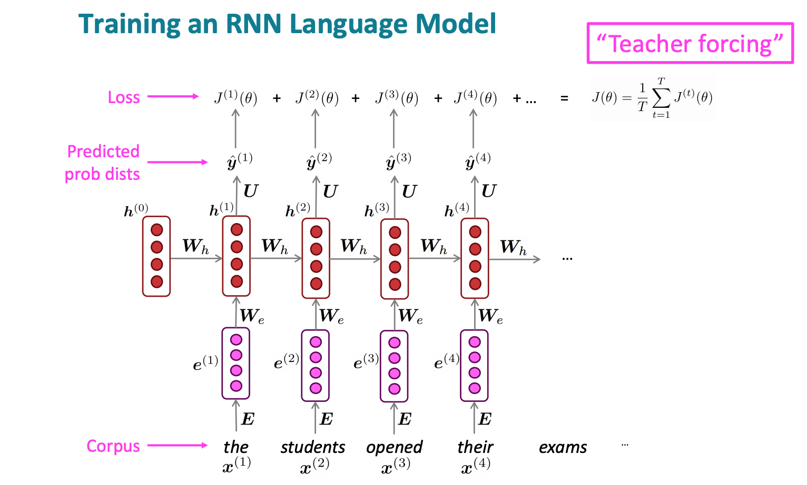

**Problem** : Computing loss and gradients across entire corpus $$ is too expensive!

- 第二条补充：shorter unit of text

## Backpropagation for RNN

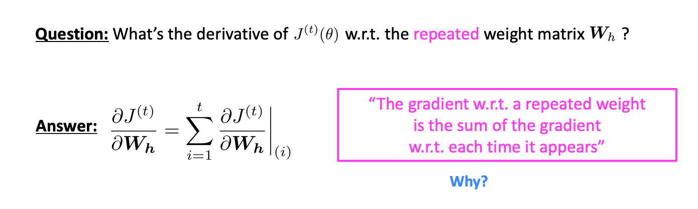

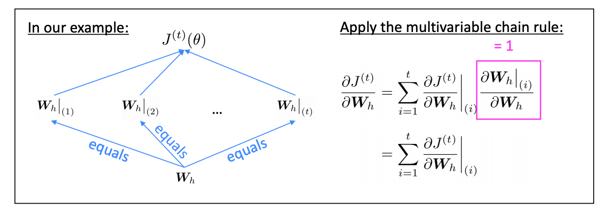

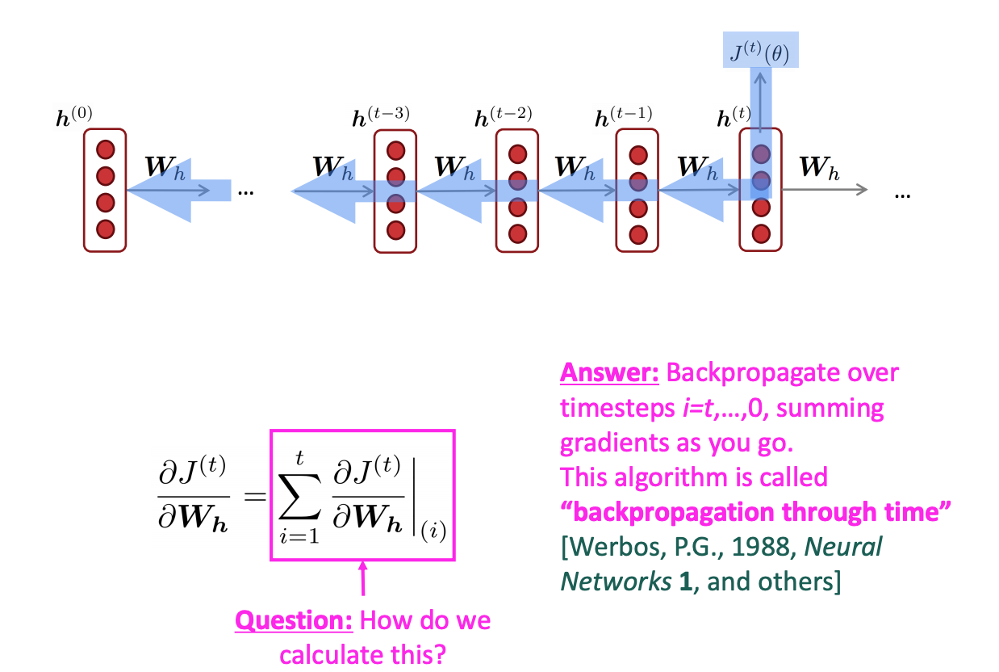

[TODO]

## Generating text with an RNN Language Model

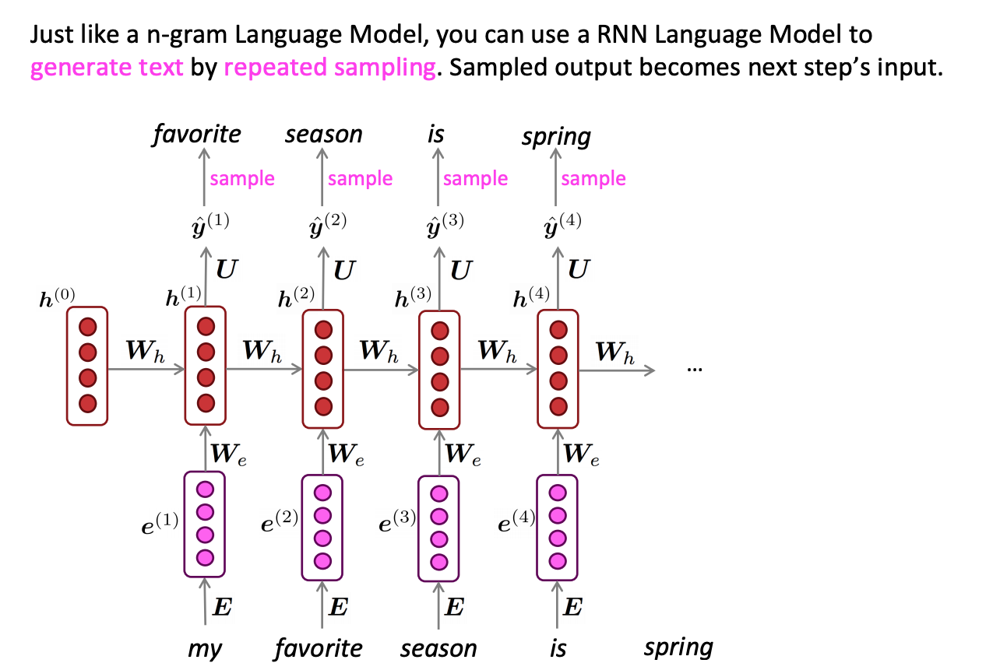

- RNN 不能记住overall的信息（比如之前在做或者做过什么事情）

[TODO: 移入language model的笔记]

## Evaluating Language Models

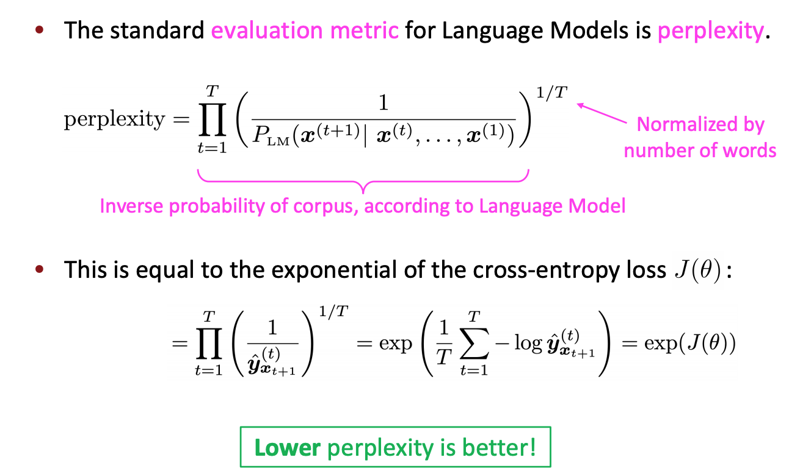

=> min(J(\theta)) 等价于 min(perplexity)

## Why should we care about Language Modeling? 

- Language Modeling is a **benchmark task** that helps us **measure our progress** on understanding language
- Language Modeling is a **subcomponent** of many NLP tasks, especially those involving **generating text** or **estimating the probability of text**:
  - Predictive typing 
  - Speech recognition 
  - Handwriting recognition 
  - Spelling/grammar correction 
  - Authorship identification 
  - Machine translation 
  - Summarization 
  - Dialogue 
  - etc

## Other applications of RNN

### 1. tagging e.g., part-of-speech tagging, named entity recognition

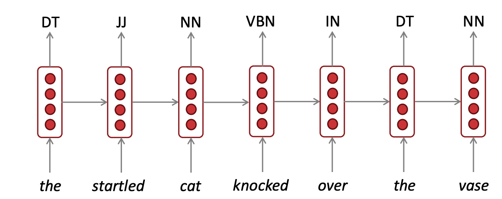

### 2 .sentiment classification

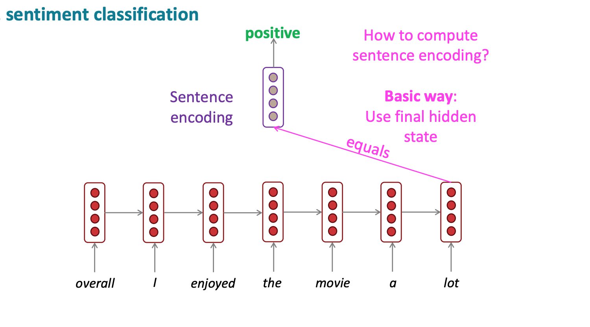

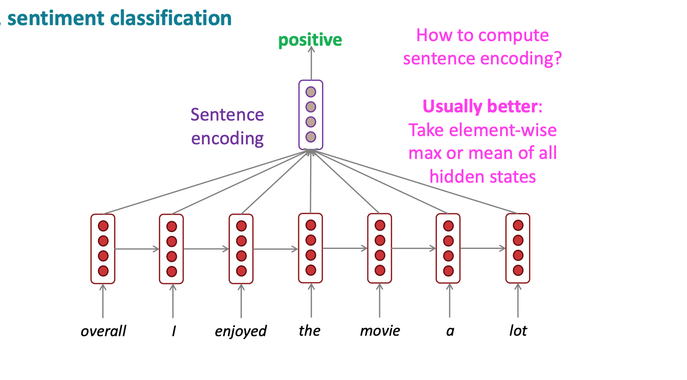

### 3. encode model

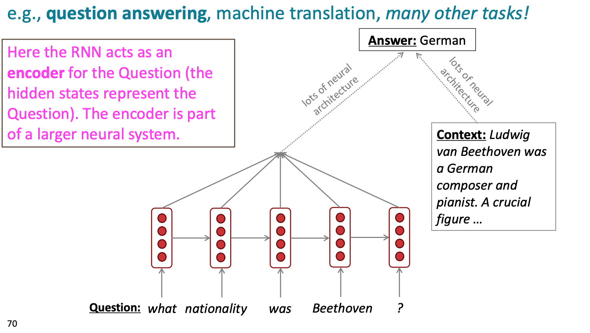

文字版的问题 --通过RNN --> 代表question的something

### 4. generate text

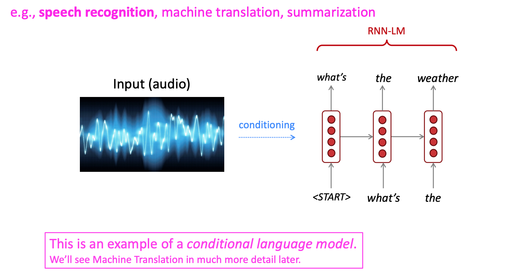

- 在speech recognition里，一般用WER （word error rate）作为衡量标准，有时候也用 perplexity
- conditional language model =there's some kind of input that we need to condition on

## Different types

1. many-to-many
   1. $T_x = T_y$
   2. $T_x \neq T_y$
      1. machine translation 
      2. 
2. many-to-one
   1. 🌰 setimant classification
3. one-to-many
   1. music generation 
   2. 

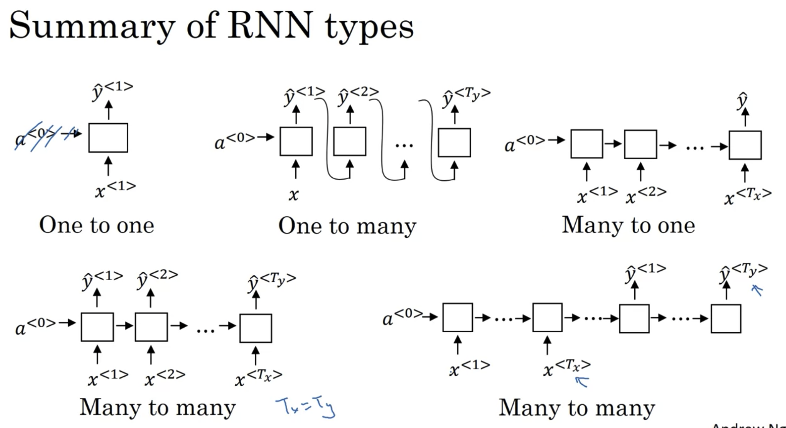

## Backpropagation through time

Sampling a sequence from a **trained** RNN 

区别于之前，现在的input $x^{<2>} = \hat{y}^{<1>}$ 而不是 $y^{<1>}$ 【Q】

Novel Sequences 

Character-level language model

- (+) 不会<unk>
- (-) match longer sequence
- (-) much computational expensive

## Vanishing Gradients with RNN

### Why happened

- may have very long term dependency 
  - The ==cat==. Which already ate ..., ==was== full

  - The ==cats==. Which already ate ..., ==were== full

- $\frac{\part \text{error}}{\part \text{前排参数}} \approx 0$ 

- The basic RNN model has many local influence

1. vanishing gradient bigger problem
2. exploding graident also problem
   1. 容易发现
   2. solution: gradient clipping

### GRU gated recurrent unit 

**Motivation** cat---> was

= modification of hidden layer in RNN 

+ (+) capture long range connections
+ (+)Helps a lot with  vanishing gradient problem

增加 c = memory cell 来存储信息，比如 cat是单数还是复数

$c^{<t>}:=$ memory cell value

$a^{<t>}:=$ output activation value

In GRU，取 $c^{<t>}:= a^{<t>}$ ，但在LSTM中不同。

- $\tilde{C}^{<t>} = \tanh(W_c[c^{<t-1>, x^{<t>}}] + b_c)$
- 遗忘门 $\Gamma_u = \sigma()$,between 0 and 1, u: undate ,
  - $\Gamma_u$ 是否记住某个信息
- $C^{<t>} = \Gamma_u *\tilde{C}^{<t>}  +(1-\Gamma_u) * C^{<t-1>}$
  - $\Gamma_u = 0$ 保持旧信息
    - 因为是$\sigma()$，当内部比较负的时候，会始终保持
  - $\Gamma_u = 1$ 遗忘旧信息，记住t时刻的新信息；

=> 显著帮助vanishing gradient  problem

【Q】没理解：$\Gamma_u$ 接近0，所以 $C^{<t>} \approx C^{<t-1>}$ 不就意味着不更新了么

FULL GRU

1. 增加Gate $\Gamma_r$ 告诉如果通过前一个时刻的$C^{<t-1>}$计算t时刻的候选$\tilde{C}^{<t>}$
2. 其他paper的notation
   1. h,u,c,h...

## LSTM

- $a^{<t>} = C^{<t>}$ 不成立；
- 更新$C^{<t>}$ 的Gates有两个update $\Gamma_u$ 和forget  $\Gamma_f$  
- 增加output gate $\Gamma_o$
  - $a^{<t>} = \Gamma_o C^{<t>}$

注意到，当设置合理的 $\Gamma_u, \Gamma_f$后，上面一行： $c^{<0>}$到$c^{<3>}$ 可以很快传递，保证了LSTM可以长时间很好的记住某些信息

### Peephole connection （LSTM的变形）

- Gates also depends on $c^{<t-1>}$

#### GRU VS LSTM

- GRU 
  - 更简单，可以建更大的模型

- LSTM
  - more powerful, more effective 
  - more proven choice 

### Bidirectional RNN

- 单向不够！只给前两个单词 "He said"，无法判断 "Teddy" 是人名 还是其他
- 

- (-)需要entire sentence 

## Deep RNNs

- 对RNN来说，3层已经很深了
  - 因为水平已经很长了
- 更常见的是，3层RNN后续在$y^{<t>}$ 的位置加多层的NN（深但没有水平连接）
- 
