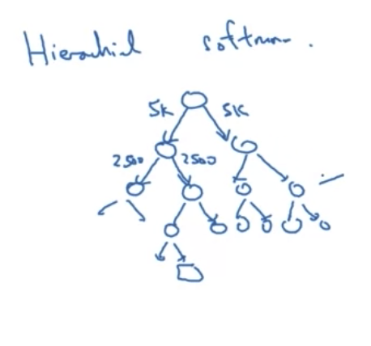

## Word vector 

## Visualizing word embeddings

-  t-SNE 

## Using word embeddings 

- Word emmbedding 算法的training set足够大(1B - 100B words)
  - 知道orange, apple, durian 是类似的，farmer cultivator 是类似
- named entity recignition 就可以用比较小的训练集(100k words)

## Embedding matrix

### Hierarchical softmax

 

### Negative Sampling 

context: orange 

原本的target word: juice

如果random取到 of，依然label = 0

**choice  of k**

- k = 5-20 for smaller dataset
- k = 2-5 for large dataset 

## Glove

f(x) 是 weighting term，满足：

- If $X_{ij} = 0$, $f(X_{ij}) = 0$。（避免计算log 0，这里用"0log0 = 0"

- If 高频词(this, is, of, a,...) 降低weight
- If 低频词（durian,...) 升高weight

## Sentiment Classification

Problem: not a huge label training set

- Average 
- RNN

## Debiasing 

- The problem of bias in word embeddings
  - Man: Woman as King:Queen
  - Man:Computer_Programmer as Woman:Homemaker X
  - Father:Doctor as Mother:Nurse X
- Word embeddings can reflect gender, ethnicity, age, sexual orientation, and other biases of the text used to train the model
- 

