1. Introduction

## 1.1 定义

NLP = Natural language processing 


## 1.2 How do we represent the meaning of a word?

**meaning**

- 用一个词，词组表示的概念
- 一个人想用语音、符号等表达的想法
- 文章，艺术等作品中表达的思想

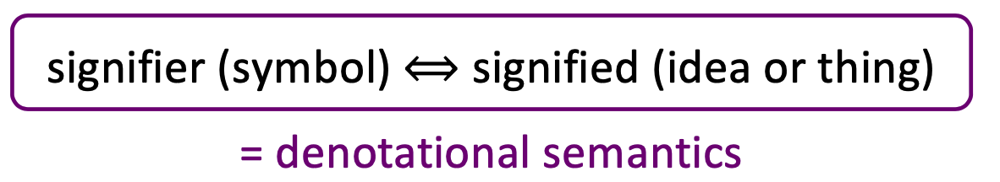

## 1.3 How do we have usable meaning in a computer?

### 1.3.1 WordNet

#### Idea 💡 

- **用包含同义词，上位词(hypernyms)的词典**

#### 例子 🌰

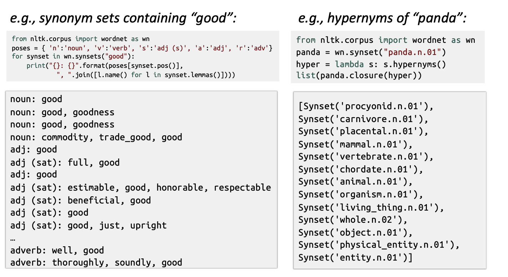

#### 缺点 ❎

- 忽略词之间的细微差别

  - 'proficient' 不完全等同于 'good'

- 缺少单词的新含义,不可能持续更新

- 需要人工创造，调整

- 不能计算单词相似度

  
### 1.3.2 one-hot vector

#### Idea 💡 

在传统NLP里，把单词作为离散符合：用one-hot vector表示

#### Definition

用只有一位为1，其余都是0的，长度为 `|V|` 的向量表示，(其中`|V|` = 词汇量）。

#### 例子 🌰

```
motel = [0 0 0 0 0 0 0 0 0 1 0 0 0 0 0]
hotel = [0 0 1 0 0 0 0 0 0 0 0 0 0 0 0]
```

#### 缺点 ❎

- 不能表达词之间的相似性。
  -   任意两个one-hot 向量都垂直
-   向量维度很大，非常sparse

#### Solution ✅

- 用 WordNet 中的同义词来获得相似性（但不可行，比如WordNet中不可能收录所有同义词）  
- **Instead : learn to encode similarity in the vectors themselves**


## 1.4 Distributional semantics
#### Idea 💡 根据上下文推测单词含义
#### Definition

- **Distributional semantics** := A word’s meaning is given by the words that frequently appear close-by

#### 例子 🌰

banking_meaning.jpg

- **context** = When a word w appears in a text, its ***context*** is the set of words that appear nearby (within a fixed-size window).

- If you can explain what context it's correct to use a certain word, versus in what context would be the wrong world to use. => understand the meaning of the word 

- ##### 注意⚠️ 这里假设：中心词c的含义只与上下文相关，i.e. 与远距离的单词无关。

  - 在实际中，不完全成立。比如人称代词可能指代的是几句甚至几段之前的人物。

## 1.5 语言模型(Language Models)
#### Idea 💡

语言模型是用来计算一个句子的概率的概率模型。比如*"The cat jumped over the puddle."* 这样完整且合理的句子应该有高的概率，而 *"stock boil fish is toy"* 有低概率。

对于任意一列n个单词，它的概率用 $P(w_1, w_2, ..., w_T)$ 表示。

一般的，根据Bayes 公式，
$$
P(w_1,...,w_T) = P(w_1)P(w_2|w_1)P(w_3|w_1,w_2)...P(w_T|w_1,...,w_{T-1})
$$
其中条件概率 $p(w1), p(w_2|w_1), ..., p(w_T|w_1,...,w_{T-1})$ 是模型的参数。对于一个长度为$T$ 的句子，需要计算 $T$  个参数。在词汇量为$|V|$ 的语料库，任意长度 T 的句子共用 $|V|^T$ 种可能，进一步就有 $T \cdot |V|^T$ 个参数。（这里忽略了重复参数，只看量级就好）。


### 目标函数

对于统计语言模型而言，利用最大似然，可把目标函数设为：
$$
L = \prod_{w \in C} P(w|\text{contex}(w))
$$
其中 C表示 语料库（Corpus)，Contex(w)表示单词w的上下文


## 1.6 Word vector

### 1.6.1 定义

对于词典D里的任意单词w，都指定一个固定长度的向量$v(w) \in \mathbb{R}^{n}$，就称 $v(w)$ 是w的词向量，n为词向量的长度。 

- 这个向量被称为词向量（word vectors)，词嵌入（word embedding）或者 word representations

显然，上面提到的 one-hot vector 就是最简单的词向量。基于one-hot，我们希望能够得到满足下面条件的词向量：

- 长度 $n \ll |V|$ 
- 词向量是稠密的
- 词语之间的相似性可以通过词向量来体现 => w的词向量与它上下文中的单词的向量相似

### 1.6.2 例子 🌰

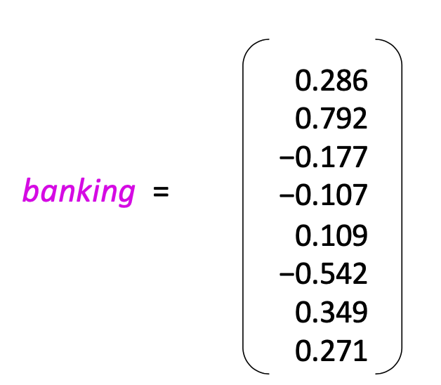

banking_vector.jpg

进入计算，学习词向量的算法前，我们看两个词向量的可视化。（为了方便，下图把9维词向量投射到二维空间）

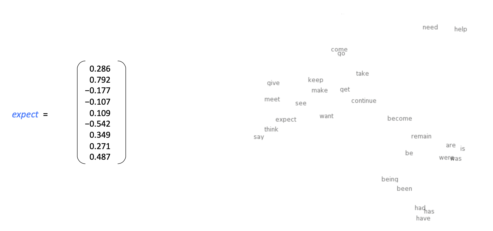word_vector_visualization.jpg

- 含义相近的词，有一定的聚集性，表现了词之间的相似性

这里的 **相似性**是指**“结构”相似性**：如果两个词出现在同样的上下文，我们就当做它们相似。如上图come 和 go，含义上是反义词，但在词向量空间很接近。


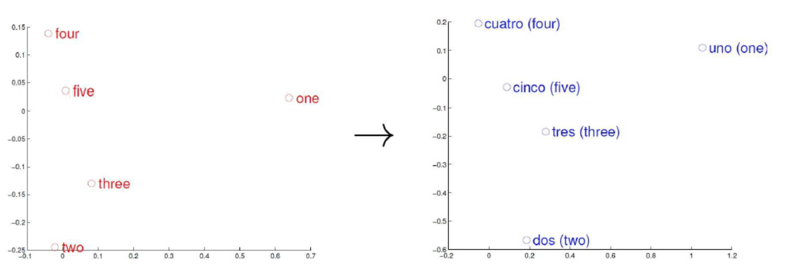

word_vector_visualization2.jpg

- 分别画出英语和西语的数字单词的词向量，同样发现有很高的相似性。


# 2. Word2vec 

## 2.1 Overview

Word2vec (Mikolov et al. 2013) 是一个学习词向量的框架。

#### Idea 💡
- 我们有一个大的语料库（大量文本）（a large corpus of text）
- 词汇表中的每个单词都由一个向量表示
- 遍历文本中的每个位置 t，都有对应的中心词（center word） c 和上下文（ context (“outside”)） o
- 通过单词 c 和 o 的词向量的相似度，来计算给定c出现o的概率（反之亦然）
- 通过不断调整词向量，最大化这个概率


**"完形填空"**


下图为$P(w_{t+j}|w_t)$的计算过程，window size = 2， 中心词 = into

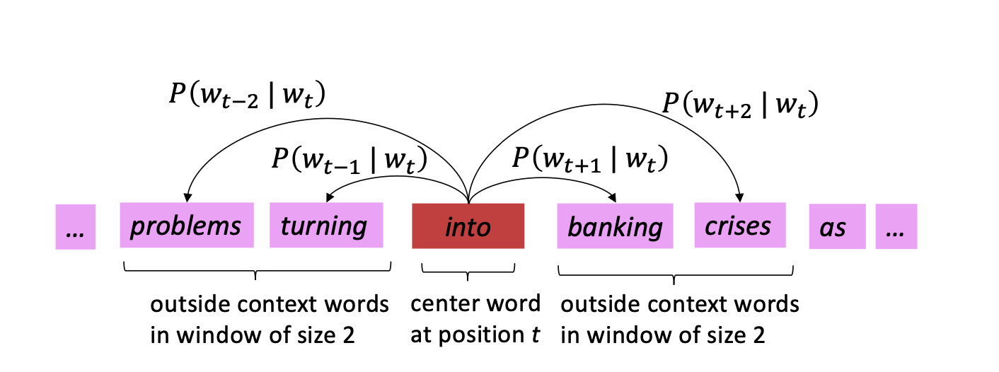into_example.jpg

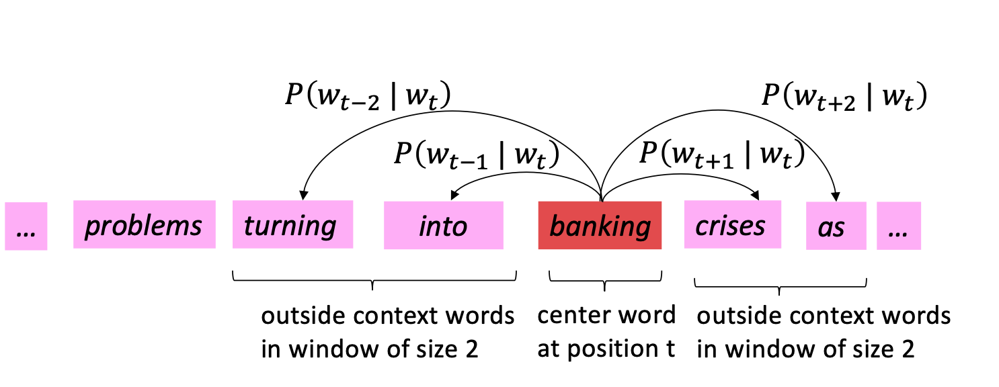

banking_example

## 2.2 Details

Word2vec 包含：
- **两个学习词向量的模型** 
  - CBOW 通过上下文预测中心词
  - Skip-gram 通过中心词预测上下文

 cbow&skipgram.png.jpg

 

由图可见，两个模型都包含三层：**输入层**、**投影层**和**输出层**

- **两个训练方法** 降低模型学习过程中的运算量
  
  - negative sampling 负采样
  - hierarchical softmax

## 2.3 Continuous Bag of Words Model (CBOW)

### 2.3.1 结构

1. simple CBOW
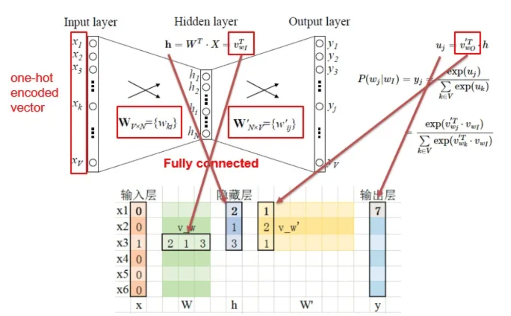simple_cbow.jpg

2. Multi-Word Context Model

  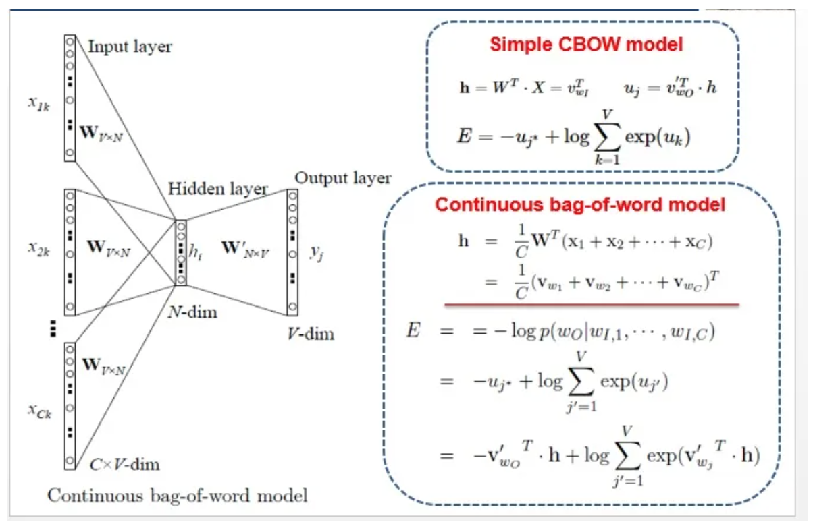multi_cbow.jpg

**目标** 对每一个单词 w，我们要学习2个向量

- v (输入向量）当 w 在上下文中；
- u（输出向量）当 w 是中心词 

**例子** 🌰
有下面的句子：

*"The cat jumped over the puddle."*

希望通过上下文 {"The", "cat", "over", "the", "puddle"} 来预测/生成中心词 "jumped"

***In math*** 希望 通过{"The", "cat", ’over", "the’, "puddle"}的词向量得到向量 = "jumped"的词向量

**Notation for CBOW Model**
- $w_i$ : Word i from vocabulary V
- $V \in \mathbb{R}^{n\times |V|}$: Input word matrix
- $v_i$ : i-th column of V , the input vector representation of word $w_i$
- $U \in R^{|V|\times n}$: Output word matrix
- $u_i$ : i-th row of U , the output vector representation of word $w_i$

我们用 $w_{c-m}, ..., w_{c-1}, w_{c+1},...,w_{c+m}$ 代表上下文，$w_c$代表中心词。假设已有所有词的one-hot vector表示。
Input:x, output:y

1. 生成上下文中的单词的 one-hot 向量: $x^{c-m}, ..., x^{c-1}, x^{c+1},...,x^{c+m} \in \mathbb{R}^{|V|}$.
2. 得到上下文的词向量：$v_{c-m} = Vx^{c-m}, ..., v_{c-1} = Vx^{c-1}, v_{c+1} = Vx^{c+1},...,v_{c+m} = Vx^{c+m} \in \mathbb{R}^{n}$
3. 计算平均值 $\hat{v} = \frac{v_{c-m} +...+ v_{c-1} + v_{c+1} + ...+v_{c+m}}{2m} \in \mathbb{R}^{|V|}$

  1. 有的地方直接求和，不影响

4. 生成分数向量 $z = U\hat(v) \in \mathbb{R}^{|V|}$

  - 这样，由于相似向量的点积大，所以为了得到高分，会向相似单词的词向量靠近。

6. 通过softmax函数把分数转化为概率 $\hat{y} = \text{softmax}(z) \in \mathbb{R}^{|V|}$
7. 我们希望生成的概率$\hat{y}\in \mathbb{R}^{|V|}$ 与真实 $y\in \mathbb{R}^{|V|}$ 相匹配，注意这里`y` 也是one-hot。

### 2.3.2 目标函数 Obejective function 

For each position 𝑡 = 1, ... , 𝑇, predict center word $w_c$, given the context words within a window of fixed size m  $w_{c-m}, ..., w_{c-1}, w_{c+1},...,w_{c+m}$. 

Data likelihood:
$$
L(\theta) = \prod_{c = 1} ^T  P(w_c|w_{c-m}, ..., w_{c-1}w_{c+1},...,w_{c+m})
$$


- $\theta$ 包含所有需要优化的参数（i.e. 两个词向量矩阵）

The objective function $J_{\theta}$ is the (average) negative log likelihood:

$$
J = - \frac{1}{T}\log L(\theta)
$$
**Question: How to calculate $P(o|c)$

- $𝑃(𝑢_{𝑝𝑟𝑜𝑏𝑙𝑒𝑚𝑠} | 𝑣_{𝑖𝑛𝑡𝑜})$ short for $P(𝑝𝑟𝑜𝑏𝑙𝑒𝑚𝑠 | 𝑖𝑛𝑡𝑜 ; 𝑢_{𝑝𝑟𝑜𝑏𝑙𝑒𝑚𝑠}, 𝑣_{𝑖𝑛𝑡𝑜},\theta)$


prob.jpg

### 2.3.3 Gradiant descent and stochastic gradient descent

## 2.4 Skip-gram


### 2.3.1 目标函数  Obeject function 

对任意的位置 $𝑡 = 1, ... , 𝑇$, 给定中心词 w，预测它的上下文（window of fixed size m） 

Likelihood:
$$
L(\theta) = \prod_{t= 1}^T\prod_{-m\leq j\leq m, j\neq 0}P(w_{t+j}|w_t; \theta)
$$
其中用$\theta$ 表示所有（需要优化的）参数，那么目标函数 $J(\theta)$ 是
$$
J(\theta) = - \frac{1}{T}\log L(\theta) = -\frac{1}{T}\sum_{t=1}^T\sum_{-m\leq j\leq m, j\neq 0}\log P(w_{t+j}|w_t; \theta)
$$


为了最小化目标函数 $J(\theta)$ ，有下面问题：

- **Question:  [High Level] 如何最小化目标函数**

- **Answer** 把相似词放在空间距离近的位置$\rightarrow$ 对于词向量，引入**点乘** 当作距离度量。

- 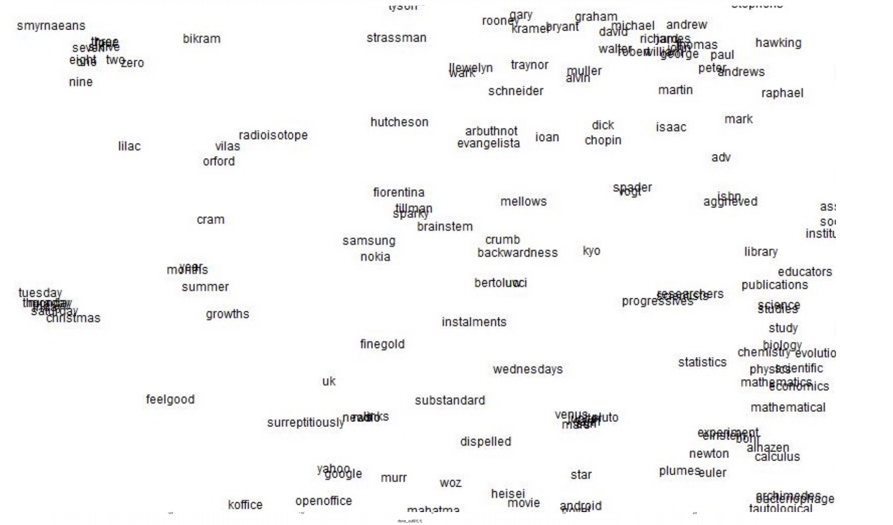

- **Question：如何计算$P(w_{t+j}|w_t; \theta)$？**

- **Answer** 对每个单词w，使用两个词向量

  - $v_w$ ，当w是中心词

  - $u_w$，当w是上下文

  - 对于中心词 c 和上下文单词 o(output)，有：
    $$
    P(o|c) = \frac{\exp(u_o^Tv_c)}{\sum_{w\in V} \exp(u_w^Tv_c)}
    $$
  
  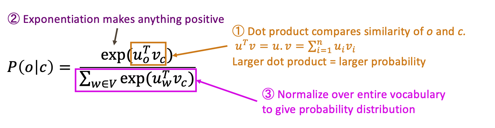
  
   - [TODO] when small, what's the meaning
     
   - Softmax function $\mathbb{R}^{n} \rightarrow (0, 1)^n$:
     $$
     \text{softmax}(x_i) = \frac{\exp(x_i)}{\sum_{j=1}^n \exp(x_j)}
     $$
  
     	- 把任意的$x_i$ 映射到一个概率分布 $p_i$
     	- "max" :能够让vector中最大的数$x_{max}$ 被取到的概率非常大
     	- "soft" 对于小的值$x_i$ 仍然有概率

### 2.4.2 训练模型

#### 2.4.2.1 Gradiant descent

##### a. Idea 

- 沿着梯度下降的方向优化参数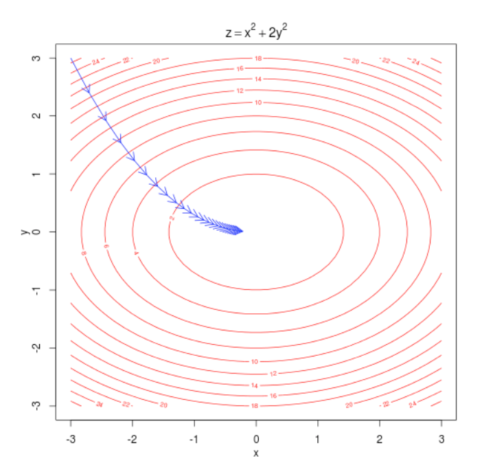(gd.jpg)

- **Idea** 对现在的参数 $\theta$ ，计算目标函数 $J(\theta)$ 的梯度，然后沿着负向梯度小步向下。（重复这个过程，直到结束）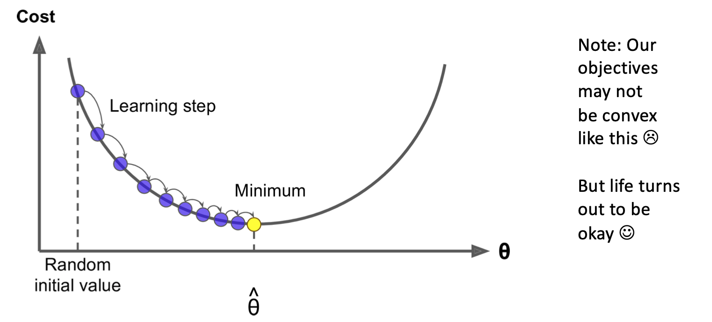

  

- 
  $$
  \theta^{new} = \theta^{old} - \alpha \nabla_{\theta} J(\theta)
  $$

  $$
  \text{i.e.}\quad \theta^{new}_j = \theta^{old}_j - \alpha \frac{\partial}{\partial \theta} J(\theta) \quad \text{for any parameter } \theta_j
  $$

  

##### b. Stochastic Gradient Descent 

每次只用单个样本更新


##### c. SGD with minibatch

+ (+) less noisy than SGD
+ (+) 更重要 可以在GPU上并行计算 

##### d. Stochastic gradients with word vectors

- 这里，我们的参数$\theta$ ：总共$|V|$ 单词，每个单词都包含两个d维的向量，所以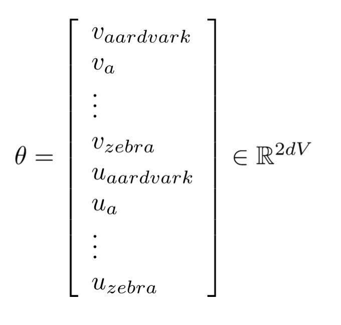
- $ \nabla_{\theta} J(\theta)$ 非常稀疏，所以只更新实际出现的向量 
  - 需要稀疏矩阵更新操作来只更新矩阵U和V中的特定行
  - 需要保留词向量的散列？

#### 2.4.2.2 求导细节

- 下面我们需要对**所有**向量求导

$$
J(\theta) = -\frac{1}{T}\sum_{t=1}^T\sum_{-m\leq j\leq m, j\neq 0}\log P(w_{t+j}|w_t; \theta)
\quad \text{with } P(o|c) = \frac{\exp(u_o^Tv_c)}{\sum_{w\in V} \exp(u_w^Tv_c)}
$$

$$
\begin{align}
\frac{\partial}{\partial v_c}\log  P(o|c) &=
\frac{\partial}{\partial v_c}\log \frac{\exp(u_o^Tv_c)}{\sum_{w\in V} \exp(u_w^Tv_c)} \\
&= \frac{\partial}{\partial v_c}(u_o^Tv_c)-\frac{\partial}{\partial v_c}\log {\sum_{w\in V} \exp(u_w^Tv_c)} \\
&= u_o - \frac{1}{{\sum_{w\in V} \exp(u_w^Tv_c)}}\cdot {\sum_{x\in V} \exp(u_x^Tv_c)}u_x.
\end{align}
$$

注意到 $J(\theta)$ 
$$
\begin{align}
\frac{\partial}{\partial v_c}\log  P(o|c) 
&= u_o - \sum_{x\in V} \frac{{\exp(u_x^Tv_c)}}{{\sum_{w\in V} \exp(u_w^Tv_c)}}\cdot u_x\\
&=u_o-\sum_{x\in V}P(x|c)u_X \\
&= \text{Actual context word} - \text{Expected context word} 
\end{align}
$$
注意到，$u_o$ 是上下文对应的词向量，而$\sum_{x\in V}P(x|c)u_X$  是以期望形式存在的，模型“预测“的结果


## 2.5 基于Hierarchical Softmax的模型

### 2.5.1 模型网络结构

Hierarchiacal Softmax 是对普通softmax更有效的替代方法，下面以CBOW为例给出了模型结构：

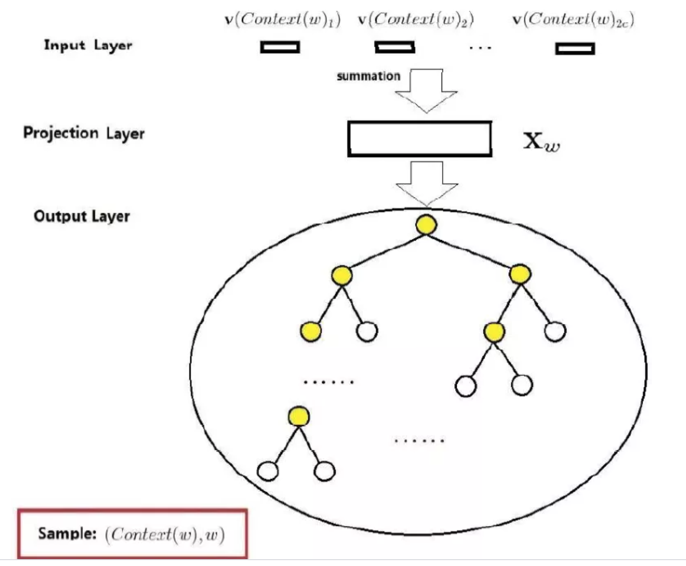

- 样本：(Context(w), w)其中w是中心词，Context(w) 是w窗口大小= c的上下文，

- 输入层：上下文Context(w)中2c 个单词的词向量：$v(Context(w)_i),\ i=1,...,2c$。

- 投影层：直接对2c个词向量进行累加，得到
  $$
  x_w=\sum_{i=1}^{2c}v(Context(w)_i)
  $$

- 输出层：一个Huffman树，其中叶子节点共|V|个，对应于|V|个单词，非叶子节点|V|-1个（图中黄色结点）。

  - 之前的输出层是一个|V|维向量。

### 2.5.2 Huffman Tree

给定n个权值作为n个叶子结点，构造一颗二叉树，使得它的带权路径长度达到最小，则称这样的二叉树为最优二叉树，也称为Huffman树

#### 2.5.2.1 Huffman树的构造

给定n个权值 $\{w_1,...,w_n\}$作为二叉树的n个叶子结点，可以通过下面算法来构造一棵Huffman树

**Huffman 树构造算法**

1. 将 $\{w_1,...,w_n\}$看成n棵树的森林（每棵树仅有一个结点）
2. 将森林中根结点权值最小的两棵树合并，作为新树的左、右子树，并且新结点的根结点权值为左、右子树根结点权值的和
3. 从森林中删除选取的两棵树，添加新树
4. 重复2，3步骤，直到森林中只有一棵树为止


**例子** 🌰

假设经过统计有:“我”，“喜欢”，“观看”，“巴西”，“足球”，“世界杯”这六个词出现次数分别是15, 8, 6, 5, 3, 1。以这6个词为叶结点，以词频为权值构造Huffman树。

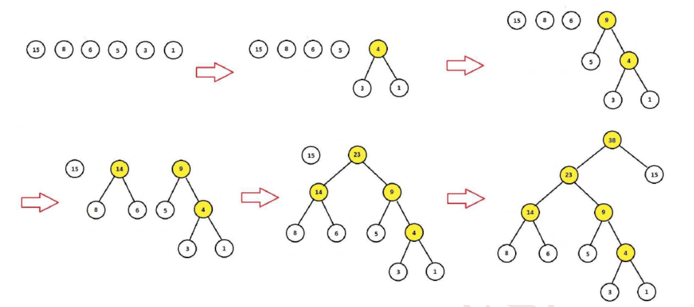

- 词频越大的词越接近根结点
- 在上面例子里，为了方便，统一将词频大的结点作为左孩子结点，词频小的作为右孩子结点


#### 2.5.2.2 Huffman编码

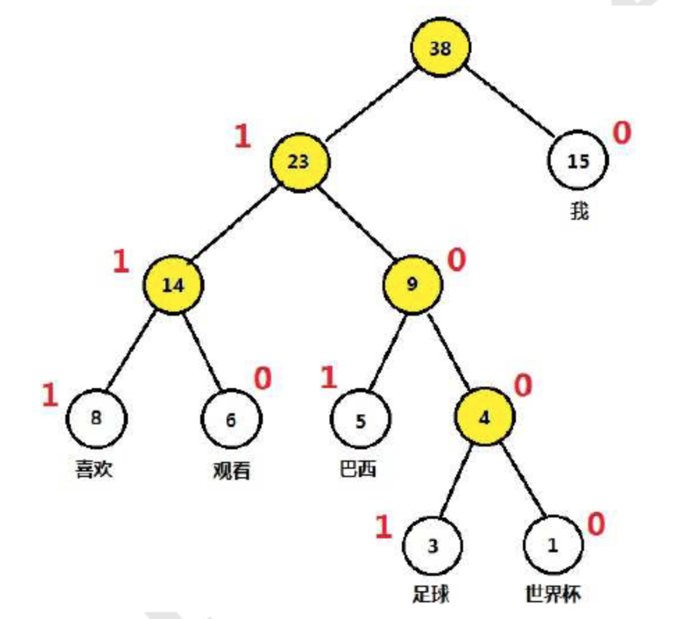 

记左边为1，右边为0，那么编码如下：

"我"：0；"喜欢"：111，"观看"：110， "巴西"：101， "足球"：1001， "世界杯"：1000 

发现Huffman编码有下面的特点

- 不等长编码：
  - 词频高的词编码短，比如”我“
  - 词频低的词编码长，比如”世界杯“
  - 一个字符的编码不可能是另一个字符编码的前缀

### 2.5.3 目标函数

为了便于下面的介绍和公式的推导，这里需要预先定义一些变量：

-  $p^w$：从根节点出发，然后到达单词w 对应叶子结点的路径。
- $l^w$ ：路径$ p^w$中包含的结点的个数。
- $p_1^w,...,p_{l^w}^w$ : 路径$p^w$ 中对应的各个结点，其中 $p^w_1$代表根结点，而$p^w_{l^w}$ 代表的是单词w对应的结点。
- $d_1^w,...,d_{l^w}^w\in (0,1)$ : 单词w 对应的哈夫曼编码，一个词的哈夫曼编码是由 $l^w-1$位构成的， $d_j^w$表示路径$p^w$ 中的第j个单词对应的哈夫曼编码，根结点不参与对应的编码。
- $\theta_1^w,...,\theta_{l^w}^w$ : 路径 $p^w$ 中非叶子节点对应的向量，$\theta_j^w$ 表示路径 $p^w$ 中第 j 个非叶子节点对应的向量。 这里之所以给非叶子节点定义词向量，是因为这里的非叶子节点的词向量会作为下面的一个辅助变量进行计算，在下面推导公式的时候就会发现它的作用了。

#### 例子🌰 w="足球"

下图中红色线路就是我们的单词走过的路径，

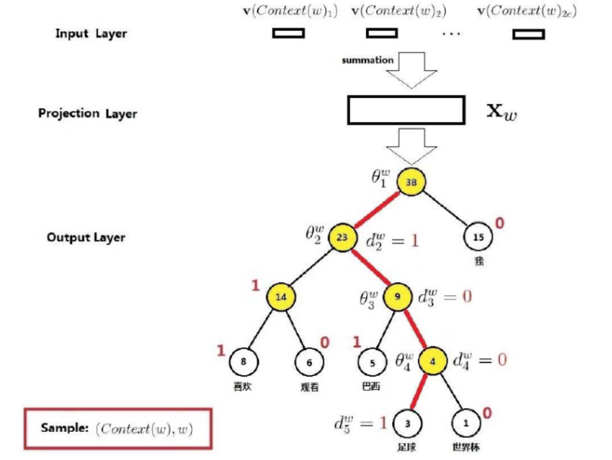


- 整个路径上的5个结点就构成了路径 $p^w$ (红色)
- 其长度$l^w=5$ ，
- $p_1^w,...,p_5^w$ 就是路径 $p^w$ 上的五个结点
  - 其中$p_1^w$ 对应根结点，$p_5^w$ 对应叶子结点
- $d_1^w, d_2^w, d_3^w, d_4^w, d_5^w$ 分别为1,0,0,1
  - "足球"对应的哈夫曼编码就是1001。
-  $\theta_1^w, \theta_2^w, \theta_3^w, \theta_4^w,\theta_5^w$ 是路径 $p^w$ 上的个非叶子节点对应的向量


**Idea** 💡从根节点到"足球"这个单词，经历了4次分支，而对于这个哈夫曼树而言，每次分支相当于一个二分类。

如何定义正负label呢？

- 自然的，我们可以根据Huffman编码定义，编码为1则为正类，编码为0则为负类（反之亦可）

- 为了和Word2vec源码保持一直，我们将编码为1的认定为负类（左子树），而编码为0的认定为正类（右子树）。

那么一个结点被分到

- 正类的概率是$\sigma(x_w^T\theta)$，其中$\sigma$是Sigmoid函数：
  $$
  \sigma(x_w^T\theta) = \frac{1}{1+\exp(-x_w^T\theta)}
  $$
  
- 负类的概率是$1- \sigma(x_w^T\theta)$.

- 其中参数 $\theta$  就是非叶子对应的向量 $\theta_i^w$。

- 

对于从根节点出发到达`"足球"`这个叶子节点所经历的4次二分类，将每次分类的概率写出来就是：

- 第一次分类 left： $P(d_2^w|x_w,\theta_1^w)= 1- \sigma(x_w^T\theta_1^w)$
- 第二次分类 right： $P(d_3^w|x_w,\theta_2^w)= \sigma(x_w^T\theta_2^w)$： 
- 第三次分类 right： $P(d_4^w|x_w,\theta_3^w)= \sigma(x_w^T\theta_3^w)$： 
- 第四次分类 left： $P(d_5^w|x_w,\theta_1^w)= 1- \sigma(x_w^T\theta_4^w)$： 

所以，对于单词`"足球"`，我们希望最大化上面的概率之积：
$$
P(\text{足球}｜Context(足球)) = \prod_{j=2}^5P(d_j^w|x_w,\theta_{j-1}^w)
$$
**注意⚠️ 这个方法最大的优势是计算概率的时间复杂度是$O(\log(|V|))$，对应着路径的长度。**

一般的，
$$
P(w｜Context(w)) = \prod_{j=2}^{l^w}P(d_j^w|x_w,\theta_{j-1}^w)
$$
其中
$$
  P(d_j^w|x_w,\theta_{j-1}^w)= \left\{\begin{array}{@{}l@{}}
   \sigma(x_w^T\theta_{j-1}^w), \quad d_j^w = 0 \\
    1- \sigma(x_w^T\theta_{j-1}^w),\quad d_j^w = 1
  \end{array}\right.\,
$$
或者写作
$$
P(d_j^w|x_w,\theta_{j-1}^w)= [\sigma(x_w^T\theta_{j-1}^w)]^{1-d_j^w}\cdot
    [1- \sigma(x_w^T\theta_{j-1}^w)]^{d_j^w}
$$
得到目标函数（ log Likelihood）
$$
\begin{align}
J &= \log L(\theta) =  \sum_{w\in C} \sum_{j=2}^{l^w} \log P(d_j^w|x_w,\theta_{j-1}^w) \\
&=  \sum_{w\in C} \sum_{j=2}^{l^w} \left( ({1-d_j^w})\cdot\log[\sigma(x_w^T\theta_{j-1}^w)]+
    {d_j^w}\cdot\log[1- \sigma(x_w^T\theta_{j-1}^w)]\right)
\end{align}
$$
为了梯度推导方便起见，将上式中双重求和符号下的内容记为 $L(w,j)$，即:
$$
L(w,j) =({1-d_j^w})\cdot\log[\sigma(x_w^T\theta_{j-1}^w)]+
    {d_j^w}\cdot\log[1- \sigma(x_w^T\theta_{j-1}^w)]
$$

- 是单词w，路径上第j个结点的“概率”

### 2.5.4 梯度计算和参数更新

- $L(w,j)$ 对参数 $\theta_{j-1}^w$ 的梯度：
  $$
  \begin{align}
  \nabla_{\theta_{j-1}^w}L(w,j) &=({1-d_j^w})\cdot \frac{1}{\sigma(x_w^T\theta_{j-1}^w)}\cdot \sigma(x_w^T\theta_{j-1}^w)(1-\sigma(x_w^T\theta_{j-1}^w))\cdot x_w \\
  &-  {d_j^w}\cdot \frac{1}{1- \sigma(x_w^T\theta_{j-1}^w)}\cdot\sigma(x_w^T\theta_{j-1}^w)(1- \sigma(x_w^T\theta_{j-1}^w))\cdot x_w
  \\
  &=[1-{d_j^w}-\sigma(x_w^T\theta_{j-1}^w))]\cdot x_w
      
  \end{align}
  $$

- $\theta_{j-1}^w$的更新公式为
  $$
  \theta_{j-1}^w = \theta_{j-1}^w + \eta[1-{d_j^w}-\sigma(x_w^T\theta_{j-1}^w))]\cdot x_w
  $$

- $L(w,j)$ 对参数 $x_w$ 的梯度：
  $$
  \nabla_{x_w}L(w,j) = [1-{d_j^w}-\sigma(x_w^T\theta_{j-1}^w))]\cdot \theta_{j-1}^w
  $$

- $x_w$ 的更新公式为：
  $$
  \begin{align}
  v(\tilde{w}) &= v(\tilde{w}) + \eta\sum_{j=2}^{l^w}\nabla_{x_w}L(w,j) \\
  &= v(\tilde{w}) + \eta\sum_{j=2}^{l^w}[1-{d_j^w}-\sigma(x_w^T\theta_{j-1}^w))]\cdot x_w 
  \quad\text{   for }\tilde{w} \in Contex(w)
  \end{align}
  $$

  - 注意$x_w$是 Contex(w) 中所有单词累加的结果，这里我们需要使用$x_w$来对Contex中的每个单词Contex(w) 进行更新。直接使用 $x_w$的梯度累加对$v(\tilde{w})$进行更新

  


## 2.6  基于Negative Sampling的模型

回忆
$$
J(\theta) = -\frac{1}{T}\sum_{t=1}^T\sum_{-m\leq j\leq m, j\neq 0}\log P(w_{t+j}|w_t; \theta)\quad \text{with } P(o|c) = \frac{\exp(u_o^Tv_c)}{\sum_{w\in V} \exp(u_w^Tv_c)}
$$
注意到分母导致每次计算目标函数 $J(\theta)$都需要遍历整个词典 V，计算量是$O(|V|)$ 级别的（millions)。一个简单的想法是我们不去直接遍历计算，我们预估这个和。那么类比上面的内容有三项需要更新：

- 目标函数 $J(\theta)$
- 导数 $\nabla_{\theta} J(\theta)$
- 更新规则

（下面以skip gram为例）

### 2.6.1 Idea 💡

这里我们改变预测相邻单词这一任务：

- （左图）是原始的，我们根据中心词 not 预测它的上下文 thou 

- （右图）是根据输入的（中心词c，单词w），判断它们是否是邻居（0表示“不是邻居”，1表示“邻居”）。
  - w 是上下文： label = 1
  - w 是随机生成的噪声：label = 0

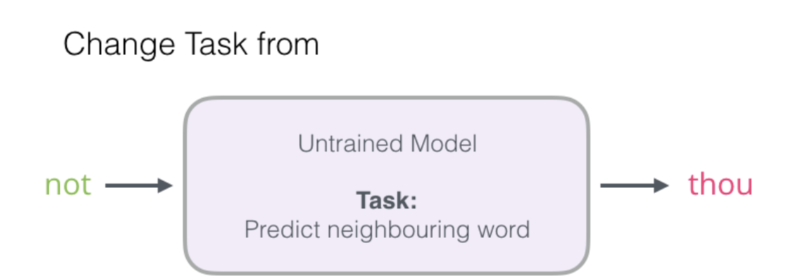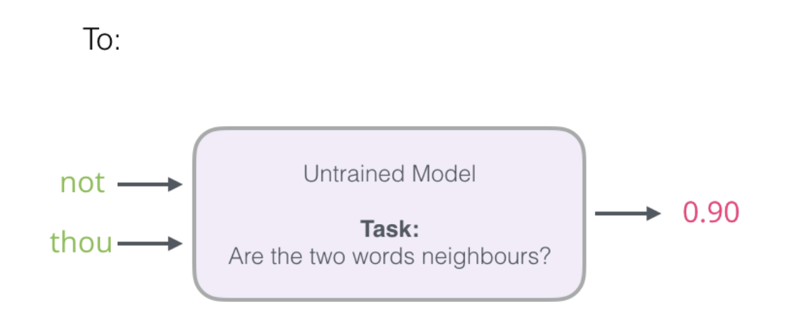

也就是我们需要的模型从神经网络改为逻辑回归模型——因此它变得更简单，计算速度更快。

**Main idea**: train binary logistic regressions for a true pair (center word and a word in its context window) versus several noise pairs (the center word paired with a random word)

这个方法需要我们更新数据集的结构：增加标签列（0或者1）显然，对于(中心词，上下文)，标签列都是1。

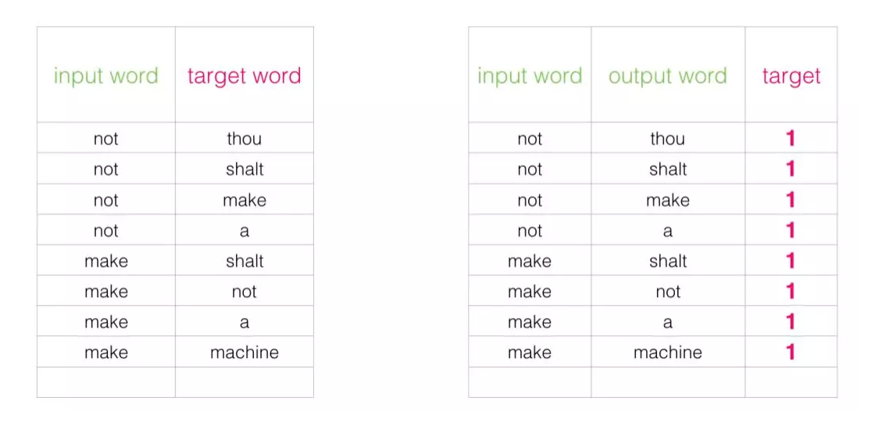

为了让机器能够正确学习，这里我们需要引入负样本 \- 不是邻居的单词样本。下一个问题就是负样本要怎么选取？简单的说我们从词汇表中基于词频随机抽取单词

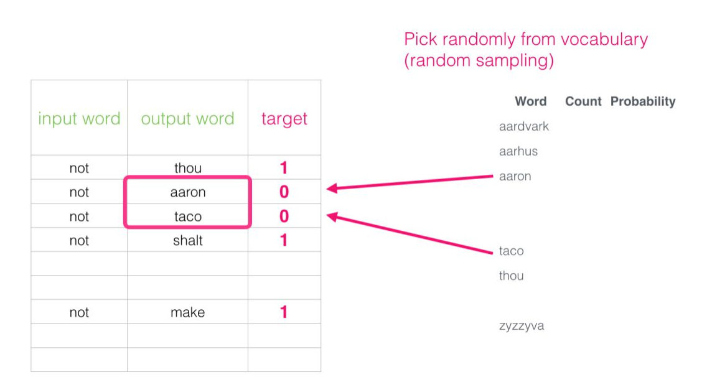

neg_sampling1.jpg
neg_sampling2.jpg
neg_sampling3.jpg
neg_sampling4.jpg

### 2.6.2 目标函数 $J(\theta)$

考虑一对中心词c和另一个单词w的词对 (w,c)，

- 如果(w,c)来自于语料库，或者是 w是c的上下文，用$P(D=1|w,c)$表示；

- 如果(w,c)不在语料库中，用$P(D=0|w,c)$表示；

- 对$P(D=1|w,c)$ 用Sigmoid函数建模：
  $$
  P(D=1|w,c; \theta) = \sigma(u_c^Tv_w) = \frac{1}{1+\exp(-u_c^Tv_w)}
  $$

- 

显然我们希望：

- 如果(w,c)来自于语料库，$\max_{\theta}P(D=1|w,c;\theta) $； 

- 如果(w,c)不在语料库中，$\max_{\theta}P(D=0|w,c;\theta)$ ;

  

得到似然函数
$$
\begin{align}
L(\theta) &= \prod_{(w,c)\in D}P(D=1|w,c;\theta) \prod _{(w,c)\in \tilde{D}}P(D=0|w,c;\theta)\\
&= \prod_{(w,c)\in D}P(D=1|w,c;\theta) \prod _{(w,c)\in \tilde{D}}(1-P(D=1|w,c;\theta))\\
&= \prod_{(w,c)\in D}\frac{1}{1+\exp(-u_c^Tv_w)} \prod _{(w,c)\in \tilde{D}}(1-\frac{1}{1+\exp(-u_c^Tv_w)})\\
& = \prod_{(w,c)\in D}\frac{1}{1+\exp(-u_c^Tv_w)} \prod _{(w,c)\in \tilde{D}}\frac{1}{1+\exp(u_c^Tv_w)}\\
\end{align}
$$
其中 $\tilde{D}$是“假”的语料，

我们希望最小化如下目标函数
$$
\begin{align}
J  &= -\log L(\theta)\\
&= -\sum_{(w,c)\in D}\log \frac{1}{1+\exp(-u_c^Tv_w)} -\sum _{(w,c)\in \tilde{D}}\log\frac{1}{1+\exp(u_c^Tv_w)}
\end{align}
$$

- **Skip-gram** 对应给定的中心词向量$v_c$来观察上下文单词$w_{c-m+j}$的目标函数：
  $$
  -\log \sigma(u_{c-m+j}^Tv_c) -\sum _{k=1}^K\log\sigma(\tilde{u}_k^Tv_c)
  $$
  
- **CBOW** 对应给定的上下文向量$\hat{v}=\frac{v_{c-m}+v_{c-1}+...+v_{c+1}+v_{c+m}}{2m}$来观察中心词向量 $u_c$的目标函数：
  $$
  -\log \sigma(u_c^T\hat{v}) -\sum _{k=1}^K\log\sigma(\tilde{u}_k^T\hat{v})
  $$
  其中，$\{\tilde{u}_k|k=1,...,K\}$是从$P_n(w)$中抽取的K个负样本。

- 实际中发现效果最好的是3/4的Unigram模型：
  $$
  P(w) = U(w)^{3/4}/Z
  $$
  其中Z是正则化系数（没有特别说明的情况下，后续会始终用Z表示正则化系数）

- 这个指数$\alpha = 3/4$使得
  - 降低高频词被抽中概率
  - 增加低频词被抽到概率
  -  is: $0.9^{3/4} = 0.92$
  - constitution: $0.09^{3/4} = 0.16$
  - bombastic: $0.01^{3/4} = 0.032$

### 2.6.3 负采样介绍

**Question** 对于给定的词 w，如果生成w对应的负样本呢？

**Answer** 带权采样，且权重与单词出现频率相关

- 对于高频词，希望被选为负样本的概率比较大
- 反之，对于低频词，希望选中的概率就比较小。

设词典中的每一个词w都对应一个线段 len(w)，其长度为：
$$
len(w) = \frac{\text{count}(w)}{\sum_{u\in C}\text{count}(u)} = \text{w 在语料C中出现的频率}
$$
现在将这些线段首尾相连地拼接在一起，形成一个长度为1的单位线段。如果随机地往这个单位线段上打点，则其中长度越长的线段（对应高频词）被打中的概率就越大。

由此得到区间[0,1]上的一个非等距剖分，剖分点分别是$\{l_i\}_{i=1}^{N}$, 其中 $l_0 = 0, l_k = \sum_{j=1}^k len(w_j)$,$k=1,...,N$，$w_j$是词典里的第j个单词。记第i个剖分为 $I_i = \{l_{i-1}, l_i\}$。

另在区间[0,1]上取一个M等分的等距里剖分，剖分点记为$\{m_j\}_{j=0}^M$，其中$M\gg N$。

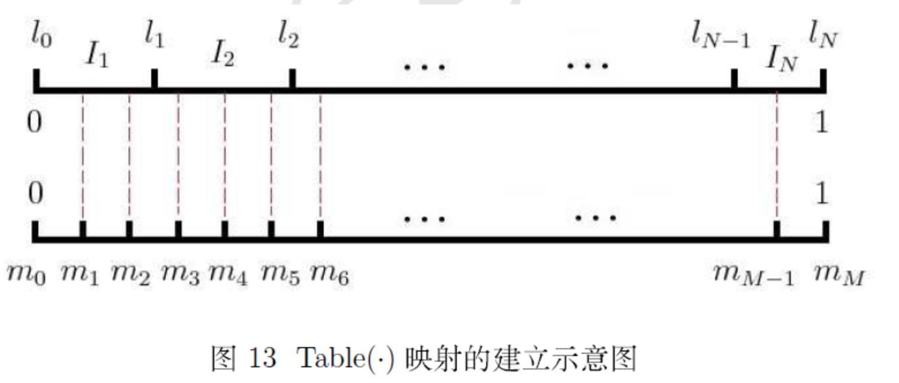

定义如下映射：将内部剖分点$\{m_j\}_{j=1}^{M-1}$投射到$\{I_i\}$（上图红色虚线）
$$
\text{Table}(r) = w_k, \text{  if  } m_r \in I_k \text{ for } r = 1, 2,..., M-1
$$
每次生成一个[0, M-1]间的随机整数r，就是一个样负本 Table(r)

- 当对w进行负采样时，如果碰巧选到w自己该怎么办？跳过。

- 注意到这个过程其实就是Unigram U(w)
- Word2Vec源码中
  - 取指数$\alpha = 3/4$，即 $U(w)^{\alpha}$
  - 取 $M = 10^8$

# 3. 关于Word2vec的其他问题和思考

## 3.1 Word2Vec有哪些局限性？

Word2Vec作为一个简单易用的算法，其也包含了很多局限性：

- Word2Vec只考虑到上下文信息，而忽略的全局信息；
- Word2Vec只考虑了上下文的共现性，而忽略的了彼此之间的顺序性；

## 3.2 CBOW vs Skip gram

- cbow比skip-gram训练快
- skip-gram比cbow更好地处理生僻字
- skip-gram 出来的准确率比cbow 高
  - 在计算时，cbow会将context word 加起来， 在遇到生僻词是，预测效果将会大大降低。skip-gram则会预测生僻字的使用环境。
- Ref [Efficient Estimation of Word Representations in Vector Space](https://arxiv.org/pdf/1301.3781.pdf)

## 3.3 Hierarchical Softmax vs Negative Sampling

In practice, hierarchical softmax tends to be better for infrequent words, while negative sampling works better for frequent words and lower dimensional vectors.

1. Hierarchical Softmax对词频低的和词频高的单词有什么影响？为什么？

   Hierarchical Softmax利用了Huffman树依据词频建树，词频大的节点离根节点较近，词频低的节点离根节点较远，距离远参数数量就多，在训练的过程中，低频词的路径上的参数能够得到更多的训练，所以效果会更好。

2. Negative Sampling 对词频低的和词频高的单词有什么影响？为什么？

## 3.4 word2vec的参数选择

- Skip-Gram 的速度比CBOW慢一点，小数据集中对低频次的效果更好；
- Sub-Sampling Frequent Words可以同时提高算法的速度和精度，Sample 建议取值为 $[10^{-5}, 10^{-3}]$；
- Hierarchical Softmax对低词频的更友好；
- Negative Sampling对高词频更友好；
- 向量维度一般越高越好，但也不绝对；
  - [最小熵原理](https://kexue.fm/archives/7695/comment-page-1 )
- Window Size，Skip-Gram一般10左右，CBOW一般为5左右。
  - 不同的任务适合不同的窗口大小。
  - 使用较小的窗口大小（2-15）会得到这样的嵌入：两个嵌入之间的高相似性得分表明这些单词是可互换的（注意，如果我们只查看附近距离很近的单词，反义词通常可以互换——例如，好的和坏的经常出现在类似的语境中）。
  - 使用较大的窗口大小（15-50，甚至更多）会得到相似性更能指示单词相关性的嵌入。
  - Gensim默认窗口大小为5（除了输入字本身以外还包括输入字之前与之后的两个字）。
- 负样本的数量原始论文认为5-20个负样本是比较理想的数量。当你拥有足够大的数据集时，2-5个似乎就已经足够了。Gensim默认为5个负样本。

## 3.5 其他问题

### 3.5.1 Word2Vec为什么需要两个词向量矩阵

1. 方便计算梯度，如果使用同一个词向量矩阵，$J(\theta)$的分母出现二次项$v_c^Tv_c$ ，
2. Ref [知乎](https://www.zhihu.com/question/278791534)

### 3.5.2 Word2vec碰到新词怎么办？

1. unk技巧

   - 在训练word2vec之前，预留一个<unk>符号，把所有stopwords或者低频词都替换成unk，之后使用的时候，也要保留一份词表，对于不在word2vec词表内的词先替换为unk。

   - 源代码中，有删除低频词的操作：若某个词在语料库中出现次数小于**min_count**，则将其从词典中删除

   - 当数据中出现大量<UNK>时，势必会影响模型的性能

2. subword技巧

   - 这个技巧出自fasttext，简而言之就是对oov词进行分词，分词之后再查找，找到的就保留，找不到的继续分词，直到最后分到字级别，肯定是可以找到的对应字向量的。

3. BPE技巧

   - BPE(byte pair encoder)，字节对编码，也可以叫做digram coding双字母组合编码。BPE首先把一个完整的句子分割为单个的字符，频率最高的相连字符对合并以后加入到词表中，直到达到目标词表大小。对测试句子采用相同的subword分割方式。BPE分割的优势是它可以较好的平衡词表大小和需要用于句子编码的token数量。BPE的缺点在于，它不能提供多种分割的概率。

   此外还有很多技巧啦，如word2vec的增量学习，这里就不赘述了。

   ref

   [知乎1](https://www.zhihu.com/question/329708785)

   [知乎2](https://www.zhihu.com/question/308543084)


### 3.5.3 其他Tips

- 去掉the, and, that, of 这样的停用词，可以使词向量效果更好 
- [reading](https://zhuanlan.zhihu.com/p/335347401)
- 

Reference

1. [CS224n Lec1](https://www.youtube.com/watch?v=8rXD5-xhemo&list=PLoROMvodv4rOhcuXMZkNm7j3fVwBBY42z)
2. [CS224n Lec1 Notes](http://web.stanford.edu/class/cs224n/index.html#schedule)
3. [CS224n Reading Notes](https://github.com/LooperXX/CS224n-Reading-Notes/blob/master/CS224n-2019-01-Introduction%20and%20Word%20Vectors.pdf)
4. [Word2Vec中的数学原理详解](https://www.cnblogs.com/peghoty/p/3857839.html)
5. [深入浅出Word2Vec原理解析](https://mp.weixin.qq.com/s/zDneR1BU6xvt8cndEF4_Xw)
6. [图解Word2vec，读这一篇就够了](https://mp.weixin.qq.com/s?__biz=MjM5MTQzNzU2NA==&mid=2651669277&idx=2&sn=bc8f0590f9e340c1f1359982726c5a30&chksm=bd4c648e8a3bed9817f30c5a512e79fe0cc6fbc58544f97c857c30b120e76508fef37cae49bc&scene=0&xtrack=1#rd)
